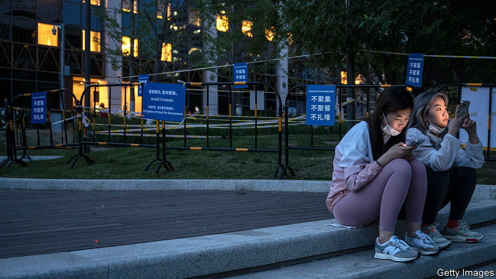

###### All eyes on Beijing

# The Chinese capital tries to avoid a lockdown 

##### Shanghai hopes to come out of its own quarantine by the end of June 

 

> May 19th 2022 

On may 17th the authorities in Shanghai announced that a milestone had been reached in the city’s draconian lockdown that has lasted nearly two months: no new cases for three days outside quarantine areas. But officials say people across China must not let their guard down. Despite growing signs of discontent and severe , the country’s health chief, Ma Xiaowei, said on May 16th: “We’re a long way off being able to relax.”

On social media, complaints swirl about the heavy-handedness of Shanghai’s lockdown, which involves mass testing and containing all new outbreaks within quarantine sites. Though painful, it is crudely effective. During the Omicron outbreak, Shanghai has recorded fewer than 600 deaths, roughly one per thousand infections. A recent paper in , a journal, concluded that, if restrictions had not been applied, the Omicron outbreak could have led to 1.6m deaths nationwide within six months. As it and others note, this is largely because China has failed to vaccinate enough elderly people. 

All eyes are now on the capital. Cases there are still far lower than in Shanghai, which itself is recording just hundreds a day. But other cities have adopted more sweeping controls than Beijing with even fewer cases. It prefers to focus on buildings where cases have been found and districts with higher numbers of infections. Such areas face the closure of schools and shopping malls, work-from-home orders, the suspension of some public transport and frequent mass testing. 

Officials are grappling with tough political decisions in the . This is particularly true in Beijing. It wants to avoid any disruption to the crucial Communist Party congress later this year at which China’s president, Xi Jinping, is expected to secure another five-year term as party leader. A large covid outbreak would cast a dark shadow, but so would public anger over a hard lockdown. 

Shanghai officials say they will start loosening restrictions from June 1st and that life in the city could be back to normal by the end of June. But other moves suggest the “zero-covid” policy could remain in place well beyond the congress. On May 14th China said it would no longer host the 2023 Asian Cup football competition, due to be held in June and July of next year. 

The party’s determination to crush covid has elicited criticism abroad. “When we talk about the zero-covid strategy, we don’t think that it is sustainable,” said Tedros Adhanom Ghebreyesus, the World Health Organisation’s boss, on May 10th, prompting a sharp rebuke from China. 

On May 15th a rare offline show of discontent will have rung alarm bells at party headquarters: a group of students at Peking University gathered to complain about covid-related restrictions. Authorities have been sensitive to any hint of student activism on that campus since the 1980s, when it was a hotbed of anti-government unrest. Online, censors have been trying to stifle grumbles about the government’s measures, for example by deleting videos of the angry students and posts quoting Dr Tedros. It is proving an uphill battle. ■


