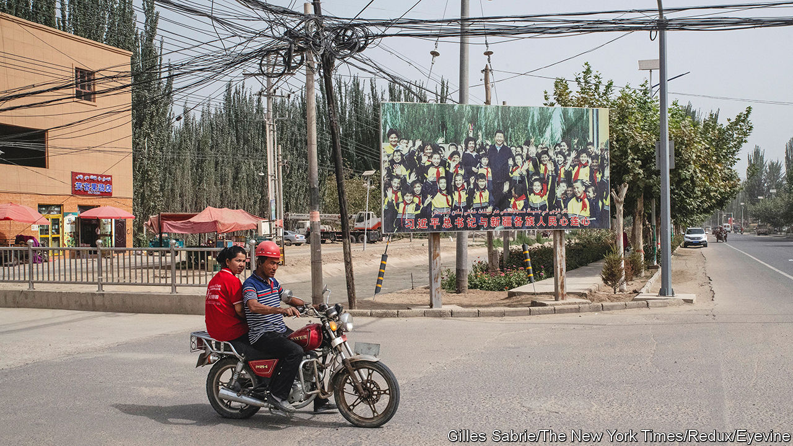

###### Nothing to see here

# The UN’s human-rights chief is finally about to visit Xinjiang 

##### Whether she will learn anything is up to China 

 

> May 19th 2022 

On the surface, much has changed in the western region of Xinjiang since Michelle Bachelet, the un High Commissioner for Human Rights, first proposed a visit there in 2018. Many of the camps where some 1m Uyghurs and other minorities were “re-educated” in 2017-2019 have been dismantled. This does not mean the situation has improved. Some camps have been transformed into forced labour sites, with the barbed wire taken down and new signs declaring that they are factories. Satellite imagery shows that new detention camps have sprung up in remote mountains and deserts, out of sight and hard to reach. Meanwhile, Xinjiang’s formal prison population has grown dramatically. 

In cities, the soldiers and security checks that conveyed a sense of crisis in 2018 are largely gone. Visiting foreign reporters are still followed and harassed, especially if they try to see demolished religious sites or former camps. But in places like Kashgar the minders keep a light touch. They want foreigners to stroll through the restored old city, visit the night market and watch videos of young Uyghurs singing upbeat Mandarin songs. 

That controlled version of Xinjiang is what Ms Bachelet is likely to see when she finally visits China this month, as her office and the Chinese foreign ministry say she will, the first human-rights chief to do so since 2005. Chinese officials say that she is welcome, but only on a “friendly” visit aimed at “exchange and co-operation”, not an investigation. That is not the kind of fact-finding mission many had hoped for. Critics recall a visit by World Health Organisation experts to Wuhan in early 2020. It was meant to investigate the origins of the new virus, but China shifted the focus to its pandemic response, and the who went along with it. Some fear Ms Bachelet may be similarly browbeaten. 

Last June more than 40 countries in the un Human Rights Council called for “unfettered access” to Xinjiang. Activists say that should include free access to detention centres and relevant government documents, freedom of movement, and unsupervised interviews. Since China will not grant any of these things, more than 200 activist groups are now calling for the trip to be postponed. That is unlikely. An advance team has already quarantined for several weeks in Guangzhou.

In Beijing, Western diplomats expect that Ms Bachelet will be given the “Olympic bubble” treatment, with covid used as an excuse to isolate her from any uncontrolled engagement. Radio Free Asia, an American government-funded agency, has reported that officials in Xinjiang are warning Uyghurs not to speak with foreigners. In Kashgar, police are reportedly holding weekly political study sessions to prepare for the un visit. If asked about “re-education”, one police officer told rfa, they should only say positive things about how it leads to a “good and normal life”.

Western ambassadors have largely resisted invitations to visit Xinjiang, because they do not want to be used for propaganda. Some have said they would only visit if they could meet with Ilham Tohti, perhaps the most prominent imprisoned Uyghur academic. China rejected such requests, and those to meet Chen Quanguo, Xinjiang’s former party secretary and chief architect of the camps. But many diplomats from autocratic or poor countries like Sudan and Zimbabwe have visited and been featured in state media praising China’s policies. Such countries also tend to vote with China at the un. Having persuaded most developing countries to support it or abstain on issues such as Xinjiang and Hong Kong, China argues that only a few jealous, fading Western powers object to its human-rights record.

The negotiations in advance of Ms Bachelet’s visit have been fraught. For more than three years, the un Human Rights Office has been working on a report about atrocities in Xinjiang. Scholars consulted say it includes many interviews with camp survivors. Researchers have collected evidence to support a “very strong condemnation” of the Communist Party’s leadership, says Rune Steenberg, an anthropologist who has helped the team translate. When and how that evidence is released, however, is not up to them.

Last December Ms Bachelet’s office said the report would be released “in a matter of a few weeks”. Then news reports suggested that Chinese leaders had pressed her office to withhold it until after the Winter Olympics in February. Meanwhile, China appointed a Uyghur athlete to carry the Olympic torch at its opening ceremony. Bargaining over the report gave China a “sports-washing opportunity”, says Rayhan Asat, a human-rights lawyer who is fighting for her brother’s release.

Listening to the people

Governments and un agencies say they are waiting for the report before taking new actions, says Zumretay Arkin of the World Uyghur Congress. Ms Bachelet’s office only met her group this week, she says, after it led a protest in Geneva against the visit. The high commissioner has yet to meet any ordinary Uyghurs or their leaders. It should be Uyghurs, not the Chinese government, “telling her where our families are held”, says Ms Asat.

A spokesperson for Ms Bachelet’s office said this week that the report would only be released after the trip. The Chinese authorities will see it first and have a chance to share their views. The un cares less about transparency than about maintaining access to Chinese leaders, and that makes it harder to hold China accountable, frets Andrew Bremberg, America’s former ambassador to the un in Geneva.

 If Ms Bachelet’s team disclosed the terms they agreed to for the visit, governments could press China to uphold them, he says. But without transparency, they are handicapped. “Now you own it. You have to defend the value of the trip and praise China for [its] openness, knowing full well it’s not true,” says Mr Bremberg. “This is how these important institutions lose their credibility, by not being truthful or transparent.” ■

