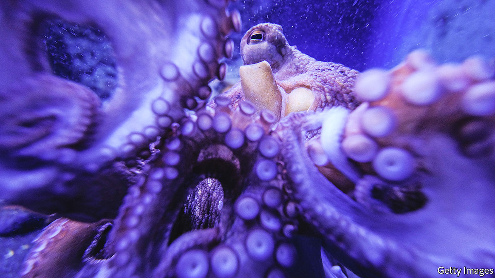

###### Arrival of the interspecies

# AI is changing the way people relate to other beings 

##### James Bridle explains how in “Ways of Being” 

 

> May 18th 2022 

By James Bridle. 

Interspecies was once a technical term used in science to describe how one species got along with another. Now it is a word of more consequence: it evokes the new connections between humans and non-humans that are being made possible by technology. Whether it is satellite footage tracking geese at continental scale, or a smartphone video of squirrels in a park, people are seeing the 8.7m other species on the planet in new lights. In “Ways of Being”, James Bridle, a British artist and technology writer, explores what this means for understanding the many non-human intelligences on Earth. 

Mr Bridle makes clear that three kinds of minds are now interacting: human, non-human and machine. Using artificial intelligence (ai), machines will in future have the capability to interpose themselves as translators between human and other biological life forms. The strength of machine intelligence is its rapidity, repetition and accuracy over time. 

The author spots an immediate hitch: ibm, Microsoft, Amazon, Google, Facebook and other big technology firms are, he alleges, “the number one driver of climate change” and so of “global extinction”. That is overcooking it, given that the same companies build climate solutions and disseminate knowledge, and that other industries are much dirtier. What is true is that profit is the main motive for advances in ai; as yet nature does not get much of a look in, and non-human intelligences go unexplored outside zoology departments. Computing is as focused on humans as ever, even as climate change and biodiversity-loss suggest it should devote much greater attention to other species. 

The first step towards an interspecies future, Mr Bridle argues, is showing more appreciation for other forms of intelligence (the “ways of being” of his title). To some extent, this is already happening, starting with cephalopods. Through films and other initiatives many people now know that octopuses have an advanced and strange intelligence. Human beings’ last common ancestor with the octopus lived 600m years ago, compared with 16m years for the chimpanzee. Yet the octopus eye resembles the human kind. If similar eyes can evolve through separate routes, so might intelligences. 

The next step, Mr Bridle asserts, is recognising that people live in an “entangled” and “more than human” world. Everything is messier than it seems. Other intelligences have developed from a common evolutionary base, and they overlap in ways that science is just beginning to discern. Mortal intelligence is not only limited by its capacity, but by its type: people are bipedal primates who see and hear better than they smell and touch.

Metamorphoses revisited

To see the world like this is in some ways a return to the animism of bygone centuries, an outlook reminiscent of Ovid. Yet the territory ahead is uncharted. Science may soon crack the Rosetta Stone of animal languages. That would mean the preferences of other species are made explicit, and so may intrude into law and politics. 

Because technology has helped to wreck nature, Mr Bridle finds himself surprised that the answer for drawing closer to the living world is “sticking tiny digital sensors on everything”. In time ai might move beyond translation to engage with other species. It could help in providing them with security and veterinary care, for instance, and eventually more sophisticated services; should a system be developed to ascribe value to plants and animals, a form of digital money could even circulate across species barriers.

Teaching ai about life on Earth will require not just humans and hard drives, but the scanning and input of all the “actual intelligences” of animals, trees, fungi and brain-sized microbial colonies. Machines themselves may come to resemble natural beings, subject to the same evolutionary pressures as biological life forms, and with their own capacity for contemplative reflection. 

“Ways of Being” would have benefited from sharper editing. There are many Wiki-heavy digressions in a book that could have been half the length. Yet like the randomness in nature he celebrates, Mr Bridle’s meandering is part of the effect. In making clear the patience, imagination and humility required to better know and protect other forms of intelligence on Earth, he has made an admirable contribution to the dawning interspecies age. ■

