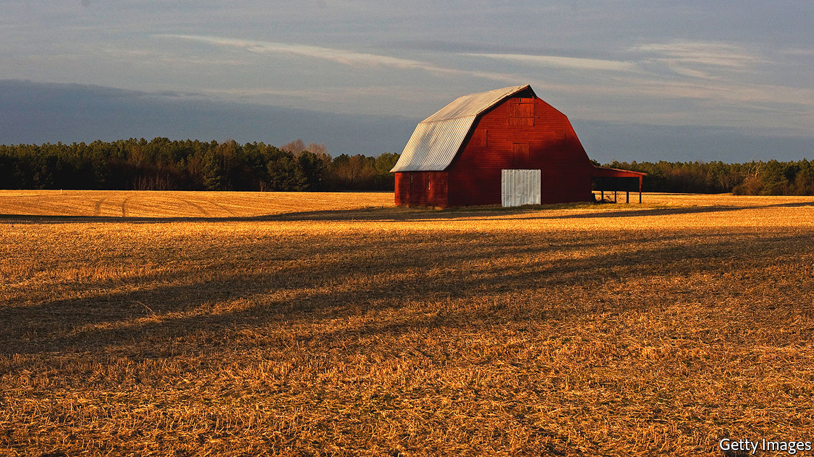

###### Home Entertainment

# Discover the charm of Wendell Berry’s rural tales 

##### Amid the nostalgia, they offer salutary lessons for modern life 

 

> May 19th 2022 

Wendell berry was almost 30 when he packed up his life as a New York intellectual and decamped to Port Royal, a tiny community in Kentucky where generations of his forebears had farmed the land. His friends thought him mad. Mr Berry said it was “not an altogether pleasant fate”. But he felt obliged—destined, even—to record the history of the place. 

Since moving to Port Royal in 1964 he has lived as if he were in the 19th century, writing by hand and ploughing his fields with horses. His eight novels and more than 50 short stories are usually set in Port William, a stand-in for Port Royal. Yet his appeal transcends his backwater milieu. The feminist bell hooks was a fan. Nick Offerman, an actor, wanted to adapt his work for the screen. Mr Berry refused, for the “tv cord is a vacuum line, pumping life and meaning out of the household”. 

His Luddism also belies the prescience of his encompassing theme: that humans must nurture the earth that grants them life. “The soil is the greatest connector of lives,” he has written; “without proper care for it we can have no community.” This philosophy dominates his novels and polemics. In “The Unsettling of America”, published in 1977, Mr Berry critiqued the natural destruction caused by giant agribusinesses. He thinks capitalism has divorced farming from culture, severing people from nature. 

Mr Berry’s fiction explores the deterioration of convivial values by following Port William’s interwoven clans as their pastoral outpost enters the modern age. In “Dismemberment”, a short story, Andy Catlett loses a hand to a harvesting machine and becomes a recluse. He sees his withdrawal is mistaken and reconnects with the town, finding “the wealth of an intimate history” in belonging to “his ancestral place”. 

Port William’s inhabitants often come to such realisations. In “Hannah Coulter”, Mr Berry’s seventh novel, the titular character grows old after a tragic life and anticipates loneliness when her children leave to find work in the city. Instead, her hope is restored when an estranged grandson returns to run the farm. Mr Berry paints the community in atmospheric hues, each brushstroke deepening the reader’s understanding of how the link between soil and people sustains the town. 

The author’s rural world is not always melancholic. “Watch With Me”, a series of short stories, traces the loving marriage of Ptolemy and Minnie Proudfoot. In one tale set in 1932, Ptolemy, an expert horseman, struggles to drive a motor car. Here the clash of old and new is humorous, as the couple go “easy into the modern world, never really getting the hang of it”. 

These stories may be conservative fables about cherishing soil and rustic communities, but they offer profound advice for readers living through ecological disaster. Though few can return to agrarian basics, Mr Berry’s messages of building communities, being a good neighbour and resisting the destructive temptations of modern life are still valuable. Besides, his mission to find the “peace of wild things” is easily accomplished by spending a few hours in Port William. ■

