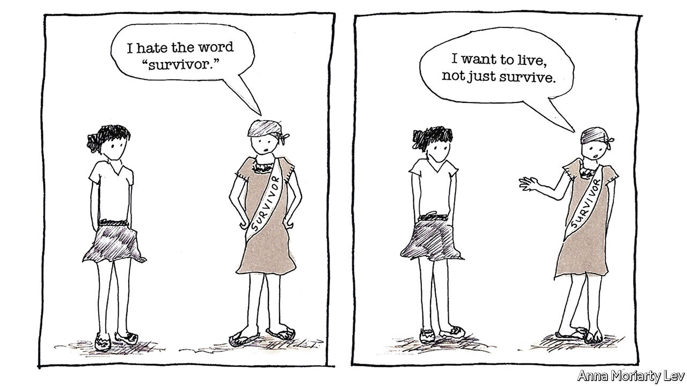

###### Comic relief

# Doctors and therapists are turning to comic books 

##### They can spread awareness of conditions and help patients express themselves 

 

> May 18th 2022 

The class begins with the following assignment: draw a four-panel comic strip about your day. In five minutes the pupils—among them writers, artists, stay-at-home mothers, a graduate student and a cinema manager—produce lighthearted yet touching sketches about play dates, tedious chores and a quizzical chicken. 

By the end of the session, however, the drawings they submit express raw emotions: regret at failing to say goodbye to a loved one, feelings of inadequacy in motherhood and memories too painful to articulate in other ways. For four years Kaye Shaddock, an art therapist, has guided these informal workshops in a studio in Massachusetts or online—together with Anna Moriarty Lev, a cartoonist whose subjects have included her mother’s experience of breast cancer (see picture). Their aim is to demonstrate how comics can serve as a tool for reflection. “Putting words and pictures down on paper clarifies things that, otherwise, I’m alone with in my head,” says one participant.

Exactly when the therapeutic virtues of comic books were recognised is unclear. Justin Green, an American cartoonist, gave clinicians a nudge with “Binky Brown Meets the Holy Virgin Mary”, a bawdy autobiographical account of growing up tortured by religious guilt and compulsive neurosis, published in 1972. Green, who died last month, was eventually diagnosed with obsessive-compulsive disorder (ocd). (He is also credited with pioneering autobiographical comics and as an inspiration to Art Spiegelman, creator of “Maus”.)

Anecdotally, comics have been used in treatments since the late 1980s. But in recent years they have increasingly caught the attention of doctors, therapists and even government agencies. In 2017 the nhs authorities in Manchester, England, funded the publishing of comic-type workbooks on panic attacks and insomnia. America’s agency for defence-technology innovation, darpa, has considered comic-design software as an emotional tool for veterans of the war in Afghanistan.

Katharine Houpt, an art therapist in Chicago, explains that the drawing of comics gives people agency in their stories. The imagery and malleable conventions—such as thought bubbles, perspective shifts and the personification of inanimate concepts—can help convey thorny ideas and experiences. Getting patients to draw a daily six-panel strip, and other such exercises, can reveal cognitive patterns and potential triggers for distress.

Draughtsmen can dissociate themselves from their ailments by portraying them as separate characters. Take insomnia: Ms Shaddock encouraged a child to draw a comic about why she had trouble sleeping. The child conceived of “Wornight”, a monster that filled her head with worries at night. “It shifted the problem away from her and put it onto something that was external,” Ms Shaddock recounts.

Engaging with comic-book characters can also prod patients to go easier on themselves. John Pollard, who researched the use of comics in psychotherapy as part of his training as a counsellor in Britain, notes that readers develop empathy with, say, superheroes as they endure and overcome trials. So why, patients can gently be asked, “can’t you experience that same level of compassion for yourself?” In a similar way, “pathographies”, usually autobiographical accounts of illnesses such as bipolar disorder or depression, can coax people to be kinder to themselves.

In cases of trauma, such as sexual assault or post-traumatic stress disorder, drawing offers a sense of control when revisiting painful memories. The panel-by-panel format allows patients to regulate the pace at which they reconstruct the events in question. They can identify gaps in the story and present the episode and those involved from their perspective. 

Doctors can benefit from comics, too. A study of clinicians who read “My Degeneration”, Peter Dunlap-Shohl’s account of life with Parkinson’s disease, found the graphic novel enhanced their empathy for sufferers. Crafting one can be a self-help tool for medical professionals as well as patients. After trying writing and painting as ways to deal with the stress of her work as an hiv/aids nurse in Chicago in the 1990s, M.K. Czerwiec turned to comics. “This little combination of image and text in sequential fashion”, she says, “was really, really helpful for me.” She published her drawings as a graphic novel in 2017, and now teaches medical students how to use art to cope with strains.

Heal thyself

The roles of comics are multiplying. They can simplify medical information, making arcane concepts more accessible to children and people with learning disabilities or language barriers. Examples include helping patients to grasp the notion of informed consent, understand how electronic health records work or negotiate handovers between carers. Government health agencies are harnessing the medium for public education. In 2020 Stark County, Ohio, commissioned Cara Bean, an artist, and the Centre for Cartoon Studies in Vermont to produce a comic to introduce pupils to mental health.

Behind this burst of activity is a group of enthusiastic medical professionals and artists. Some have been fans of the medium since childhood; others, such as Ms Czerwiec, stumbled upon it as adults. In 2007 Ian Williams, a Welsh doctor-turned-artist, made a website to gather those interested in what he called “graphic medicine”. The name stuck.

It is still a young field. Mr Williams—who in 2014 published “The Bad Doctor”, a semi-autobiographical graphic novel about a doctor with ocd—recalls being invited to speak at conferences as comic relief rather than a practitioner. But a growing body of evidence attests to the art form’s uses, and new textbooks are codifying its applications. “The idea of graphic medicine is getting into the medical mainstream now in a way which would have been unimaginable ten years ago,” says Michael Green, who teaches the subject at Penn State University and guest-edits the digital-comics section of , a respected journal.

Comics are not for everyone, notes Mr Pollard, the researcher, and using them in therapy requires tact and expertise. But he can vouch for their potential from his personal experience. Reading them helped him overcome dyslexia. “If I hadn’t had any kind of contact with comics,” he reflects, “I have my doubts that I would have gone to university.” ■

