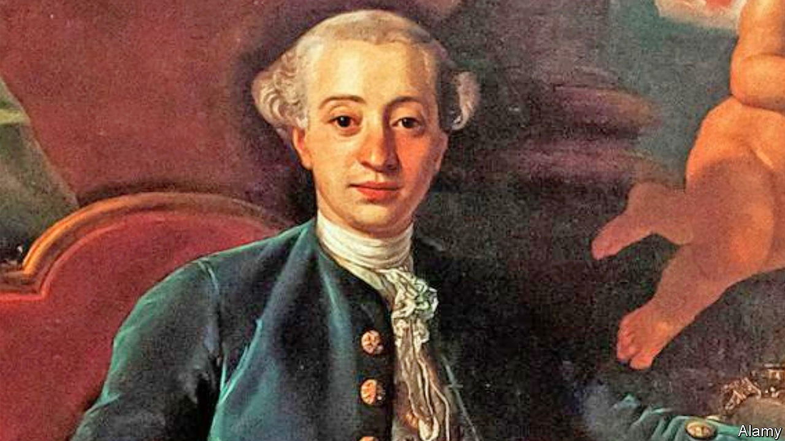

###### A scoundrel’s life

# The dark side of Casanova’s hedonism 

##### By today’s standards, Leo Damrosch recounts, he was a rapist and murderer 

 

> May 19th 2022 

. By Leo Damrosch. 

To his many admirers over the centuries, Giacomo Casanova, who lived from 1725 to 1798, embodied a certain kind of freedom. He was an unapologetic hedonist, indulging his urges in defiance of social conventions and moral hypocrisy. A self-professed libertine, he lived by the philosophy that pleasure was “a gift of God”, and that it was monstrous to think God enjoyed “the pains, sorrows and abstinence that people offer in sacrifice to him”.

As Leo Damrosch chronicles in “Adventurer”, his new biography, this approach took Casanova into some pretty grim territory. In addition to being a serial seducer, by 21st-century standards he was a rapist, a murderer, a child-abuser, a crook and an all-round scoundrel. He was also an engaging storyteller, whose “Histoire de ma vie” not only established him as the archetypal ladies’ man, but also provides one of the most vivid and perceptive accounts of life and manners in 18th-century Europe.

Casanova was born in Venice, an independent republic that had long since transformed itself from a maritime power to a tourist destination, in large part by guaranteeing a degree of anonymity to seekers of illicit pleasure. A child of actors in this city of masks, Casanova was naturally inclined to play fast and loose with his identity. From a young age, the intelligent and ambitious boy realised that he would have to enact many different roles to satisfy his voracious appetites—and to enjoy a life in keeping with his sense of himself as a member of the aristocracy of talent, if not that of birth. He variously passed himself off as a nobleman, soldier, magus, expert in finance and even a hydraulic engineer.

He is, of course, most famous for his amorous escapades. In his telling he was simply irresistible to women. Invariably his partner comes to enjoy the experience as much as he does—even when that experience would today be considered criminal, or at least exploitive. In Casanova’s world, women are as sexually adventurous as he is, and just as willing to defy norms in pursuit of carnal gratification. In this, if nowhere else, Casanova can be seen as a proto-feminist, acknowledging and even celebrating women’s sexuality.

But, as Mr Damrosch points out, not only is Casanova an unreliable narrator of his libidinous career: the nature of his conquests usually discounts any notion of mutuality or consent. “Casanova”, Mr Damrosch writes, “aspired to a life of freedom from restraints—but freedom at whose expense?” The answer is painfully obvious in the scores of deceived, swindled, abandoned and abused victims who populate these pages. The author is clear-eyed about Casanova’s faults. To cite a typical example, in a case involving the purchase of a 13-year-old girl for sex, he observes that his subject “seems oblivious to the darker implications of his actions”. 

Ultimately, however, the indignation seems inadequate. Why should modern readers care about a man whose pursuit of pleasure now seems much more sinister than liberating, and whose idea of freedom is merely the freedom to trample the feelings of others? “Adventurer” doesn’t excuse Casanova’s selfishness or hide his cruelty, yet it fails to offer a coherent critique of the inequalities that he exploited. As colourful and entertaining as it often is, the book knocks Casanova off his pedestal without making a compelling case for why readers should follow Mr Damrosch into the mud.

