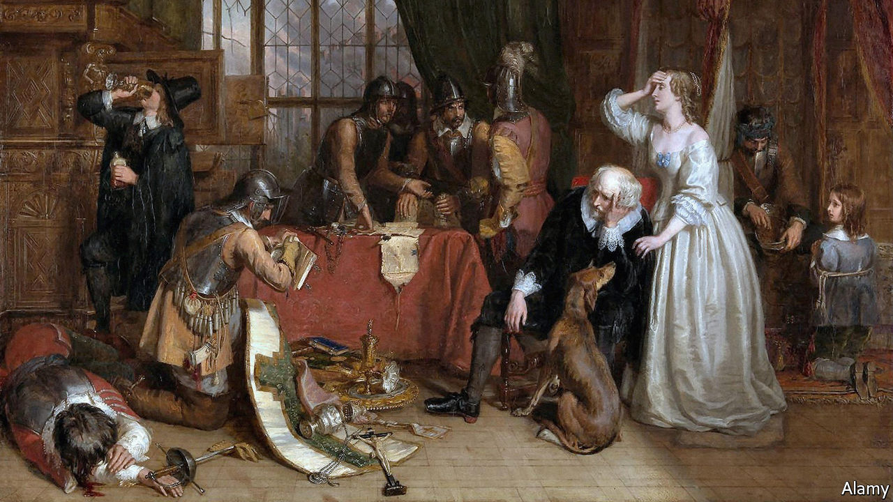

###### The English civil war

# The pity and horror of “The Siege of Loyalty House” 

##### Jessie Childs’s book shows how quickly order and humanity can crumble 

 

> May 19th 2022 

By Jessie Childs. 

“There is nothing that doth more advance and sour a man’s misery”, the eulogist said at the funeral of Sir Marmaduke Rawdon in April 1646, “than this one thought and apprehension: that he was once happy.” Before the outbreak of the English civil war, Rawdon had been a highly successful merchant in London; his unofficial motto, “win gold and wear gold”, hints at his style. But history knows him as a leading royalist officer in the defence of Basing House.

The siege of that house is the immediate subject of Jessie Childs’s riveting new book. The mansion, part of which was a castle, was reputed to be the largest private residence in England. The estate was the Hampshire seat of John Paulet, Marquess of Winchester, a Catholic royalist. The nickname Loyalty House derived from “Aimez Loyauté”, the Paulet family motto.

When the parliamentary army first attempted to take it in July 1643, the house had strategic value: it was deep in the Roundheads’ own territory. Royalist troops emerged from it to harry the roads west of London. Later its resistance made it a symbol—of the stubbornness of hope for one side, of papist pride and error for the other. Never mind that most of its garrison were, like Rawdon, Protestants.

The house would not fall until October 1645, when Oliver Cromwell, basking in the proof of God’s favour after victory at the battle of Naseby, arrived with 7,000 men. His artillery included a cannon so big that 40 horses were required to move it. Cromwell needed only three days of bombardment to achieve what had eluded other parliamentary forces for over two years.

Weighing 63lbs (29kg), the balls from Cromwell’s great cannon were only the latest projectile to batter Basing House. Among the most feared were granadoes, large shells packed with gunpowder, nails and stones, which descended from an immense height and bounced and rolled unpredictably before exploding. An early form of chemical warfare involved brimstone and arsenic. All this was God’s work, the besiegers told themselves. 

Inside the house were several hundred soldiers and numerous women and children. Ms Childs reconstructs their suffering—near-starvation, filthy water, a smallpox outbreak—with startling immediacy using first-hand accounts, letters, memoirs and reports in the viciously partisan press. The book is raucous with opinion, as a civil-war history should be. One heroic royal sortie from Oxford, accomplished with dazzling courage and cunning, brought respite. But it proved brief. 

The waves of hope and despair are well-caught and moving. A parliamentary soldier, his leg shattered in an early assault on the house, slit his own throat as royalists goaded him. Honora, the marchioness, and her maids frantically stripped lead from the turrets to recast as shot as scaling ladders reached the walls. When the house was finally breached, a clergyman’s daughter was killed by a single sword-blow to the head as she tried to protect her father. 

A contingent of Rawdon’s troops who came from Snow Hill in the City of London lend the narrative an extra dimension. Ms Childs focuses on Thomas Johnson, a Yorkshire-born apothecary and herbalist, who had once hoped to locate and label every indigenous plant in England and Wales. The breaking of such lives and communities makes poignant reading. Forced to take sides amid their era’s tyrannical certainties, Johnson and others fled parliamentary London, itself expecting to be besieged, only to end up immured in Basing House. “Let cursed neutrality go to hell,” a preacher urged Cromwell’s men before the final attack.

Ms Childs’s wider subject, then, is what happens to people during civil war: how quickly and imperceptibly order becomes chaos, and decency cruelty, even among friends and neighbours. In other words, how close to inhumanity humanity always is. Her focus is local and English, but the story is human and timeless. ■

