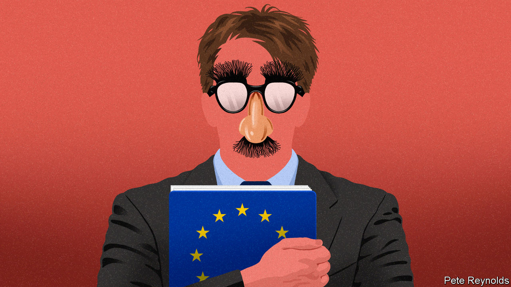

###### Charlemagne

# A new sitcom gives faces to “faceless Eurocrats” 

##### Laughing about the EU is a serious matter 

 

> May 19th 2022 

Aside from war, illness and retirement planning, nothing can possibly be less funny than a “trilogue”. This arcane facet of lawmaking in the eu involves shutting elected meps, officials representing the bloc’s 27 member states and boffins from the European Commission in a room until a deal is thrashed out, often late at night. The forging of cross-institutional consensus over Article 225(b) is more likely to induce sleep than laughter. So to devise an entire ten-episode sitcom about the way the eu’s laws are crafted—centred on a trilogue on fisheries regulation, no less—is to venture near some of comedy’s outer limits. “Parlement”, a multilingual satirical show whose second season is out this month, takes a crack at turning Brussels into a punchline. For fans of the eu, it is a serious moment.

Politics often makes for good television. The corridors of power are naturally rich in scheming, conflict and comically colossal egos. A fast-talking, starry-eyed version of American politics kept viewers riveted through seven seasons of “The West Wing”. “Borgen” made Danish politics seem more conspiratorial than it probably is. “House of Cards”, a British show later remade in America, dripped with sexy intrigue But what happens in Brussels has until now stayed in Brussels. Who would watch second-tier politicians fighting over whether a directive needs to be turned into a regulation? Incessant calls for more power to be turned over to European institutions lack a certain dramatic impact. Forget the clashes that bring national politics to life: the eu from the outset has been about taking emotions out of governing. “Less war, more committee meetings” sums it up. 

“Parlement”, a joint French, German and Belgian production sadly only available for now in those countries (plus Spain and America), revolves around a young assistant to a Euro-mp who gets caught up in the Heath-Robinson procedures that turn ideas into law. Even a plain, unembellished description of the process would be dismissed by outsiders as implausible. Does the European Parliament really shuffle every month between two fully equipped venues, in Strasbourg and Brussels, with a large secretariat based in Luxembourg? Have amendments penned by lobbyists genuinely ended up copy-pasted into eu law by unwitting parliamentarians? How is it that so many people in Brussels speak four different European languages, but have a foreign accent in all of them? And surely no institution needs 14 vice-presidents, not to mention five quaestors, whatever they may be?

Satire turns out to be a good prism through which to inspect the Brussels bubble—perhaps because it is so close to the truth. In “Yes Minister”, a British classic from the 1980s, civil servants run rings around hapless ministers, showing the world where power really lies. More recently “The Thick of It” and its American offshoot, “Veep”, have elicited chuckles by depicting politicians who think themselves destined for greatness getting bogged down in day-to-day mishaps. The big idea behind “Parlement” is that the eu is, after all, human. Those faceless Eurocrats are real people who have dragged their families to a charmless district of Belgium’s rain-soaked capital in the hope that Europe will progress beyond nationalism. Who is flirting with whom and which committee chair holds a grudge against which diplomat matters just as much as the findings of all those long-winded impact assessment reports. (Also, a cadre of Germans secretly runs the place.)

The show is befittingly multilingual, flitting between French, English, German and a smattering of the eu’s other 21 official languages. The texture of the eu is impeccably rendered, unsurprisingly given that a couple of Eurocrats are among the show’s writing team (one of them once honed his wit at ). One advantage of the European Parliament’s nomadic ways is that one of its two debating chambers is always empty, and so can be turned over to film crews. Familiar faces spring up as cameos, albeit featuring “stars” recognisable only to eu nerds. The dastardly French minister for European affairs who features in the series is played by Clément Beaune, the outgoing (and not-so-dastardly) French minister for European affairs.

Many of the ways “Parlement” needles eu officialdom ought to infuriate those it depicts. No national stereotype is left unexploited: the few Brits who remain in Brussels are usually sozzled; the Germans are stern; the French turtle-necked and the Italians endlessly dissatisfied with the coffee. meps in the show range from the feckless to the careerist by way of the delusionally earnest. Unelected officials nudge policymaking to suit their own interests. Elected ones dispatched from national capitals are inevitably manoeuvring to further their own government’s agenda—while painting their actions as serving the greater European good. 

Even such fictional potshots have irked some in Brussels, a thin-skinned place that too often confuses legitimate criticism of some misguided eu policy with an attack on the entire idea of European integration. Better would be to recognise the show’s welcome irreverence as disguised flattery: only the powerful are worth satirising. Brussels is easily annoyed about being mocked, but its true fear is being ignored.

EU must be joking

Plenty of builders of the European project bemoan the lack of a common culture that ties the continent together. Beyond the odd football tournament, the Eurovision song contest and whatever Netflix is serving up, Europeans rarely tune in to the same television fare. Surely a multilingual television show poking fun at the one thing all Europeans have in common—their 705 meps, their dozens of commissioners and the thousands of hangers-on—is the way to forge a unified European ? But steady on. Sometimes it is better just to laugh at a joke than to deconstruct it. “Parlement”, whose third season is currently in the worksearns its laughs precisely because it doesn’t take the eu too seriously. ■


