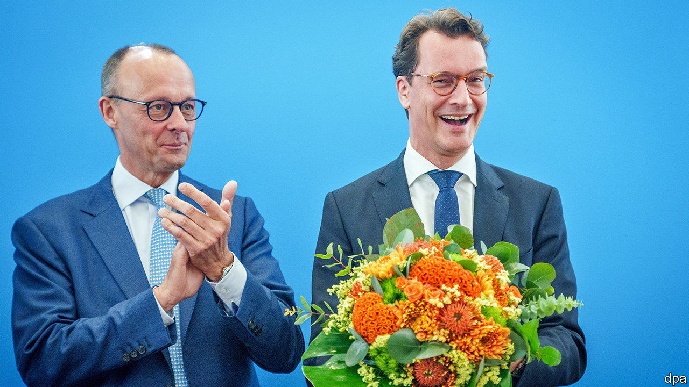
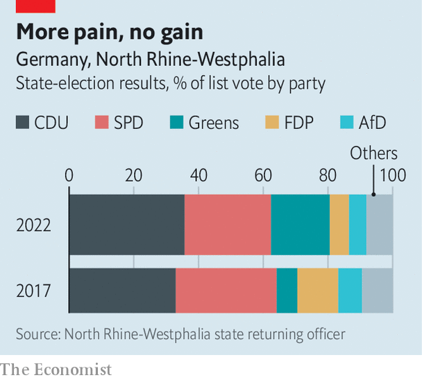

###### Another blow for Mr Scholz

# An upset in North Rhine-Westphalia unsettles Germany’s ruling coalition 

##### The Social Democrats did awfully; their Green partners did remarkably well 

 

> May 19th 2022 

The election-night party on May 15th in a tent in the garden of the headquarters of the Christian Democratic Party (cdu) in Düsseldorf, the capital of North Rhine-Westphalia (nrw), got so noisy that the office of public order had to intervene after locals complained. cdu members celebrated their unexpectedly strong showing at the state’s election with 500 litres of beer and very loud chanting. Hendrik Wüst, the usually stiff Westphalian who is the incumbent state premier, was dancing and chanting along.

Mr Wüst’s landslide surprised everyone. In the last polls before the vote the cdu and the Social Democratic Party (spd) were neck-and-neck. Yet the cdu ended up fully nine percentage points ahead, with 35.7% compared with 26.7% for the spd. The other big winners were the Greens, who tripled their share of the vote to 18.2%; the other big loser was the free-market Free Democratic Party (fdp), which saw its share halve, to just under 6%, compared with the election in 2017. 

The result is the second painful setback on consecutive weekends for Olaf Scholz, Germany’s chancellor, who campaigned hard for Thomas Kutschaty, the spd candidate for premier in nrw. On May 8th the spd suffered a humiliating defeat at state elections in Schleswig-Holstein, taking only 16% of the votes, the worst result in its history in the state (the fdp also lost votes, whereas the Greens won big). But the state election in nrw is far more significant than Schleswig-Holstein’s because nrw is the state with the biggest economy and the highest number of inhabitants, with a fifth of the entire population of Germany. 

 


“This will unsettle the coalition,” says Stefan Marschall of Düsseldorf University, referring to the “traffic-light” alliance Mr Scholz heads at the federal level of the spd, fdp and Greens. The Greens will be even more self-confident after such success in two state elections. And the fdp is likely to be more prickly, after faring poorly twice in a row. As for Mr Scholz, his authority at the head of his unwieldy coalition is certain to have been dented. Some analysts are already referring to him as a one-term chancellor.

The Greens have been the great beneficiaries of the alliance. Annalena Baerbock, the Green foreign minister, and Robert Habeck, the Green economy minister and vice-chancellor, are more popular than either Mr Scholz or Christian Lindner, the finance minister, who is leader of the fdp. Yet the Greens’ jubilation about their success in nrw has been muted. “They understand the explosive power of the election result,” says Klaus Schubert of Münster University. The coalition needs to benefit all three parties if it is to hold together.

Mr Lindner, who hails from nrw and led the local fdp at state elections there in 2012 and 2017, said the result was a “disastrous defeat” for his party. For a while the fdp even worried that it might not win 5% of the vote, the hurdle that must be crossed to secure any seats in the state parliament at all. The party has been the junior partner in Mr Wüst’s governing coalition. But Joachim Stamp, the local fdp leader, failed to excite voters.

The Greens are now the kingmakers in nrw, since the cdu and fdp no longer have enough seats to continue their governing alliance. They could join forces with the spd and the fdp for a local version of the national coalition; or form a red-green government. Yet most observers expect the Greens will team up with the cdu, again the largest party in the state. Hessen and Baden-Württemberg are both run by cdu-Green coalitions—and Schleswig-Holstein may be about to get one, says Frank Decker of Bonn University. The least likely potential government is a grand coalition of the battered spd and the cdu. Both parties have signalled little interest in such a combo. ■

