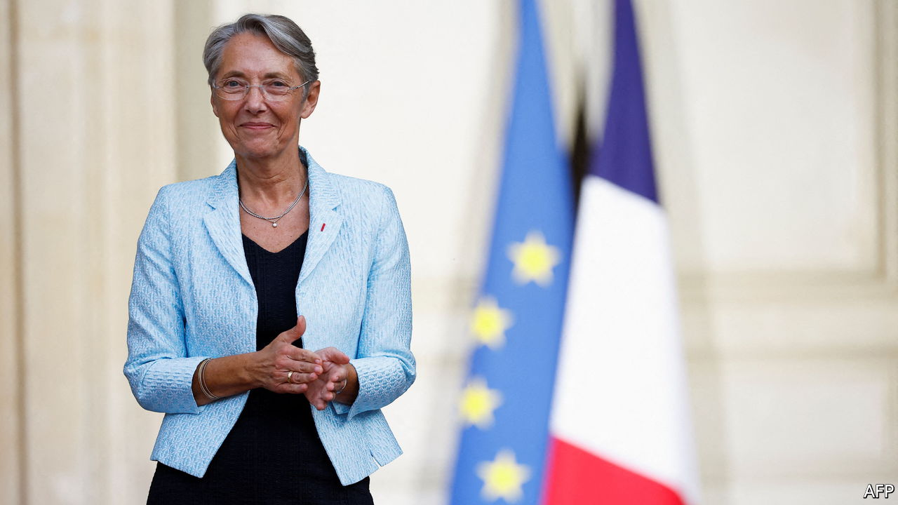

###### First Borne

# Meet Elisabeth Borne, France’s new prime minister 

##### Emmanuel Macron nods to the left, sort of, with her nomination 

 

> May 17th 2022 

In 2022 it ought to be unremarkable for a woman to be appointed to run a European government. Yet the nomination on May 16th of Elisabeth Borne as prime minister of France was anything but. It is the first time in 30 years that a woman has held the post, and only the second time ever. The previous one, Edith Cresson, appointed by François Mitterrand, did not last a year in the job. As Ms Borne took over from Jean Castex on the evening of her nomination, she dedicated her appointment to “all the little girls” in France, telling them to “follow your dreams”.

Such folksy utterances are atypical of Ms Borne. An engineer by training, and a career technocrat, the 61-year-old is better known as a no-nonsense details person who gets on with the job. Ahead of France’s  on June 12th and 19th, her immediate task will be to help win another majority for the centrist grouping led by , and to draw up plans to ease the soaring cost of living. An even trickier challenge will be to negotiate the pension reform that Mr Macron has promised for his second term, including a controversial rise in the pension age from 62 to 64 or 65.

Mr Macron has put her in the job in part because Ms Borne has shown that she can be an efficient negotiator. In a previous post as his transport minister, and as a former head of the Paris metro, she brought in a reform of the sncf national railways that included opening passenger transport to competition and ending special protected contracts for newly recruited railway workers. She may not have left the unions with warm, fuzzy feelings, but she got the reform through. Employment will also be near the top of her in-tray. Serving as Mr Macron’s labour minister, Ms Borne expanded apprenticeships and reformed the rules for unemployment benefits. Having already brought joblessness down from 9.2% to 7.1%, Mr Macron has promised to bring about full employment by the end of his second term.

Ms Borne’s nomination also brings a degree of political balance to the top of France’s government. Mr Macron was first elected in 2017 to govern “neither on the left nor the right”. Yet his two previous prime ministers, Edouard Philippe and Mr Castex, both came from the centre-right. Insofar as Ms Borne hails from the left, it is as a technocrat, not a politician. Like Georges Pompidou and Raymond Barre when they were appointed in the 1960s and 1970s, she has never held elected office, though she is running for parliament next month in Normandy. She has only the loosest of links to the now-moribund Socialist Party. Indeed, Jean-Luc Mélenchon, the hard-left leader, dismissed the notion that Ms Borne is from the left as “trickery”. 

Still, under the French system, where ministers pick civil servants to form a  of staff, Ms Borne has chosen to build a career on the left. Before joining Mr Macron in 2017 she worked for a succession of Socialist leaders. Her jobs included a spell as chief of staff to Ségolène Royal, a former environment minister, and a stint in charge of urban planning for Bertrand Delanoë, a former mayor of Paris. 

Besides pension reform, Ms Borne is also likely to get the job of overseeing “green planning”. During the presidential campaign, Mr Macron promised that this concept would underpin all policymaking during his second term. This idea remains vague, but the principle seems to be to appoint a powerful environment minister under Ms Borne to implement France’s transition to a greener economy. This may be Julien Denormandie, a close ally of Mr Macron and his outgoing farm minister.

Ms Borne’s is a decidedly unshowy appointment, and comes after three weeks of dithering by the re-elected Mr Macron. Nor does she exude the provincial warmth of the south-western Mr Castex. Yet for all their differences in style and temperament, the austere Ms Borne and the rugby-loving Mr Castex share one attribute essential to success under Mr Macron: neither of them steals the limelight from the president. And should the parliamentary election not turn out as planned, she could be gone in a month. ■

