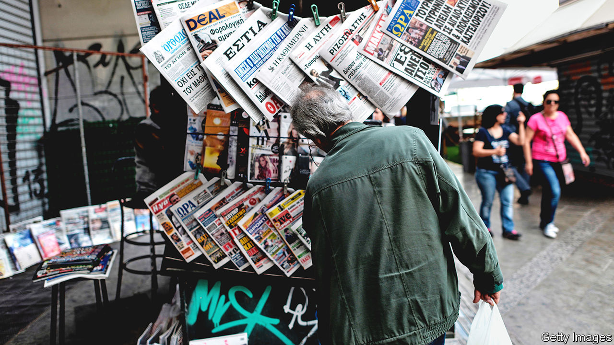

###### Hemlock for hacks

# Rows over press freedom overshadow Greece’s recent achievements 

##### Prison for “fake news”, and a reporter gunned down 

 

> May 19th 2022 

Greece’s centre-right government has done a fine job of polishing its image with tourists and investors since Kyriakos Mitsotakis took over as prime minister in 2019. The country’s ancient heritage, not least the invention of democracy, plays a big role in the messaging. But just as in the fifth century bc, freedom of speech matters too.

Greece tumbled 38 places this year in the World Press Freedom Index published by Reporters Without Borders (rwb), an ngo based in Paris. Ranking 108th (out of 180), the Greeks for the first time lagged behind all other eu countries as well as their Balkan neighbours.

A tweak to the penal code last year making journalists, editors and publishers liable to a prison term for spreading fake news is one reason for the Icarus-like plummet. Another is the unsolved murder of Giorgos Karaivaz, an investigative reporter gunned down more than a year ago outside his home.

The most recent cause for concern is the surveillance in 2020 and 2021 of Thanasis Koukakis, a financial editor probing possible collusion between local bankers accused of wrongdoing and public prosecutors and judges. The Citizen Lab, a Canadian cyber-watchdog, has confirmed that Mr Koukakis’s mobile phone was infected last year with Predator, a hacking software made by Cytrox, an Israeli-owned company based in North Macedonia. The software is similar to Pegasus, the Israeli spyware acquired by various repressive governments to eavesdrop on activists and other politicians. The government’s spokesman insists that the Greek authorities have not used it, and has also questioned the methodology employed by rwb in compiling its index. 

There are other worries. State hand-outs to cash-strapped websites and newspapers are restricted to pro-government media, says rwb; reporters covering ”pushbacks” of refugees from Aegean islands by the Greek coastguard are often harassed; journalists complain of being bullied on the phone by aides in the prime minister’s office.

The free-speech row is undermining the government’s impressive achievements elsewhere. Tourists are now flocking back after a two-year gap owing to covid-19. Greece attracted a record €5bn ($5.3bn) of foreign investment last year, with Amazon and Microsoft among the big-name firms setting up around the capital. And the cash is starting to flow from Greece’s €31bn share of the eu’s covid-recovery fund. An unhampered press has a crucial part to play in making sure all that cash is spent fairly and well. 

