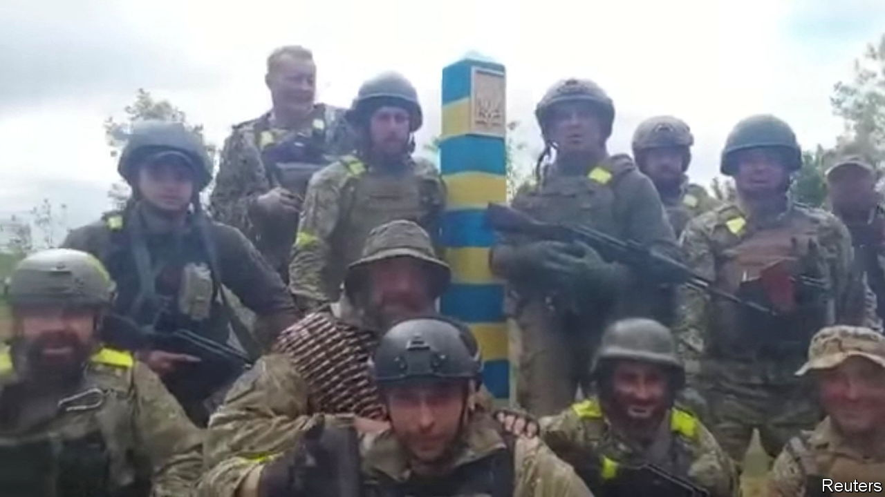
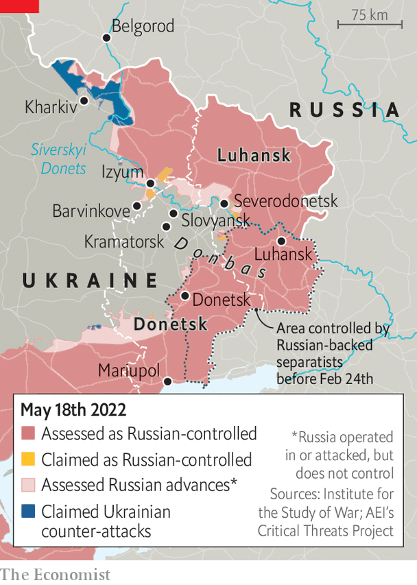

###### The relief of Kharkiv

# Russia’s invasion of Ukraine is running out of steam, again 

##### Ukrainian troops are counter-attacking. How far can they go? 

 

> May 16th 2022 

Eighty years ago the second Battle of Kharkov was raging in what was then the western Soviet Union. The Red Army had heroically driven the Nazi  back from the gates of Moscow. It gathered in a bulge west of Izyum, a town to the south of Kharkov, as Ukraine’s second city was then known. The subsequent Soviet offensive, launched on May 12th 1942, was a disaster. Soviet armies were driven back and encircled. Over 170,000 Soviet troops were killed. Nikita Khrushchev later focused on the battle when denouncing his tyrannical predecessor as Soviet leader. “This is Stalin’s military ‘genius’,” he sneered, citing the crude tactics of frontal assault. “This is what it cost us.”

The Russian army is once again gathered around Izyum. And once more it is in retreat from Kharkiv, as the city is now called, after another underwhelming campaign failed to take it. Ukrainian counter-attacks to the north and east of the city have forced the Russians back tens of kilometres, out of artillery range of the city and, in places, back to the border. It has been over a month since Russia, having abandoned its assault on Kyiv, launched a  in the east. The idea was to encircle Ukrainian troops in a large salient stretching from Izyum in the north to the city of Donetsk in the south, in part by driving south from Izyum.

 


There have been minor successes. Russia has now taken almost all of Luhansk province—it held only the southern part before the war—bar a salient around the well-defended city of Severodonetsk. It has also pushed south of Izyum, taking villages towards Barvinkove, an important rail junction, and the industrial cities of Slovyansk and Kramatorsk. Yet progress has been slow—one or two kilometres a day—and casualties heavy. The war is now dominated by , rather than swift mechanised offensives. Much of Donetsk province is still in Ukrainian hands, though its port city of Mariupol has now fallen to the Russians, bar the presence of a small number of fighters still hunkering down in the Azovstal steel works in the east of the city. On May 16th, an initial group of 264 fighters surrendered; others have since followed.

The Russians’ generally slow progress is no surprise. Conventional military theory says that attackers need a three-to-one advantage over defenders to break through defensive lines. Russia is far short of that. Its units are operating below their full strength, some severely so, despite efforts to coax ex-servicemen back into action with big pay packets. Even if Russian forces get as far as Severodonetsk, Slovyansk and Kramatorsk, the heavy casualties from urban warfare are likely to sap their capacity to fight yet further. 

Ukrainian forces are grimly confident. Their warplanes are active over Donbas, including Izyum itself, despite the proximity to Russian air-defence systems over the border to the east. In the past two weeks, Ukrainian drones and jets have also repeatedly struck Russian helicopters, landing craft and surface-to-air missiles on and around Snake Island, a tiny outcrop in the north-western corner of the Black Sea, near Odessa. And while Russia is struggling to replenish its forces, Western arms—including heavy artillery—are now flowing into Ukraine in useful quantities, with a lot more to come. On May 10th America’s House of Representatives approved a $40bn aid package for Ukraine which, once approved by the Senate where it is still pending, will bring the cumulative total of American support to $54bn.

Ukrainian forces are capable of “tactical manoeuvres”, like the operations around Kharkiv, says a Western official. But scaling this up along a front which stretches hundreds of kilometres in Donbas alone, and 1,300km in total—in other words, turning counter-attacks into a full-blown counter-offensive—will be a challenge. Russia’s woes in Ukraine have served as a reminder that war tends to favour the defender. If Ukraine were to attack dug-in Russian positions, it would find it harder going. For exactly that reason, Russian forces in Kherson, Mykolaiv and Zaporizhia provinces in southern Ukraine have been digging trenches and building concrete fortifications, according to the Institute for the Study of War, a think-tank. 

“Overall, the battle is finely balanced,” says the official. “Ukrainian personnel are highly motivated and highly experienced, and [deployed] in sufficient numbers to hold a defensive line—but perhaps don’t have the capabilities they might need.” Western weaponry has been abundant, but not decisive, so far at least. Russian forces, despite their heavy losses and tactical shortcomings, still “significantly overmatch the Ukrainians in terms of their overall capability”. That assessment was echoed on May 10th by Lieutenant-General Scott Berrier, the head of America’s Defence Intelligence Agency. “The Russians aren’t winning and the Ukrainians aren’t winning,” he said. “We’re at a bit of a stalemate here.” Ukrainians receive such pronouncements with scepticism. They have been underestimated before. ■


