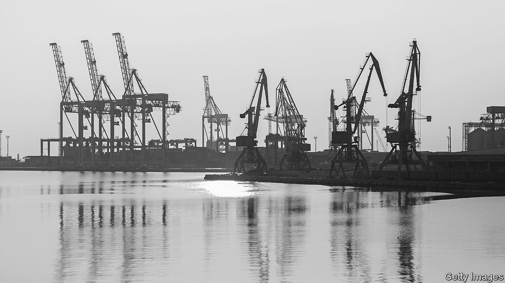
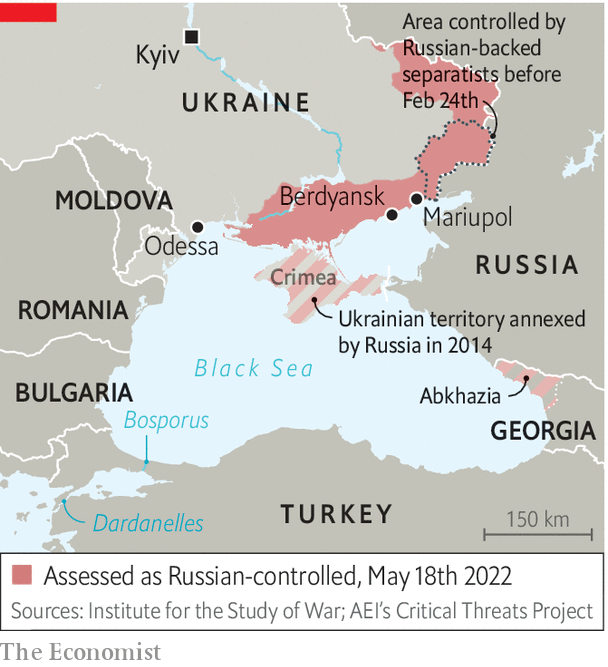

###### Re-opening Odessa

# Ukraine’s ports are worsening world hunger 

##### But there are few good options to get Ukrainian grain to global markets 

 

> May 18th 2022 

The fiasco of the Gallipoli campaign of 1915 was caused, in part, by a global food crisis. The Ottoman empire’s entry into the first world war, on Germany’s side, blocked grain exports from the Russian empire, which then encompassed Ukraine. By forcing open the passage between the Black Sea and the Mediterranean, Britain and its allies hoped to knock the Turks out of the war and restore Russian trade. That would help lower , and strengthen Russia’s weak finances. But the landings in the Dardanelles turned to disaster and the allies withdrew after a year.

A century on, the West faces a similar conundrum: how to get Ukraine’s vast food crop past Russia’s blockade to relieve global food shortages. Andrey Stavnitser, the owner of Ukraine’s largest private shipping-terminal operator, tis, says that Ukrainian grain silos are largely full, and there is not enough room for this year’s crop. “If we can’t store it, it will start rotting,” he says. Frustratingly, Russia is able to export its grain, including crops stolen from occupied land, from the Black Sea while Ukraine’s is shut in. “Unblocking Odessa is as important as providing weapons to Ukraine,” he says. 

The eu is seeking to expand alternative routes by rail and road. But these can take only a fraction of Ukraine’s exports. If the bulk of Ukraine’s grain is to get out, it must be by sea. But how? Some people are now exploring the idea of naval convoys to escort merchant vessels in and out of Odessa and nearby ports. Mr Stavnitser hopes for a un convoy led by Turkey. James Stavridis, nato’s former supreme allied commander, has suggested taking a leaf out of the operation by America and some allies to protect oil tankers in the Persian Gulf during the Iran-Iraq war of the 1980s. 

But James Foggo, the ex-commander of nato forces in the Mediterranean, argues the parallel is misleading. “The difference is: Iran was not a nuclear power. Russia is a nuclear power. Russia is a major power and there is a risk of escalation.” The tanker war was fraught; America’s warships were struck by Iraq and Iran and one of them mistakenly shot down an Iranian airliner. 

Convoys in the Black Sea face military, legal and political constraints. Begin with Russia’s “anti-navy”—the thicket of anti-aircraft, anti-shipping and electronic-warfare systems based in Crimea, which Russia annexed in 2014. This allows it to dominate much of the Black Sea from the land. And despite the , Russia’s flagship in the Black Sea, its naval forces remain powerful—including ships and submarines armed with Kalibr cruise missiles. Even if Russia shrinks from attacking convoys, says Michael Petersen of the us Naval War College, ships in port will be sitting ducks. Odessa is within range of Russia’s Bastion-b anti-ship cruise missiles in Crimea, he notes. 

Ukraine has heavily mined its waters to prevent a Russian amphibious assault. Odessa’s beaches are closed and guarded by soldiers in camouflaged outposts. The port, including its famous Potemkin Stairs, is off-limits. Russia has laid mines, too. About 80 foreign ships are now stuck in Ukrainian waters; some have been sunk.

“Mining is easy; de-mining is complicated,” notes a Western diplomat. Ukraine lacks the capacity to clear the necessary sea-lanes. Moreover, says another diplomat, “If things are de-mined for the purposes of letting the wheat out, but then Russians are allowed to sneak in and attack Odessa, that’s a problem.” As the , however, President Volodymyr Zelensky has told visiting American congressmen that arming Ukraine with more anti-ship missiles could allow de-mining to start.

 


Protecting convoys might require a substantial nato naval presence. This raises questions related to the Montreux Convention of 1936, which regulates shipping in the Turkish straits. Turkey has invoked Article 19, in effect barring passage to the navies of belligerent states—a move that affects Russia more than others. Turkey has informally told other countries not to deploy warships in the Black Sea. It could take such measures formally under Article 21 if it felt “threatened with imminent danger of war”.

The convention anyhow limits war vessels from non-littoral states, and how long they can stay in the Black Sea. A nato operation would thus require the frequent rotation of ships. Turkey is a nato member and faces no such limits. But its dealings with Russia are ambiguous: it has sold Ukraine the much-celebrated Bayraktar tb-2 combat drone, but has also declined to impose sanctions on Russia and has allowed oligarchs’ superyachts to shelter in its waters. 

The debate over convoys has echoes of the earlier one over imposing a  over western Ukraine: are nato allies ready to risk a direct fight with Russia? President Joe Biden said no to a no-fly zone. That would risk “World War III”, he said. Without American backing, it is hard to imagine others confronting Russia.

The faint hope is that international pressure, particularly from non-Western countries, may persuade Russia to relent. Some in the un think—or hope—that Vladimir Putin, its president, will not want to be accused of causing global hunger. António Guterres, the un secretary-general, has suggested a deal whereby Russia would allow food shipments out of Odessa in exchange for easing of sanctions on fertiliser exports from Belarus and Russia.

Many officials think Mr Putin is, if anything, even more determined to crush Ukraine economically given his failure to conquer it militarily. Western diplomats say reopening Ukrainian ports is not a practical option for at least six months. A Ukrainian one is blunter: “There is no point in escorting merchant ships if nobody is prepared to shoot back at Russia. The only answer is for us to defeat Russia.”

America, which currently holds the presidency of the un Security Council, is pushing for action on improving food security generally. The effort is intended in part to prove to fence-sitting countries that the war in Ukraine, and the economic disruption it is causing, should be blamed on Russia, not the West. 

Western countries may yet put forward a motion calling for the reopening of Odessa, if only to force Russia to use its veto. The un General Assembly, which includes all members, requires any country casting a veto to explain itself before the assembly within ten days. Russia may not care, says Richard Gowan of the International Crisis Group, a think-tank. “In some ways the greatest risk is that Russia says yes to reopening Odessa but then creates all manner of procedural obstacles.” ■


