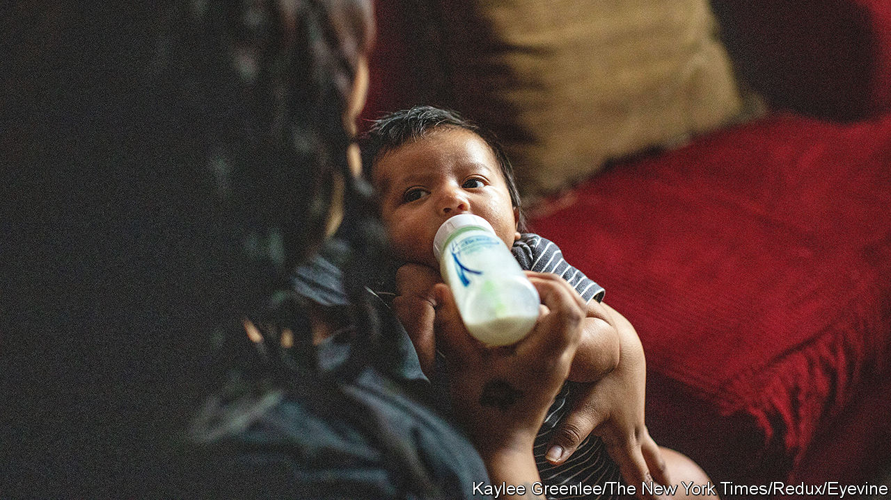

###### Powder keg

# A baby-formula shortage feeds criticism of corporate heft and price gouging 

##### The former is a valid concern. The latter is a misleading distraction 

 

> May 17th 2022 

Shoppers have become all too familiar with the fragility of supply chains. In America the latest product missing from supermarket shelves is infant formula. Whereas previous shortages, affecting everything from cars to couches, presented an inconvenience, a lack of nourishment for babies creates serious health risks. So the administration has swung into action. On May 16th the Food and Drug Administration (fda) said America would loosen restrictions on imports of formula. Two days later, President Joe Biden invoked the Defence Production Act to boost domestic production. 

There are several explanations for the shortage. The biggest problem has been a halt to production at a facility in Michigan since February, when officials began investigating infections in four babies possibly caused by its milk-based powder. A lack of packaging, delays to the import of ingredients and staffing vacancies have also contributed to the headache. As much as 43% of formula products were out of stock across America in early May, according to Datasembly, a data firm. 

Some politicians and analysts have also pointed to two deeper problems in the American economy supposedly exposed by the shortages: corporate concentration and price gouging. The former is a valid concern; the latter is a distraction.

Just four companies (Abbott, Gerber, Perrigo and Reckitt Benckiser) make nearly all of America’s formula. The production stoppage occurred at a factory owned by Abbott, which controls around 40% of the market. It is an illustration of how reduced competition, seen in about three-quarters of American industries over the past 30 years, can serve the economy poorly. 

Concentration in the formula market has been exacerbated by regulation. About 98% of formula consumed in America is made domestically because of the fda’s stringent approval process for foreign factories. And more than half is purchased through a nutrition programme for low-income families, which in turn buys from a single supplier in each state. In 2007 when California switched its contract from Abbott to Mead Johnson (now owned by Reckitt), Abbott’s market share there fell from 90% to 5%, while Mead’s rose from 5% to 95%. On May 13th a group of Democratic senators called for an antitrust review of the industry. If that were to happen, it would not solve the shortages at hand, but it could put the market on sounder footing.

More dubious are claims about the severity of price gouging. Mr Biden has asked the Federal Trade Commission to investigate whether “unscrupulous profiteers” were scooping up formula in shops and reselling it for hugely marked-up prices. And there have indeed been instances of such anti-social behaviour.

But for some in the Democratic Party, these allegations about pricing now fit into a broader narrative, that corporate greed lies at the root of high inflation. Elizabeth Warren, a Democratic senator from Massachusetts, and several colleagues introduced a bill on May 12th that would “prohibit...price gouging during all abnormal market disruptions”. They cited a study by the Economic Policy Institute, a left-wing think-tank, which argued that fatter profit margins have driven more than half of price rises since 2020. Mr Biden has also seized on greed as an explanation for high prices. On May 13th he tweeted that making the wealthiest companies pay “their fair share” would bring down inflation.

In theory the fiscal drag that would come from higher taxes without any offsetting increase in government spending could reduce inflation (as well as growth). But if corporate greed explains high inflation, why did so many prices only start to soar well after the pandemic began? It is not as if companies just discovered a love of profits. Jeff Bezos, the owner of Amazon, was right to criticise Mr Biden’s tweet as “misdirection”, accusing him of trying to muddy the water in the debate over prices. 

Indeed, something far more basic explains the run-up in inflation: a surge in stimulus-fuelled demand, compounded by disruptions to supply. For individual products the signal sent by higher prices is the most effective way to bring supply and demand back into balance. In the case of baby formula, it encourages domestic companies to make more and foreign producers to run the gauntlet of approvals. Much like formula itself, higher prices can play a part in healthy development. ■


