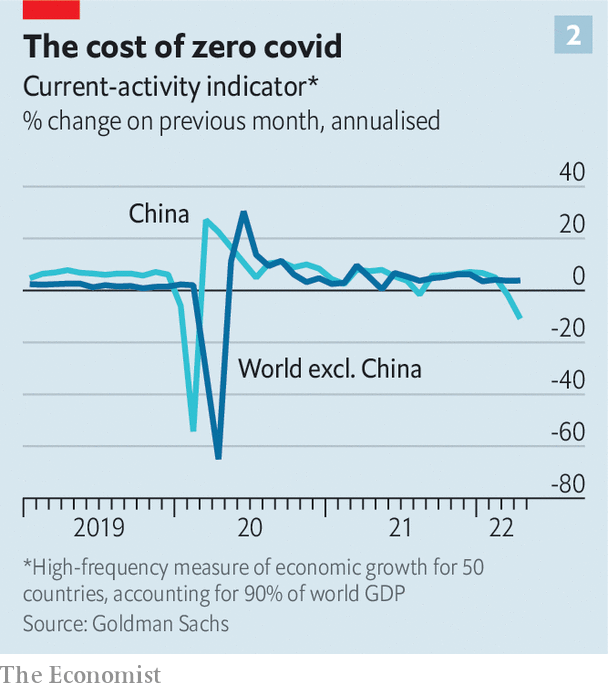

###### Recession watch

# Global growth is slowing, but not stopping—yet 

##### The Chinese and Russian economies, though, are probably shrinking 

 

> May 15th 2022 

Since 1900 the global economy has fallen into recession, as defined by a year-on-year decline in gdp per person, about once a decade on average. In 2020 the world experienced the deepest downturn since the end of the second world war. Just two years on, is ?

Worries are certainly mounting. The war in Ukraine has triggered  and energy prices, which have hammered households’ disposable incomes. Lockdowns in China are disrupting supply chains. And central banks are rapidly raising interest rates to tame inflation. 

Fears about the state of the world economy have jolted financial markets. In the past month  have fallen by more than a tenth. Risky assets, including tech stocks and cryptocurrencies, have taken a nasty blow. Economists, meanwhile, are steadily downgrading their forecasts for global growth. To what extent are recession fears already materialising? A look at the data gives grounds for cautious optimism—for now, at least. 

 


True, in many places people sound as though the recession is already here. Across the oecd, a club mostly of rich countries that accounts for more than 60% of global gdp, consumer confidence is now lower than it was when the coronavirus first struck (see chart 1). A gauge of American consumers’ sentiment constructed by the University of Michigan this month fell to its lowest level in a decade, according to a preliminary estimate. Respondents were gloomier about their own financial situations; fewer of them thought it a propitious time to buy durable goods, on account of high inflation. If consumers hold back from spending, the economy will slow. 

Yet, so far, what people say and what people do seem to be different things. Global restaurant bookings on OpenTable, a reservations website, are still above the pre-pandemic norm. In America retail sales are still increasing, and hotel occupancy continues to improve. A high-frequency measure of Britons’ spending habits, constructed by the Office of National Statistics and the Bank of England, shows little sign that people are holding back from social activities, or from purchases that could be deferred. 

Consumers are likely to be able to carry on spending for a while, even as inflation cuts into purchasing power. Households across the oecd are still sitting on roughly $4trn of savings (worth 8% of gdp) accumulated during the pandemic, according to our estimates. And, contrary to what is commonly supposed, not all that money is in the hands of the rich. In America the bank accounts of low-income families were still 65% fatter at the end of last year than in 2019. 

Businesses too look resilient for now.  of some retailers. But the oecd’s measure of business confidence remains solid. Data from Indeed, a jobs site, suggest that vacancies in rich countries may have stopped increasing—but they are still plentiful. There remains appetite for investment, too. Analysts at JPMorgan Chase, a bank, reckon that global capital spending rose by 7.6% in the first three months of the year, compared with the same period the year before—twice its rate towards the end of 2021.

 


Some countries do look weak. Goldman Sachs, another bank, produces a “current-activity indicator”, a high-frequency measure of economic growth based on a combination of surveys and official data. The Russian economy has sharply slowed since Western countries slapped on sanctions in response to the invasion of Ukraine. And in , where the government’s zero-covid strategy has led to the strictest lockdowns since early 2020, the economy may well be shrinking (see chart 2). 

 


But most places are stronger. Adapting a weekly gdp series for 45 countries, including India, Indonesia and the g7, produced from internet-search data by Nicolas Woloszko of the oecd, we estimate that global gdp growth has remained steady in recent weeks (see chart 3). Overall, Goldman’s measure of economic activity is lower than it was in early 2021, when economies reopened, but it is still respectable. 

The data could yet shift—if Russia turns off the gas taps to Europe, China tightens lockdown restrictions further or central banks are forced to raise interest rates faster than they currently expect. When America’s labour market has been this tight in the past, notes JPMorgan, a recession has tended to follow in “the medium term”. But the 12th global recession since 1900 does not seem to have started just yet. ■


