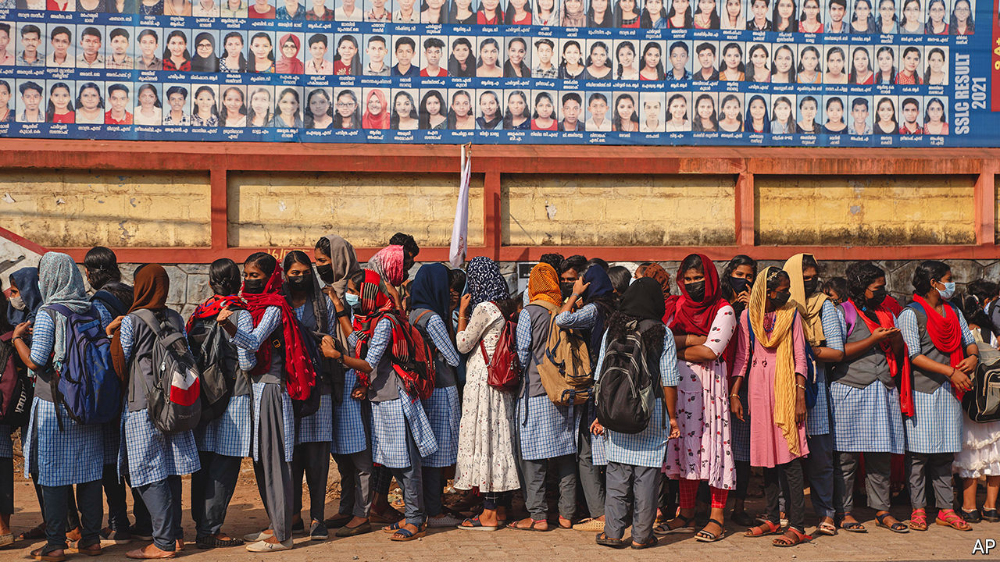

###### Half-measures

# India’s once-vaunted statistical infrastructure is crumbling 

##### The reasons are worryingly familiar 

 

> May 19th 2022 

The modern Indian state has a proud statistical heritage. Soon after the country gained independence in 1947, the government resolved to achieve its development through comprehensive five-year plans. The strategy, though economically inadvisable, nonetheless required the creation of a robust data-gathering apparatus. In 1950 PC Mahalanobis, the leading light of Indian statistics, designed the National Sample Survey, which sent staff to the far corners of the vast country to jot down data regarding its mostly illiterate citizens. The survey’s complexity and scope seemed “beyond the bounds of possibility”, reckoned one American statistician. 

Of late, however, admiration has been replaced by alarm. India’s statistical services are in a bad way. Across some measures, figures are simply not gathered; for others, the data are often dodgy, unrepresentative, untimely, or just wrong. The country’s tracking of covid-19 provides a grim example. As the pandemic raged across India, officials struggled to keep tabs on its toll. Officially, covid has claimed more than half a million lives in India;  excess-deaths tracker puts the figure far higher, between 2m and 9.4m. India’s government has also hampered efforts to assess the pandemic’s global impact, refusing at first to share data with the World Health Organisation (who), and criticising its methods. 

The preference for flattering but flawed figures is pervasive. In education, state governments regularly ignore data showing that Indian children are performing woefully in school and instead cite their own administrative numbers, which are often wrong. In Madhya Pradesh, a state in central India, an official assessment showed that all pupils had scored more than 60% in a maths test; an independent assessment revealed that none of them had. Similarly, in sanitation, the central government says that India is now free of open defecation, meaning that people both have access to a toilet and consistently use it. Anyone who takes a train out of Delhi at dawn and looks out of the window, however, might question the claim. 

When it comes to poverty, arguably India’s biggest problem, timely figures are not available. Official estimates are based on a poverty line derived from consumption data in 2011-12, despite the fact that more recent but as yet unpublished numbers exist for 2017-18. By contrast, Indonesia calculates its poverty rate twice a year. India’s government explains its approach by pointing to discrepancies between recently gathered data and national accounts statistics—but many suspect the true reason is that newer data would probably show an increase in poverty.

In some cases, flawed data seem more a problem of methodology than malign intent. India’s gdp estimates, for instance, have been mired in controversy ever since the statistics ministry introduced a new series in 2015 (a change that was in the works before the current government entered office). Arvind Subramanian, a former government adviser, calculated that the new methodology overestimated average annual growth by as much as three to four percentage points between 2011-12 and 2016-17. Although current advisers insist that the official methodology is in line with global standards, other studies have also found problems with the calculations. 

The erosion of India’s statistical infrastructure predates the current government, but seems to have grown worse in recent years. Narendra Modi, the prime minister, has previously bristled at technocratic expertise and number-crunching. (“Hard work is more powerful than Harvard,” he said in 2017.) 

India’s data woes are also troubling for what they suggest about the ability of the state to provide the essential public services needed to foster long-run growth. The statistics ministry, short of staff and resources, is emblematic of the civil service. Data-gathering has become excessively centralised and over-politicised. A National Statistical Commission was set up in 2005 and tasked with fixing India’s data infrastructure. But its work has been complicated by turf wars and internal politics; it is widely considered toothless, including by former members. 

Who’s counting

The situation is not hopeless, perhaps because of statisticians’ past efforts. According to the World Bank, the quality of Indian data is still in line with that of other developing countries, even after years of neglect. India’s new goods-and-services tax and digital-welfare infrastructure are yielding troves of data. Leading Indian statisticians argue that an empowered regulator could fix existing problems. 

State governments and departments are also doing their bit. Telangana, a southern state, is investing in its own household surveys, for example. India’s rural-development ministry recently released a dataset covering 770,000 rural public facilities, such as schools and hospitals, inviting data whizzes to peruse the figures and suggest improvements. Civil society is also responding. During the pandemic, dozens of volunteers co-operated to produce granular, timely estimates of covid cases. New technologies could help gather data quickly and cheaply, over phones and tablets.

Yet in a modern economy there is no substitute for high-quality national data-gathering. The sunlight provided by accurate figures is often unwelcome for an increasingly autocratic government: transparency invites accountability. But neglect of the statistical services also leaves Indian policymakers flailing in the dark, unable to quickly spot and respond to brewing economic and social problems. ■


