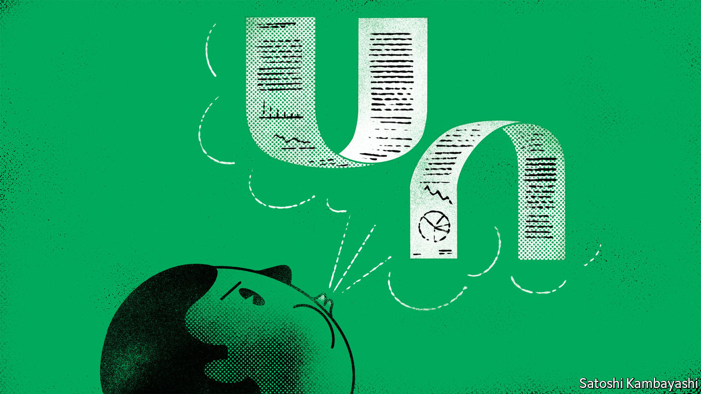

###### Buttonwood

# Is China “uninvestible”? 

##### The word has become more common even as the world has become more investible 

 

> May 19th 2022 

Few chinese companies have caught the imagination of global investors like its technology firms. But they have suffered a catastrophic spell. At one point in March, they had lost about 70% of their value since their 2021 peak. On March 14th Alex Yao of JPMorgan Chase and his team published a set of gloomy reports on internet firms such as Alibaba, an e-commerce giant, Dingdong, an online grocer, and Netease, a maker of computer games. Mr Yao fretted about the industry’s prospects over the next year, owing to China’s economic slowdown, its regulatory crackdown on tech and its souring relations with the West. Some of the reports even described the sector as “uninvestible”. 

That word caused a bit of a furore. JPMorgan lost its position as the lead underwriter for the listing in Hong Kong of Kingsoft Cloud, a Chinese cloud-computing firm. According to Bloomberg on May 10th, editors at the bank had in fact tried to replace “uninvestible” with the less apocalyptic “unattractive”. But some mentions slipped past them.

Using the word was undiplomatic. But was it justifiable? It has been bandied around quite freely in recent years, applied not just to the usual suspects, such as Russian or Iranian assets fenced off by financial sanctions, but also to less obvious candidates. Jim Cramer of cnbc, a tv channel, described oil stocks as uninvestible in January 2020, calling them the new tobacco. Not so long ago, the same was said about big banks and the whole of southern Europe.

The odd thing is that the word has become more common even as the world has become more investible. Thanks to financial innovation and globalisation, far-flung assets are far easier to buy than they used to be. Back in 1988 msci’s emerging-markets equity index included only ten countries with a combined market capitalisation of just over $50bn. The index now includes 24 countries with a market value of $6.9trn. At the end of last year the value of global investible assets reached a record high of $179trn, according to State Street, an asset manager. That is equivalent to 186% of world gdp in 2021, up from 116% in 2000.

Even in his unedited report, Mr Yao did not argue that it was impossible to hold Chinese internet stocks. Indeed, he advised global investors to remain “neutral” on 11 of them. So what was on his mind? He worried that the depositary receipts of some internet firms might be delisted from American exchanges, because China has been reluctant to open the books of its auditors to American regulators. This in itself would not make them uninvestible, because the shares of most of these companies can also be bought in Hong Kong, as Mr Yao himself pointed out. But he saw this regulatory row as the latest manifestation of the geopolitical risks faced by China, which became more salient after Russia invaded Ukraine. 

Because of these risks, he said, global investors were likely to shun Chinese internet firms over the next 6 to 12 months, however cheap they became. During this “stage”, he argued, these stocks could no longer be valued by simply projecting their earnings and cashflow. Only after foreign investors had departed would his “valuation frameworks” regain relevance, presumably because the remaining investors (locals and China specialists) would be less sensitive to Sino-American relations. He recommended revisiting the sector only when this new stage arrived.

When would that be? The answer, he admitted, depended on “many unpredictable factors outside our forecast capability”. It turns out he was right. In a more upbeat report on May 16th he said that the second stage had already arrived, well ahead of schedule. Thanks to some encouraging noises on the delisting dispute, Mr Yao believes that geopolitical risks have receded enough to give his valuation framework some purchase once again. He duly offered new, higher price targets for 18 companies. 

His editors were, then, right that “uninvestible” was the wrong word. “Unanalysable” would have been better, if even uglier. It is not that Chinese internet stocks could not be bought, merely that they could not be valued using Mr Yao’s preferred framework, which could not accommodate geopolitical risk. Unfortunately, few assets these days are entirely free of such risks. Anyone taking a view on commodity prices (and thus on inflation, and therefore interest rates) is also taking a view on war and peace. If more investible assets are not to become unanalysable, stockpickers may have to invest in a broader view of the world. 


