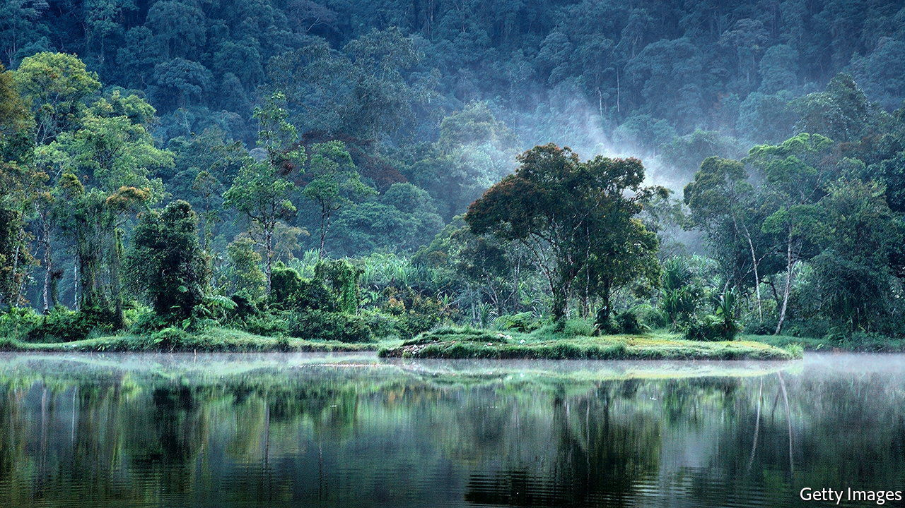

###### Carbon sinks

# Offset markets struggle in the face of surging commodity prices 

##### Prices of carbon offsets are too low 

 

> May 19th 2022 

The loamy soil and dense jungle of the Sumatran rainforest in Indonesia can store an average of 282 tonnes of carbon dioxide per hectare. If a group of climate-conscious airline passengers were to find a hectare of such forest at risk of being cut down for palm oil and were able to stop that happening, they would offset the amount of greenhouse gases emitted by 175 passengers flying, economy class, from London to New York and back.

Demand for such carbon offsets is forecast to rocket over the next couple of decades, as businesses attempt to make good on their promises to reach net zero carbon emissions. Last year an estimated $1bn was spent on offsets. McKinsey, a consultancy, predicts that the size of the market could expand by a factor of 15 by 2030 and 100 by 2050. Although a few projects use novel technology to suck carbon dioxide out of the air altogether and store it underground, most offsets promise to subsidise renewables or pay for carbon sinks, such as forests, to be restored or preserved. Such “nature-based” offsets can include protecting wetlands in Colombia, or restoring peatland in Scotland.

But the market is not working. The price of a carbon offset is far too low. The opportunity cost of leaving land uncultivated is rising. A hectare of Sumatran rainforest, for instance, could produce around 2.5 tonnes of palm oil a year, and palm-oil prices have risen to $1,520 a tonne, from around $1,000 a year ago. But the price of nature-based offsets has fallen this year, to $10 per tonne of carbon dioxide, according to contracts traded on the Chicago Mercantile Exchange. 

Deforestation remains economically rational. Because a palm-oil plantation still captures around 170 tonnes of carbon dioxide per hectare, leaving the land uncultivated offsets only 112 tonnes. An offset price of $10 means that, if the accounting is done properly, selling offsets yields revenue of only $1,120—not enough to compensate for the potential loss of about $3,800 in annual sales of palm oil. At current prices, says Ariel Perez of Hartree Partners, a trading firm, the only agricultural activity that is less profitable than preserving forests is harvesting rubber in West Africa. For as long as the price of an offset remains below $20, cattle farming in the Amazon will remain attractive. 

Why has the price of offsets fallen? Some cap-and-trade schemes, in which companies must buy permits for their emissions, allow for a certain amount of emissions to be offset. By and large, however, offsets are not required by regulation. Firms and individuals seeking to reduce their carbon footprints choose to buy them, meaning that the demand for offsets is largely driven by ethical or public-relations imperatives. As the war in Ukraine began and attention turned away from climate change, offset prices declined. 

Another problem is that there are few internationally agreed rules for offsets. A report published earlier this month by Carbon Direct, a consultancy, said that “the voluntary carbon market largely consists of projects of questionable quality.” A surplus of older and less reliable offsets hangs over the market, depressing prices. 

It is not possible to truly know what would have happened had an offset not been paid for. “Most projects over-report and some don’t reduce emissions at all,” says Barbara Haya of the University of California, Berkeley. “It’s really hard for people to know what is real and what isn’t.”

Some attempts are being made to bring clarity. Proposals from the Integrity Council for Voluntary Carbon Markets, an independent committee, are expected later this year. They are likely to emphasise the need for “additionality”, meaning that the reduction in emissions claimed must be a direct result of the offset. Paying for green-energy installation, for instance, would not count as a genuine offset if the project were viable without the offset payment. Nor would a forest that was never going to be cut down in the first place. Checking that offsets meet the criterion, though, will remain a daunting task. ■


