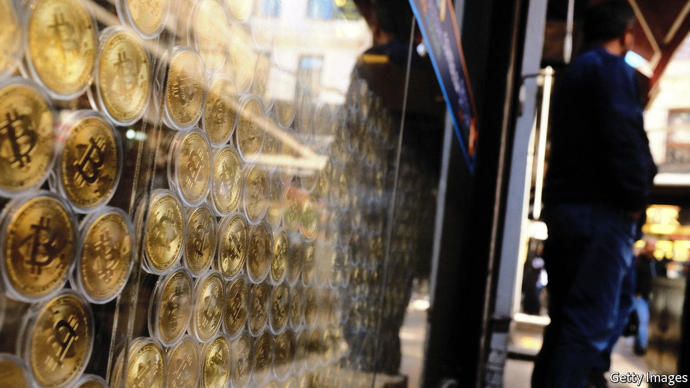
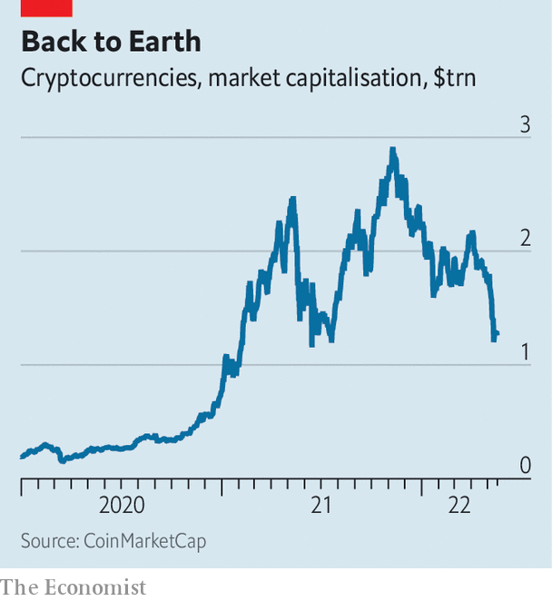
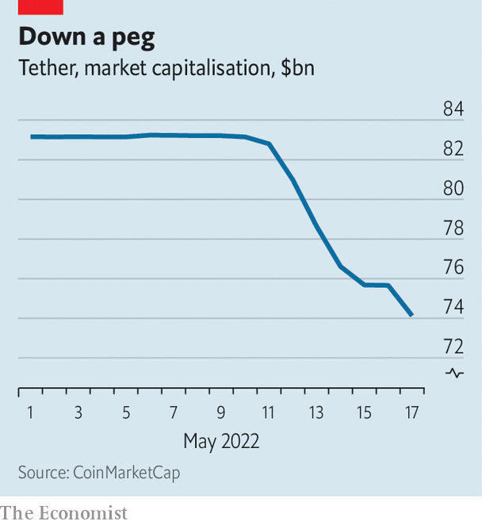

###### The infrastructure cracks

# Why crypto’s bruising comedown matters 

##### It has prompted flight from some stablecoins into others 

 

> May 19th 2022 

It has been a vicious year for financial markets, and more punishing still for crypto assets. The market capitalisation of crypto has slumped to just $1.3trn, from nearly $3trn in November. On May 18th bitcoin traded at around $29,000, a mere 40% of its all-time high in November; the price of ether, another cryptocurrency, has collapsed just as spectacularly. Six months ago Coinbase, an exchange and the leading crypto-industry stock, was worth $79bn. Now it is valued at just $14bn, and the firm is “reassessing its headcount needs”. 

The sell-off comes as the Federal Reserve begins raising interest rates. Tech stocks, high-yield bonds and other risky assets have also swooned. But crypto’s bruising comedown is interesting for a deeper reason: it has exposed weaknesses in the plumbing of the system. 

The problems lie with the market for stablecoins, a type of cryptocurrency that is pegged to another currency, often the dollar. Added together all stablecoins, the largest of which are tether and usd coin (usdc), are worth around $170bn. These act as a bridge between conventional banks, where people use dollars, and the “on-blockchain” world, where people use crypto. The biggest such coins are also used by exchanges as a base for trading between cryptocurrencies.

From May 9th, terra, then the fourth-largest stablecoin by market capitalisation, began to unravel. The implosion put pressure on tether, which is meant to be pegged one-for-one with the dollar. On May 12th its price dipped to 95 cents. Some $9.1bn in tether has since been redeemed for cash. The technology (and the jargon) associated with crypto may be newfangled, but to students of financial history, these events look familiar. They resemble the confidence crises that precede bank runs. 

 


Every stablecoin has a mechanism to maintain its peg. The simplest (and safest) method is to hold a dollar in a bank account, or in safe, liquid assets like Treasury bills, for every stablecoin token. The token can be traded freely by buyers and sellers; when a seller wants to offload their stablecoin they either sell it on the open market, or redeem it for its dollar value from the issuer, who then destroys the token. usdc and tether use versions of this method.

Others, like terra, are called “algorithmic stablecoins”, because they use an automated process to support the peg. Their main distinguishing feature, however, is in how they are backed. Terra is backed by luna, a cryptocurrency issued by Terraform Labs, which also runs terra. The idea was that holders of terra could always redeem it for one dollar’s worth of newly minted luna. On May 5th, when luna was trading at $85 a piece, that meant a terra holder could redeem it for 0.0118 lunas. If for some reason terra was trading at less than $1, arbitrageurs could swoop in, buy a terra, redeem it for luna and sell that for a profit.

That system worked as long as luna had some market value. But on May 9th the price of luna began to slide. And that in turn put pressure on terra’s peg—causing a rush to redeem. The supply of luna ballooned. On May 10th 350m tokens existed. By May 15th 6.5trn did. As the price of luna collapsed, terra also went into free fall. Its price is now hovering at around 10 cents. Luna is worthless. 

 


Do Kwon, the founder of Terraform, has tried to resuscitate terra. He has turned the blockchain off and on again, “burned” tokens and attempted to split the blockchain. But nothing has worked so far. 

Terra’s implosion has had wider and more worrying repercussions: it has prompted flight from tether. Those fleeing may have felt anxious about the lack of detail regarding tether’s backing. The company once said it backed its tokens with “us dollars”, a claim New York’s attorney-general said in 2021 was “a lie”. Now the firm says its tokens are “backed 100% by Tether’s reserves”. This appears to be some mix of cash, Treasuries and corporate debt, but the company has refused to disclose the details, claiming that its asset mix is its “secret sauce”. 

As with many past bank runs, where depositors fled to safety, holders have sold off terra and tether and rushed to tokens perceived to be of higher quality. One example is usd coin, which holds only cash or Treasuries, and publishes regular audited reports to that effect. Dai, another stablecoin backed by crypto and managed by algorithms, has managed to maintain its peg. 

Still, that other stablecoins have survived might be small comfort if tether does not. If tether really is backed by illiquid assets, or perhaps assets that have fallen in value this year, then the more some holders redeem its tokens, the less remains in the pot for others. The implosion of the world’s biggest and oldest stablecoin would be much more catastrophic than was terra’s. Tether is not only a financial bridge between crypto and conventional money—ie, dollars in bank accounts—but also between all kinds of crypto pairs that are traded on exchanges. The three biggest and most liquid cryptocurrency pairs on Binance, the biggest exchange, for instance, are bitcoin and tether; ether and tether; and Binance’s own stablecoin, busd, and tether.

Tether redeems only its big users, who are pulling $100,000 or more from it at a time, and even then at its discretion. Nonetheless, redemptions have continued apace over the past week. The loss of the peg on May 12th was a reflection of the stinginess of that system. Smaller holders who wanted out had to sell the token on the open market. The stablecoin has not fully recovered its peg. For a year it traded at or above $1; since May 12th, it has traded slightly below it. Crypto’s most important bit of plumbing is still leaking. ■


