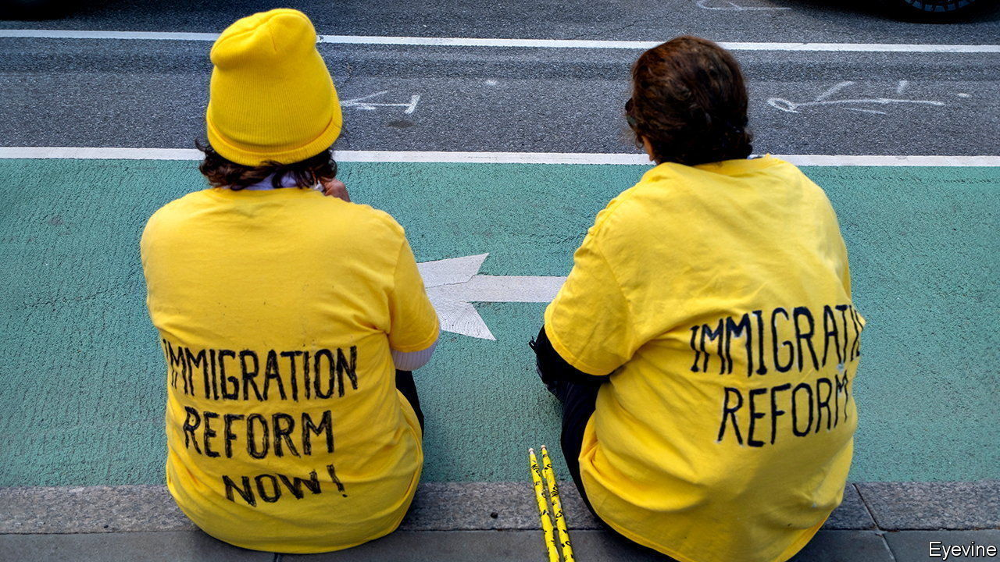

###### State of disarray

# America’s states are drifting apart over illegal immigration 

##### Deepening fissures over the treatment of illegal immigrants 

 

> May 19th 2022 

Congressional dysfunction can cause chaos in America. Look at illegal immigration, where the law strands 10.5m unauthorised migrants in limbo, with little chance of deportation or the legal status that confers the right to work. In the absence of legislation, presidents oscillate wildly. Barack Obama sought to declare almost half of the unauthorised population exempt from deportation and eligible to work. Donald Trump turned the screws the other way, and tried deterring migrants by heartlessly separating parents from children.  is facing dissent from Democrats fearful of Republican attacks if, as planned, he ends a pandemic-response measure called Title 42 on May 23rd. This lets American border police expel asylum-seekers and other migrants on public-health grounds. 

America’s federalist system wisely leaves much room to the states to act as laboratories. But state experimentation on immigration has gravitated to the extremes. In some Republican states the aim seems to be cruelty for its own sake. , the governor of Texas, has suggested that the Supreme Court should reverse precedent and remove the obligation to educate illegal children, as if that would do anybody any good. 

Democratic states, by contrast, have opted to spend money. They are expanding  for their illicit residents. New York, which in 2019 began issuing driving licences to residents in the state illegally, set up a $2.1bn fund to provide unemployment benefits and pandemic relief. Three years ago California expanded Medicaid, the government health-insurance programme for the poor, to include young irregular residents. Its governor, Gavin Newsom, wishes to offer the programme to all, regardless of immigration status. 

America is an outlier. In Europe and elsewhere access to benefits is limited to citizens or legal immigrants—who often have to wait for several years to be eligible. You would not expect Bavaria to sponsor Syrian migrants that the German interior ministry had turned away, or councils in London to offer housing benefits to adults who are in Britain illegally. It is Congress’s lack of will to deal with illegal immigration in America that explains the urge in California and New York to do something about their permanent shadow-class. Despite vigorous efforts, one-tenth of California’s non-elderly population lacks health insurance. Of that group, the illegal immigrants account for 40%.

Alas, these efforts are likely to be yet another stop-start measure. Because most federal laws ban spending on illegal residents, states must fund the expanded services without federal subsidies. At present, their budgets are swollen by a strong recovery and overgenerous federal funding during the pandemic. In a recession, when budgets are squeezed, such spending is likely to come under political attack. Democrats have long maintained, correctly, that unlawful immigrants by and large work hard and pay taxes, but receive few benefits. That line will be harder to sustain as these programmes grow—to the relish of the nativist right, who will deem their warnings vindicated.

Only Congress can sort out the confusion of half-built border walls, seesawing presidential decrees and contradictory state regimes. Immigration reform, with an orderly path to legal residency for those who pay taxes and do not commit crimes, was once a bipartisan pursuit. It has been forgotten amid the  of the Republican Party. Some Democratic senators, like Bob Menendez and Catherine Cortez Masto, remain committed to the idea of trading a route to citizenship for stronger border security and faster immigration courts, which today are overwhelmed. The party’s left has turned instead to daydreaming about abolishing America’s immigration authority. The pity is that a labour shortage makes this an especially propitious time for mending the system. 

When the federal government works, it establishes a legal floor of rights and obligations that states cannot fall below, but can choose to exceed. On ,  and immigration, however, it is failing. In its place, Democratic and Republican states are looking ever more balkanised and the courts are filling the vacuum, creating confusion and uncertainty. 

In 1858, as American states began dividing over slavery in the run up to the civil war, Abraham Lincoln warned that: “A house divided against itself cannot stand. I believe this government cannot endure permanently half-slave and half-free.” This isn’t 1858 and immigration isn’t slavery. However America’s fissures are running alarmingly deep. ■

