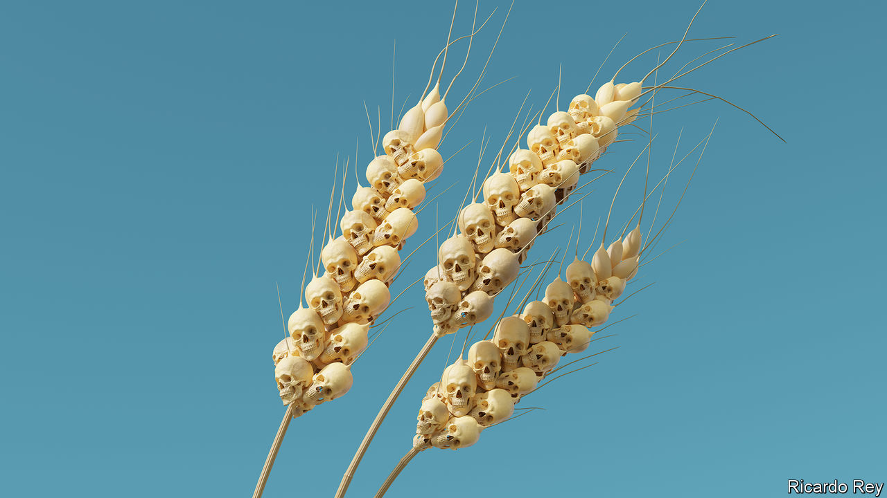

###### War and farming

# The coming food catastrophe 

##### War is tipping a fragile world towards mass hunger. Fixing that is everyone’s business 

 

> May 19th 2022 

By invading ukraine, Vladimir Putin will destroy the lives of people far from the battlefield—and on a scale even he may regret. The war is  weakened by ,  and an . Ukraine’s exports of grain and oilseeds have mostly stopped and Russia’s are threatened. Together, the two countries supply 12% of traded calories. Wheat prices, up 53% since the start of the year, jumped a further 6% on May 16th, after India said it would suspend exports because of an alarming heatwave.

The widely accepted idea of a  does not begin to capture the gravity of what may lie ahead. António Guterres, the un secretary general, warned on May 18th that the coming months threaten “the spectre of a global food shortage” that could last for years. The high cost of staple foods has already raised the number of people who cannot be sure of getting enough to eat by 440m, to 1.6bn. Nearly 250m are on the brink of famine. If, as is likely,  and supplies from Russia and Ukraine are limited, hundreds of millions more people could fall into poverty. Political unrest will spread, children will be stunted and people will starve.

 Mr Putin must not use food as a weapon. Shortages are not the inevitable outcome of war. World leaders should see hunger as a global problem urgently requiring a global solution.

 supply 28% of globally traded wheat, 29% of the barley, 15% of the maize and 75% of the sunflower oil. Russia and Ukraine contribute about half the cereals imported by Lebanon and Tunisia; for Libya and Egypt the figure is two-thirds. Ukraine’s food exports provide the calories to feed 400m people. The war is disrupting these supplies because Ukraine has mined its waters to deter an assault, and Russia is blockading the port of Odessa.

Even before the invasion the World Food Programme had warned that 2022 would be a terrible year. China, the largest wheat producer, has said that, after rains delayed planting last year, this crop may be its worst-ever. Now, in addition to the , the world’s second-largest producer, a lack of rain threatens to sap yields in other breadbaskets, from America’s wheat belt to the Beauce region of France. The Horn of Africa is being ravaged by its worst drought in four decades. Welcome to the era of climate change.

All this will have a grievous effect on the poor. Households in emerging economies spend 25% of their budgets on food—and in  as much as 40%.  bread provides 30% of all calories. In many importing countries, governments cannot afford subsidies to increase the help to the poor, especially if they also import energy—another market in turmoil. 

The crisis threatens to get worse. Ukraine had already shipped much of last summer’s crop before the war. Russia is still managing to sell its grain, despite added costs and risks for shippers. However, those Ukrainian silos that are undamaged by the fighting are full of corn and barley. Farmers have nowhere to store their next harvest, due to start in late June, which may therefore rot. And they lack the fuel and labour to plant the one after that. Russia, for its part, may lack some supplies of the seeds and pesticides it usually buys from the European Union. 

In spite of soaring grain prices, farmers elsewhere in the world may not make up the shortfall. One reason is that prices are volatile. Worse, profit margins are shrinking, because of the surging prices of fertiliser and energy. These are farmers’ main costs and both markets are disrupted by sanctions and the scramble for natural gas. If farmers cut back on fertiliser, global yields will be lower at just the wrong time. 

The response by worried politicians could make a bad situation worse. Since the war started, 23 countries from Kazakhstan to Kuwait have declared severe restrictions on food exports that cover 10% of globally traded calories. More than one-fifth of all fertiliser exports are restricted. If trade stops, famine will ensue.

The scene is set for a blame game, in which the West condemns Mr Putin for his invasion and Russia decries Western sanctions. In truth the disruptions are primarily the result of Mr Putin’s invasion and some sanctions have exacerbated them. The argument could easily become an excuse for inaction. Meanwhile many people will be going hungry and some will die. 

Instead states need to act together, starting by keeping markets open. This week Indonesia, source of 60% of the world’s palm oil, lifted a temporary ban on exports. Europe should help Ukraine ship its grain via rail and road to ports in Romania or the Baltics, though even the most optimistic forecasts say that just 20% of the harvest could get out that way. Importing countries need support, too, so they do not end up being capsized by enormous bills. Emergency supplies of grain should go only to the very poorest. For others, import financing on favourable terms, perhaps provided through the imf, would allow donors’ dollars to go further. Debt relief may also help to free up vital resources.

There is scope for substitution. About 10% of all grains are used to make biofuel; and 18% of vegetable oils go to biodiesel. Finland and Croatia have weakened mandates that require petrol to include fuel from crops. Others should follow their lead. An enormous amount of grain is used to feed animals. According to the Food and Agriculture Organisation, grain accounts for 13% of cattle dry feed. In 2021 China imported 28m tonnes of corn to feed its pigs, more than Ukraine exports in a year.

Immediate relief would come from breaking the . Roughly 25m tonnes of corn and wheat, equivalent to the annual consumption of all of the world’s least developed economies, is trapped in Ukraine. Three countries must be brought onside: Russia needs to allow Ukrainian shipping; Ukraine has to de-mine the approach to Odessa; and Turkey needs to let naval escorts through the Bosporus. 

That will not be easy. Russia, struggling on the battlefield, is trying to strangle Ukraine’s economy. Ukraine is reluctant to clear its mines. Persuading them to relent will be a task for countries, including India and China, that have sat out the war. Convoys may require armed escorts endorsed by a broad coalition. Feeding a fragile world is everyone’s business. ■


