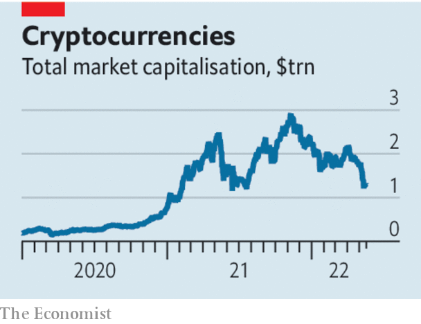

###### The tide goes out

# The cryptocurrency sell-off has exposed those swimming naked 

##### And investors are beginning to discriminate 

 

> May 18th 2022 

Financial aphorisms are trotted out by investors in every financial cycle. Think of “Buy the rumour, sell the fact”, or “Markets can stay irrational longer than you can stay solvent”. These sayings have staying power because they often ring true. Today, amid a general market rout, cryptocurrency assets are collapsing in value, and the aphorism of the moment is “When the tide goes out, you find out who is swimming naked”. 

The  has been brutal. In November the market value of cryptocurrencies was almost $3trn. That fell to $2trn by mid-April before plunging by another 35% to just $1.3trn now. Bitcoin has briefly dipped below $29,000, its lowest since late 2020. Crypto’s detractors have long argued that it is useless—unless you are a money-launderer or con-artist—and predicted its demise. The crash will convince many that they are right. In fact the picture is rather different: a sorting process is under way, as the  are exposed, while other bits prove more resilient. 

The crypto collapse is part of that broader slump.  is forcing central banks to tighten monetary policy, triggering a sell-off in riskier or long-dated assets. After a heavy sell-off on May 18th, the tech-heavy nasdaq index is down by 29% from its high. The s&amp;p 500 index has shed “just” 18%. 

 


However crypto is top of the list of speculative assets receiving a drubbing. The sell-off has exposed glaring weaknesses. Consider terra, an “algorithmic” , whose value is backed by another asset, supposedly making it dependable. On paper, users could redeem $1 of terra for $1 worth of another cryptocurrency, luna, which would be issued to meet demand. But luna’s price began to slide in early May, putting pressure on the terra peg. There was a rush to redeem. As luna’s supply ballooned, its price collapsed. On May 10th 350m luna tokens existed; now 6.5trn do. At its peak, luna was worth $40bn and supported $18bn of terra. Now it is worthless, and terra is trading at 10 cents. In hindsight the scheme looks mad.

At the other end of the spectrum is usdc, a stablecoin backed by cash and short-dated Treasury bills which publishes audited financial statements each month. It has done fine. So has dai, another stablecoin that is backed by crypto and run by algorithms. It has a decent degree of transparency and holds at least 1.5 times as much backing as it needs. The supply of the cryptocurrencies it relies on—usdc and ether—is independently controlled. 

In the middle of these two extremes is tether, the biggest stablecoin, which briefly dipped below its par value of $1 per token on May 12th. It says it is backed by assets like cash, Treasuries and corporate debt, but its disclosure is awful. Tether refuses to reveal the precise asset mix, claiming this is its “secret sauce”. It has previously been fined by New York’s attorney-general for misleading investors. As the broader market sell-off in the past weeks has intensified, its holders have rightly grown nervous. Since it slipped from its peg, tether holders have redeemed about $9bn-worth of tokens, approximately 10% of the total.

Investors are now doing what they are supposed to: penalising instruments that are fundamentally flawed or issued by organisations that are badly run. Yet the sell-off has sparked renewed calls for the government to step in. Consumers are in danger of being ripped off. And volatility could yet spill over into the conventional financial system. For example, tether is a key part of the crypto-plumbing and the most liquid base currency for trading between other crypto assets, and between crypto and conventional ones. If it failed the fallout would be bigger. 

Some critics would like the crypto system banned; others would like it heavily regulated, just as banks are; still others want regulation but fear that this might be interpreted as an official endorsement. The trouble is that a draconian crackdown would put at risk the benefits that crypto eventually promises, including new financial products that bypass stodgy banks; innovations in property rights; and the possibility of a less centralised financial system. 

So what should governments do? The best path would be to accelerate the process of sorting that is under way. Key to this is more reliable information so that retail users and institutions can guard more effectively against fraud. In particular, stablecoins should be forced to disclose their backing—what the assets are, where they are held and who controls them. Some crypto ventures based outside America are beyond easy reach of its regulators, but Uncle Sam could require the big crypto exchanges in America, which are already regulated, to flag which tokens have met disclosure standards. The saying that springs to mind is “Help the market sort the wheat from the chaff”. ■

