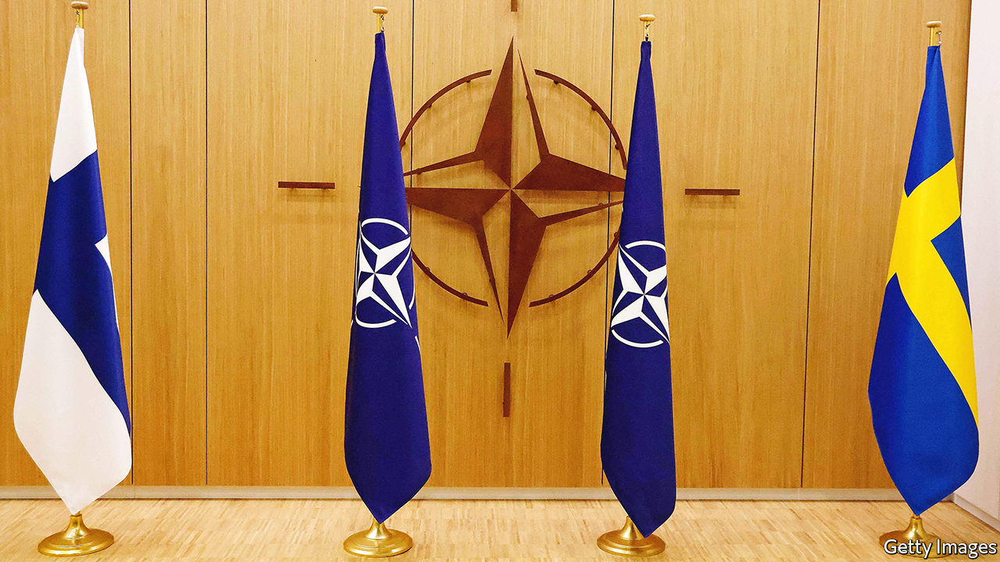

###### The meaning of membership

# Why NATO should swiftly admit Sweden and Finland 

##### Vladimir Putin has only himself to blame if his neighbours seek protection from his aggression 

 

> May 19th 2022 

For finland and Sweden to  to the anti-nato arguments of Russia’s president, Vladimir Putin. Two countries that are proud of their long history of military non-alignment think the risk of antagonising their neighbour to the east is outweighed by the security they will gain. It is the direct result of the , which Mr Putin ordered ostensibly to forestall nato’s expansion. 

 and  submitted their applications on May 18th. Despite Turkey’s stalling tactics, over Kurdish militants and possibly American fighter planes, their admission is likely. They will bring formidable capabilities in Arctic warfare and, in Finland’s case, the largest artillery force in Europe. Membership will more than double the length of nato’s border with Russia. It will also make the Baltic states easier to defend.

Mr Putin’s regime has responded by cutting electricity supplies to Finland and threatening “military-technical” action, whatever that is supposed to mean. He is not the first Russian leader to object to enlargement. In the 1990s Boris Yeltsin complained when members of the old Warsaw Pact applied to join the alliance. Over the years this hardened into the line of argument cited by Mr Putin as justification for invading Ukraine.

Russia’s president says that enlargement breaks an undertaking that James Baker, then America’s secretary of state, gave the Soviet Union in February 1990. Many Western commentators argued that enlargement was unwise, because Russia would feel threatened. The West had other ways to enhance security, such as the Partnership for Peace, which sets out to strengthen relations between the alliance and non-members.

These arguments do not stand up. Mr Baker was speaking about eastern Germany. His words were overtaken by the collapse of the Warsaw Pact nearly 18 months later. nato and Russia signed an agreement in 1997 that did not contain any restriction on new members, though enlargement had been discussed. The Czech Republic, Hungary and Poland joined almost two years later. The undertaking that has been violated is Russia’s pledge to Ukraine not to use economic or military coercion, given in 1994 when it surrendered the nuclear weapons based on its soil. 

In fact nato has every right to expand. Under the Helsinki Final Act of 1975, signed by the Soviet Union, countries are free to choose their own allies. The Warsaw Pact suffered grievously under Soviet rule. Why would its ex-members not seek a haven? For many years Finns and Swedes mostly opposed joining nato. This shifted after the invasion of Ukraine in February. Indeed, the right for sovereign countries to determine their own destinies is one of the many things currently at stake in Ukraine.

But was nato expansion wise? A spiral of mutual suspicion between Russia and nato clearly exists, but to blame nato expansion for triggering it is scarcely credible. Mr Putin has increasingly used nationalism and Orthodox religion to shore up his rule. He needs enemies abroad to persuade his people that they and their civilisation are under threat. That is why he seized territory in Georgia in 2008 and in Ukraine in 2014. Besides, Russia has a long history as an imperial power. Like most declining empires, it was likely to resist as its periphery drifted off, regardless of nato expansion.

Finland and Sweden are both long-term members of the Partnership for Peace. If one of them were attacked, nato would have no commitment to intervene. Nor would American and British nuclear weapons cover them. Their choice to join nato suggests that the partnership was not able to cope with Russian aggression. Likewise, denying central and eastern Europe membership of nato would have created a security vacuum that Russia may very well have been tempted to fill. Finland and Sweden are right to have concluded that Mr Putin is dangerous and unpredictable—not because of nato, but in the way he governs Russia. Their applications should be rapidly approved. ■


