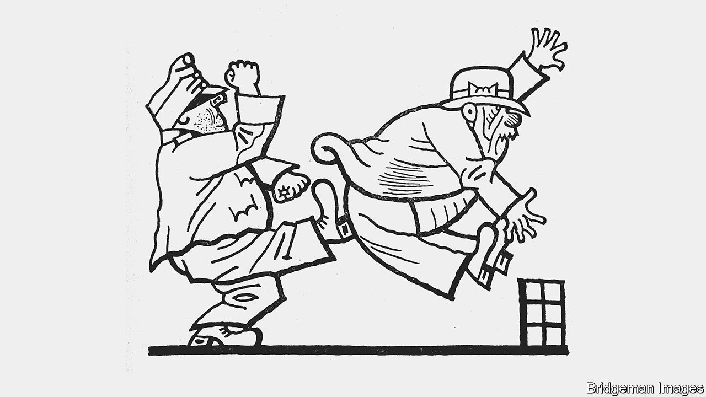
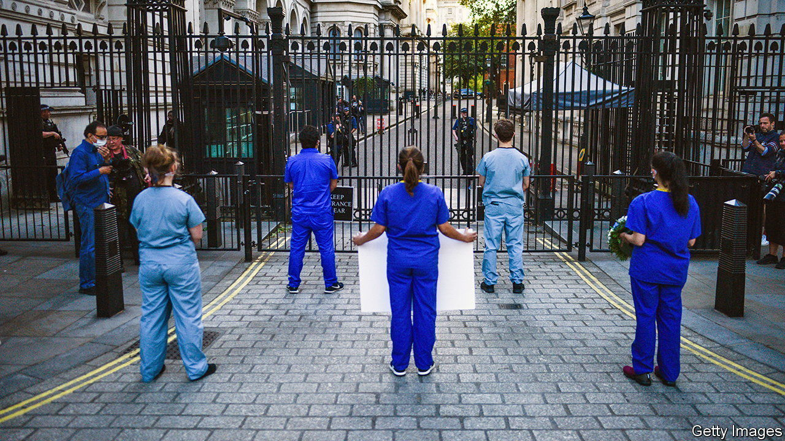

###### On abortion, Jaroslav Hasek, doctors, Celtic, staff meetings

# Letters to the editor 

##### A selection of correspondence 

 

> May 19th 2022 


America’s thorniest issue

Another way of looking at Justice Samuel Alito’s leaked draft on abortion is that it is a rare instance of judicial restraint (“”, May 7th). He is considering relinquishing power back to the states on a policy issue, rather than taking power. The constitution contains no clear law on abortion. In , Justice Harry Blackmun had to torture the words of the constitutional text in order to find a federal right to an abortion. It was an egregious act of judicial activism. Justice Alito is simply showing that the issue is complex and returning the question to the people to decide through state legislatures. 

Nor is it the case that the court only rules on policy where Congress has failed to. In the case of gay marriage, Congress had taken clear action by passing the Defence of Marriage Act, which defined marriage as between a man and a woman. The court overturned that democratic decision. Again, there was no provision on a policy (gay marriage) in the constitution. 

lantz mcclain


Many religious people believe that sexual relations are solely for the purpose of bearing children. Must women now live according to the religious views of others in states that want to ban abortion? One fact shown throughout history is that women cannot be stopped from having abortions. They can only be stopped from having safe ones. 

margot champagne


Every issue for the Democrats has become a life or death battle leading to an ideological purge. How about concentrating on protecting women’s right to choose before expecting people to learn 74 genders? Meanwhile, the Democrats’ focused political opponents have scored their biggest win in generations. Give the states the right to make policy on abortion, win the state legislatures in elections and codify abortion into law.

andres satizabal


 


“” (May 7th) suggested that abortion is illegal in Canada later in pregnancy. In fact, Canada does not have any laws on abortion. The procedure is legal at any age for any reason, including sex selection or eliminating those with potential disabilities. Some hospitals and doctors have their own limits and will refuse to carry out very late-term abortions, but there is no legal reason why they could not. 

We are working to introduce an International Standards Abortion Law, which would ensure that all women who seek an abortion have access to independent counselling, are given a 48-hour waiting period between requesting an abortion and the actual procedure and which would restrict abortion after the first trimester. Around 70% of Canadians are opposed to abortion in the third trimester. Surely the time has come for Canada to extend at least some protection to the unborn. 

anna nienhuis

Policy analyst

WeNeedaLaw


You briefly mentioned the citizens’ assembly in Ireland. Around 100 demographically diverse people were convened. They studied all sides of abortion and generated recommendations that closely reflected the will of the population at large. These were put to a referendum; it was ultimately the voters who chose to overturn the Irish constitution’s ban on abortion. 

dennis merritt


This issue will not be resolved and this cancer in our body politic will not be removed until the people of the United States express their will through a democratic process. 

robert degavre


 


Sit down and have a drink

It was a pleasure to read your brief description of Jaroslav Hasek’s “The Good Soldier Svejk”, a classic of Czech literature (“”, May 7th). It’s true: Russian soldiers invading Ukraine could do worse than read it. They could also learn from Hasek’s version of the theory that commerce civilises people. When asked whether he likes the “heathen” Turks, Palivec, the coarse barkeeper at a local pub, says that he welcomes all guests to his establishment, no matter the nationality: “For us tradesmen there’s no politics. Pay your beer, sit down and shoot the breeze, that’s my policy!” Obviously, the Russian version would go with vodka.

christian schubert

German University in Cairo

 


Levelling-up for doctors

Your article on the challenges faced by Britain’s medical profession (“”, April 30th) did not mention the fact that 90% of consultations by patients are with their general practitioner (gp) rather than a hospital doctor. Yet gps receive less than 10% of the National Health Service’s budget. In March 2022 alone over 30m appointments were made with primary care. gps help keep people out of hospital, for a fraction of the cost of a visit to the emergency department. 

A large part of the difficulties faced by our hospital colleagues is because of a workforce crisis in primary care. A third of gps are thinking of retiring or leaving the profession in the next five years. Boris Johnson’s plan for a net gain of 6,000 more gps by 2025 is, so far, nothing but hot air. Having spent most of my career in secondary care I know full well the difficulties faced by my colleagues, and the effect this has on patients. But the problem cannot be solved unless primary care becomes a priority. 

dr tanya dhir

gp trainee


 


Celtic roots

“The desire to create heroic origins of language” (, April 23rd) may also explain our ignorance of Celtic contributions to Spanish and other Romance languages. The assumption seems to be that degenerate Latin alone eventually created the members of that language family. Yet many of the local populations that were conquered by Rome spoke unwritten Celtic languages, which surely interbred with Latin to create Romance languages. 

One of my favourite examples of the evolution of a Celtic word is , a generic word for girls, into Colleen as a girl’s proper name. I like to imagine a Viking father who settled down in Britain with a Celtic wife hearing her call for  and misunderstanding it as the girl’s name. And  means river in Celtic. So the River Avon is the River River. 

richard waugaman

Clinical professor of psychiatry

Georgetown University

 

 


Yakety yak

I loved Bartleby’s fun take on innovations for the workplace (). Could we please also have a countdown clock for in-person forums too? Having sat through countless staff meetings over the past 30 years I know this would be widely appreciated. Since there are no microphones to turn off at employee gatherings, it could play music when the speaker’s time is up. 

The Black Eyed Peas’ “Shut Up” comes to mind. If that is too rude these lyrics in “Show Me” from “My Fair Lady” would work: “Words, words, words, I’m so sick of words”.

suroor alikhan


