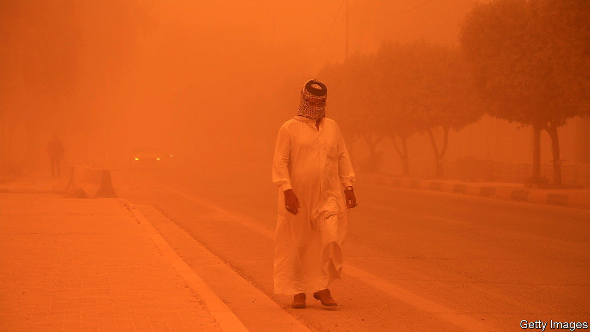
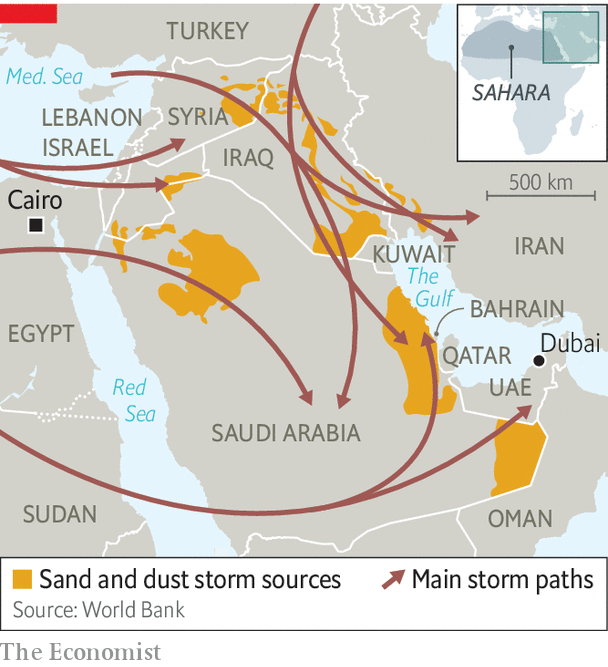

###### Sand by me

# Dust is a growing threat to lives in the Middle East 

##### As a dry region gets drier, sandstorms grow more frequent 

 

> May 19th 2022 

The sky turned orange and the hospitals turned frenetic. Thousands of Iraqis descended on emergency rooms complaining that they could not breathe. Some had to be put on respirators. Businesses told workers to stay at home, schools closed and airports cancelled flights. Life came to a halt amid a swirl of dust.

Such scenes have occurred almost weekly in Iraq since April. In decades past, two or three big sandstorms were expected every year. This spring Iraq has already logged at least eight, including the one on May 16th that put some 4,000 people in hospital. Two people died across the border in Syria. The more frequent storms are causing misery for millions and doing billions of dollars in damage.

Sandstorms have always been a fact of life in the region. The Sahara, the world’s largest hot desert, and the Arabian one, which ranks third, are not short of sand. Every year the wind whisks some 60m tonnes of Saharan dust as far away as the Caribbean. In some countries dry, dusty winds are common enough to merit a name. Gulf Arabs have the , which sweeps in from the north-west. Towering skyscrapers in cities like Dubai and Manama, Bahrain’s capital, vanish behind a curtain of grit. Egyptians call theirs , Arabic for 50, since it tends to blow for about that many days in spring. It can bring enough of the Sahara to blot out the sun.

 


Scientists say dust storms are complex and poorly understood, but their main causes are natural. In 2015 many people blamed a fierce summer storm in the Levant on Syria’s civil war, thinking that armoured cars bouncing through fields kicked up enough dust to blanket the region. Researchers at Princeton University later cited a more prosaic mix of unusual heat and wind—gusts, not gunners. 

Still, people plainly contribute to the problem. Demand for water is making an arid region even drier. A World Bank study in 2019 found that human actions, such as over-exploiting rivers and lakes, produce a quarter of the Middle East’s dust. Iran has drained wetlands for farming. Saddam Hussein dried out the marshes of southern Iraq to punish their inhabitants. Turkish dams on the Tigris and Euphrates mean drier riverbeds downstream. 

All of this means more dust to be swept up by the wind. The shrinking of the region’s meagre forests because of fires and logging means there is less vegetation to hold it back. Syria, for example, has lost an estimated 25% of its woodland since 2001, most of it to summer blazes. Climate change will exacerbate the problem.

For those lucky enough to be healthy and indoors, sandstorms are a nuisance. Newcomers to Cairo who leave a window open to catch the spring breeze soon learn a gritty lesson. For those who work outside, they make life intolerable. Delivery drivers venture forth like extras from a Mad Max film, kitted out in scarves and ski goggles.

Some studies have found that more than 10% of Saudis have asthma, a high prevalence caused at least partly by dust. Sandstorms bring tiny particles that travel deep into the lungs. The World Health Organisation says any more than five micrograms per cubic metre is unhealthy. Qataris breathe in eight times that. The World Bank estimates that air pollution causes 30,000 premature deaths a year in the Middle East—and rising. 

Economic costs will mount, too. Workers stay at home. Crops are buried under dust. Airports often cancel flights. The un puts the direct economic cost in the Middle East at $13bn a year, with indirect costs many times bigger. Occasional dust storms are an inconvenience; more frequent ones will be a pestilence. ■


