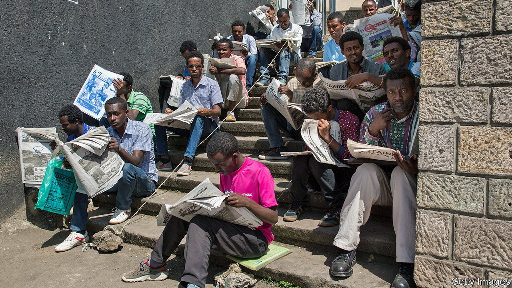

###### Back into the shadows

# Ethiopia’s civil war has been bad news for press freedom 

##### The government arrests and sometimes beats journalists who criticise it 

 

> May 19th 2022 

Does reporting a crime make you an accomplice to it? If the crime is rebellion in Ethiopia, then the answer is yes. That, at least, appears to have been the logic of Ethiopian officials when they arrested Amir Aman, a journalist working for the Associated Press, an American news agency, last year. Amir had interviewed members of the Oromo Liberation Army. For this he spent 125 days behind bars. State television accused him and his colleagues of “promoting” terrorists. If found guilty they could face 15 years in prison. 

Just a few years ago Abiy Ahmed, Ethiopia’s prime minister, seemed to be ushering in a more hopeful era for journalists in a country notorious for ill-treating them. In 2019, a year after he took office, Abiy boasted that there were no reporters behind bars for the first time in over a decade. He hosted World Press Freedom Day and declared an “unwavering commitment” to free expression. He lifted blocks on hundreds of websites and television channels. A blossoming of new media outlets followed. Yet last year Ethiopia was ranked among the worst jailers of journalists in Africa, trumped only by Egypt and Eritrea, the gulag state next door. 

Since the start of a civil war 19 months ago, at least 44 Ethiopian journalists have been arrested or detained. The most recent was Gobez Sisay, who was abducted from his home on May 1st. Others, such as Lucy Kassa, who was beaten by security agents last year, have been hounded out of the country. Foreign journalists have been expelled. Among these is Tom Gardner, s correspondent, who was also beaten by police while covering the war last year. Ethiopian authorities, accusing him of following a “mistaken approach” to reporting, withdrew his media accreditation on May 13th and soon after gave him 48 hours to leave the country. His “mistake” appears to be that he reported accurately on the war, and on atrocities by both sides.

Local reporters describe a climate of fear. “For weeks I couldn’t even trust my shadow,” says an Ethiopian freelance journalist who was arrested and beaten by police. These days he mostly writes anonymously and avoids going out in public. “The government has its own definition of a journalist,” he explains. “Whoever goes against it is not one.” 

