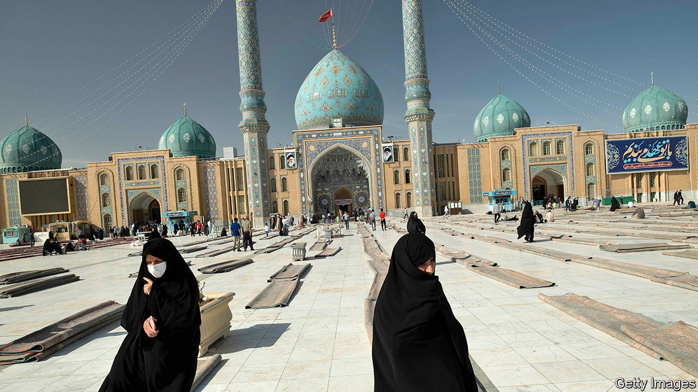

###### Mahdi mania

# Iranians yearn for a messiah. The ayatollahs are worried 

##### Twenty holy pretenders appeared in one month in the city of Qom 

 

> May 19th 2022 

His eyes lack the “hidden imam’s” blinding radiance. His beard is wispy. His favourite pastime is pumping iron. And despite a recruitment drive in the mosques he has admitted (on social media) that he has no followers. But it doesn’t take much to unnerve Iran’s ruling ayatollahs. As soon as the clerical novice from Nishapur in eastern Iran proclaimed himself the mahdi, they had him jailed as a “false messiah”. He could be charged with leading people astray, inciting public animosity and spreading corruption on earth. The last of those crimes carries the death penalty. 

Of all Iran’s many dissidents, few scare the theocrats more than messianic pretenders. Belief in the advent of the “twelfth imam”, who mainstream Shias believe went into hiding in the ninth century and will return at the end of time, helped them mobilise people to overthrow the shah in 1979. They are loth to see the same happen to themselves. 

But as Iran’s domestic malaise deepens, the search for a saviour is growing. “Internally the regime has never struggled more,” says Yaser Mirdamadi, an Iranian cleric and scholar in exile. “Sanctions, dictatorship, despair and disunity are perfect conditions for mahdis.” 

Damagingly for the regime, many ardent millenarians come from its disillusioned inner core. “The feeling of an end of times is strongest among those who had faith in the regime but now feel it has failed,” says an adviser to Mahmoud Ahmadinejad, a former president. 

Qom, a shrine city and seat of leading clerics, produces the most pretenders. According to a recent police report, it once had 20 in a month. They included a would-be twelfth imam and several , or gates, who prophesy his advent. Elsewhere there was a would-be wife of the messiah, who attracted numerous suitors. Young novices continue to gravitate towards Hassan al-Yamani, an Iraqi cleric who disappeared soon after proclaiming himself the mahdi in 2003. 

The regime is trying to reassert its monopoly over mahdism, says Saeid Golkar, the author of a report on the phenomenon issued by the Middle East Institute, a Washington-based think-tank. Iran’s supreme leader, Ayatollah Ali Khamenei, often invokes the mahdi’s name, sometimes in tears. Toadies call Mr Khamenei the , or the mahdi’s rightful deputy.

Agents responsible for catching pretenders are called “the unknown soldiers of the last imam” (and not, as you might imagine, “mahdi grasses”). Mr Mirdamadi cites a prophetic , or saying, that calls clerics “the worst of creatures”. “When the imam comes, the clerics will deny him,” he chuckles.

