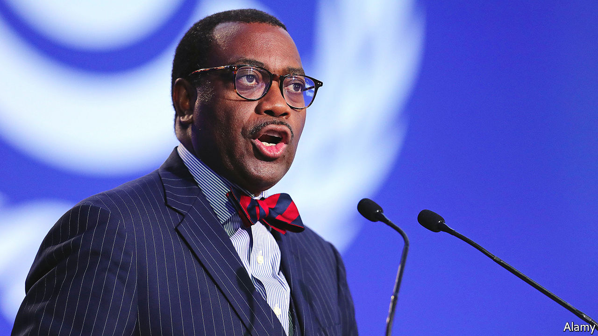
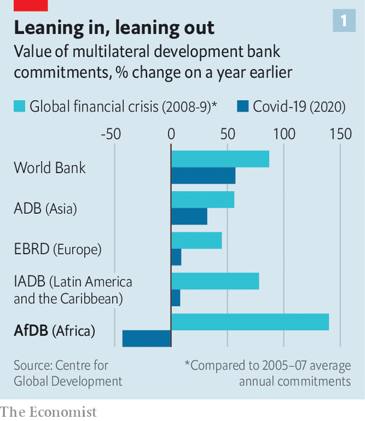
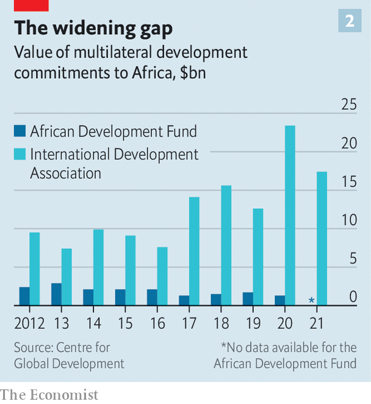
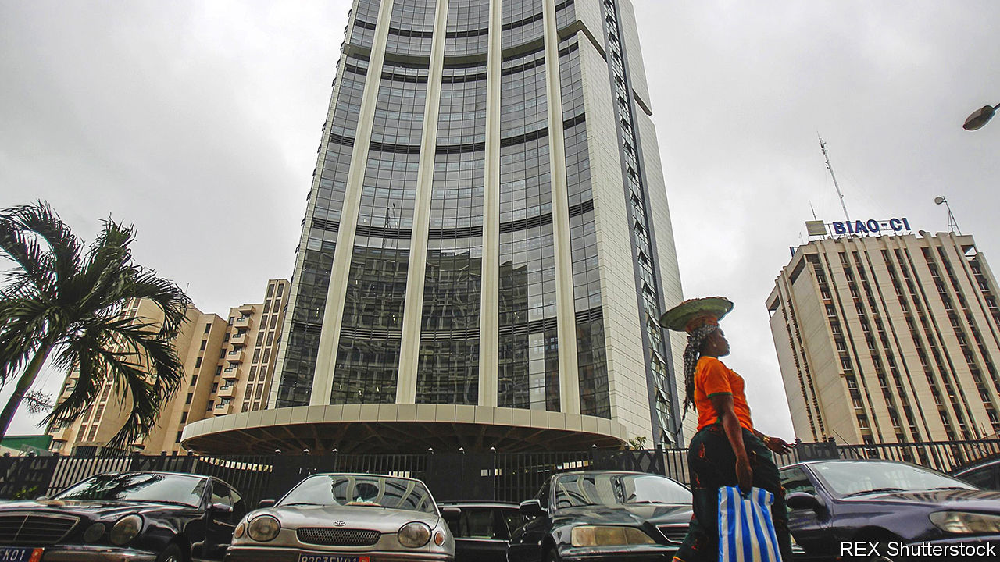

###### Too important to fail

# Is weak governance harming the African Development Bank? 

##### Several incidents raise troubling questions about one of Africa’s most important banks 

 

> May 19th 2022 

In the middle of July 2020, Roland Michelitsch slipped out of his home in Ivory Coast, taking almost nothing with him. He quietly got into an armoured Land Rover and drove to a boatyard where he abandoned the vehicle. And then he disappeared. Mr Michelitsch was not a spy or criminal mastermind. He was a banker of the least glamorous sort—the independent evaluator general of the African Development Bank (afdb). Yet he had fled the country fearing for his life.

The afdb is the most important African development institution in a region with about 70% of the world’s extremely poor people. The World Bank is far larger, but the afdb, with its headquarters in Abidjan, the commercial capital of Ivory Coast, focuses exclusively on the continent. It has a strong record of spending on things that African governments prioritise. It has assets of about $60bn and before covid-19 committed about $10bn a year in lending, much of it in line with the ambitious goals set by Akinwumi Adesina, its president since 2015. Because of its focus, rich countries have given billions to its concessional fund for the poorest countries. They also, in effect, lend their top-notch credit ratings to the bank, which allows it to borrow cheaply and lend at low rates. At its annual meetings next week, the bank’s governors and board are expected to discuss plans to ask donors for as much as $24bn.

This makes it all the more important that the afdb is run well. Yet a number of incidents over the past two years raise troubling questions about how it is managed and whether its internal watchdogs have sufficient oversight of the afdb’s executives. Importantly, they also throw into question whether the bank retains the full confidence of the creditors, donors and shareholders who fund it and whose support it needs to prevent African economies from being dragged down by mounting debt, surging international food and energy prices and the lingering effects of the pandemic. The bank says it is well managed, is able to raise funds and is commended by its African members. 

Mr Michelitsch’s departure is one of these worrisome incidents. The evaluator general’s office assesses whether the billions the bank commits are helping poor people. It is bound to report if bank projects are failing. To safeguard its independence, the evaluator reports directly to the board of directors and is supposed to be free from management influence. Yet these safeguards appear to have failed in the case of Mr Michelitsch, who had been appointed just ten months earlier after a long career at the World Bank Group. 

The events leading to his flight began with a seemingly trivial disagreement over the bank’s policy that staff had to remain in Abidjan, even while working from home during the pandemic. Mr Michelitsch, who strongly disagreed with this, told his team that he would be flexible in cases of hardship or maternity leave. Days later Mr Adesina wrote to the board accusing Mr Michelitsch of “gross misconduct and aggravated disregard, and disrespect for the authority and person of the President” and said that he would “not accept” Mr Michelitsch continuing in his role. 

 


The bank’s evaluation policies are clear: only the board has the power to fire the evaluator. Yet soon after the letter was written, Mr Michelitsch reported being the target of harassment by senior executives. He also complained to others that he believed his home was being watched and that he had received warnings from several people. This prompted him to flee, according to documents seen by . Two months after he left, the bank fired him without the board’s approval, arguing that he had abandoned his post and that his role was therefore deemed terminated under general staff rules. A delegation of board members went to Mr Adesina to complain. But it gave up the fight after Mr Adesina, who was re-elected in August 2020 to a second term, refused to back down. The bank says the evaluator’s employment was terminated “in accordance with the rules of the Bank, and in consultation with the Board of Directors”.

Outsiders saw this incident as having a chilling effect on accountability. A letter signed by nine independent evaluators of multilateral institutions, including those of the World Bank and imf, said the firing “cuts directly to a fundamental and long-standing principle of independent evaluation”. Mr Michelitsch, who declined to comment for this story, has since taken his case to a tribunal established by the bank, but which operates independently. The afdb failed to have it dismissed on a procedural technicality and it is still under way. 

Other employees tasked with scrutinising management have also quit after facing pressure, seemingly for doing their jobs. The bank’s integrity and anti-corruption office prevents corruption and investigates allegations of it. Yet in one incident a senior investigator in this office was probing allegations of graft against senior officials. As the investigator was preparing to finalise the case before leaving to take another job, officials in the human-resources department began intimidating the investigator through aggressive questioning. The investigator quit early to avoid an ugly dispute. It is understood that the investigations were never finished. The afdb says details of investigations are known only by the department responsible, which reports to the board in order to protect investigators and the department from “any form of interference of the type alleged”. 

A third case involved the bank’s auditor general (ag), who is meant to check that the bank is not wasting money or exposed to excessive risks. He also keeps an eye out for corruption. The ag is meant to have total independence and the board must be consulted over his appointment and removal. Yet these safeguards also appear to have failed. In mid-2020 Chukwuma Okonkwo, who had been ag since 2015, surprised the board by saying he would be leaving within a few weeks at the expiry of his five-year term. When asked about this by the board, Mr Adesina said Mr Okonkwo was nearing retirement age and was simply retiring, according to people familiar with the discussions. Yet Mr Okonkwo later told directors that he had been informed by the head of human resources that the president did not intend to renew his contract. In this case the board dug in its heels and kept him on for another 11 months. When he reached his actual retirement age Mr Adesina put in place an acting ag for almost a year. The bank says that it could not renew Mr Okonkwo’s five-year contract because that would have exceeded its mandatory retirement age. It says it offered to allow him to leave with a package and then respected his wish to keep working. “The allegation that the President removed the Auditor General is false,” it said. 

Whistle in the wind

The tussle over the ag came at a tumultuous time: Mr Adesina, a former agriculture minister in Nigeria, was already battling allegations of corruption and embroiled in a spat with America, the bank’s largest non-African shareholder. Just months earlier whistleblowers had accused Mr Adesina of overpaying friends and allies in breach of bank rules and of using the bank’s resources for self-promotion and private gain. He denied any wrongdoing and said the allegations were an attempt to smear him. Mr Adesina was cleared by an internal preliminary examination by the board’s ethics committee, which ruled that the accusations were unsubstantiated. But these findings were challenged by Steven Mnuchin, then America’s treasury secretary, who demanded an independent inquiry. An external panel whose members included Mary Robinson, a former Irish president, was subsequently asked to review the internal probe. The panel approved its findings, though with an unusual caveat that left some board members astonished: it noted that an “absence of evidence is not evidence of absence” and that it “does not necessarily follow from the dismissal of a complaint that there are not matters worthy of investigation”. The panel explicitly said that this comment did not apply to the complaints against Mr Adesina. The afdb says that Mr Adesina’s re-election was a “clear demonstration of the exceptional level of confidence” in him.

 


The ag’s replacement highlights two wider issues. The first appears to be a general disregard for the role of the ag. For instance, some 400 recommendations from the bank’s internal auditors were still outstanding last year. The bank says that it “consistently responds to and addresses” recommendations by the ag.

The second is that many of the bank’s key oversight roles have typically been filled by people in acting positions. At several points over the past two years, about a quarter of the bank’s senior management staff were in acting roles or temporarily in charge. Among them were the evaluator general, the head of anti-corruption, the chief risk officer (who safeguards the bank’s creditworthiness), the general counsel (who gives legal advice to the board and management), and the director of human resources (a powerful figure in hiring and firing whose role has not been permanently filled for more than two years). This creates a risk of undermining the independence of the bank’s watchdogs because those leading them may be wary of challenging senior executives who determine their career prospects. It also risks undermining the independence of the ag, who is barred from working for the bank after his or her term ends. Yet Mouhamed Ba, who had been appointed as acting ag last June, returned to his position this month as a manager within the audit team. The bank says that it appoints “capable members of staff, who are fully empowered” when positions become vacant.

Some appointments have raised eyebrows. One member of staff was appointed to a senior oversight role requiring integrity and deep trust from staff. Yet a few years earlier the same member of staff signed a statement to the bank’s ombudsman admitting to having made a false allegation of sexual harassment. The allegation was withdrawn and the member of staff blamed stress. The bank says that the individual in question did not file a complaint for sexual harassment and it “does not have any record of any such complaint”.

Turnover in senior jobs is also high. Mr Adesina is onto his fourth senior vice-president and fourth general counsel since 2015. Not all staff go quietly. Judgments by the bank’s independent tribunal have more than tripled since Mr Adesina took office. Among the cases were employment disputes filed against the bank by three vice-presidents. The bank says the increased activity of the tribunal is a clear sign of its “commitment to transparency, equity, and fairness to all, through a recourse mechanism that is fully independent”. 

Does your watchdog bite?

A weakening of the bank’s watchdogs raises questions over the quality of information reaching the board. Reports about financial risks, for instance, do not go directly to the board but are sent via senior executives. In several instances these executives have demanded changes, according to a former senior official. “There is an awful lot of sanitising and massaging information that gets presented formally as board papers,” the official says. In one instance this contributed to the board approving a pandemic response fund that could have harmed the bank’s credit rating had it been fully implemented. Yet rather than taking the near-miss as a lesson on the need for transparency, the bank’s executives are understood to have given themselves greater control over the flow of information, including requiring risk reports to be cleared by the president. The bank says it “does not withhold data or ‘massage’ information in its formal reports to the Board of Directors” and it “rejects any suggestion of a lack of probity in the conduct of risk management”.

The wider consequence of the rumblings within the afdb has been an erosion of trust in it, and thus of its ability to fund development. After Mr Adesina’s appointment lending by the bank shot up, with the value of outstanding loans increasing by 41% between 2015 and 2017. But this was at the cost of eroding the bank’s capital cushions. A report to governors in March 2018 warned that the bank had “no protection today against significant shocks”. Yet Mr Adesina played down warnings that the bank could face problems caused by a capital squeeze, according to a former official. The bank says this is false and that Mr Adesina and managers had “persistently raised the need for a timely capital increase with the Bank’s shareholders”. Yet in 2018 and 2019 the bank was forced to slow disbursements to avoid breaching limits that could have led to a downgrade by Fitch, a rating agency. By mid-2020 its balance-sheet had run out of lending capacity. In 2021 some rich countries rescued it with a temporary pledge to provide “callable capital” to avert the danger of it losing its triple-a credit rating. The bank says the capital was needed because of exogenous factors such as the credit downgrades of its shareholders.

Yet this was against a backdrop of shareholders and donors appearing to cool on the bank. In 2019 they approved a smaller percentage increase in capital than in the previous round (though larger in absolute terms) and a much smaller increase than Mr Adesina had requested, according to a person with knowledge of the talks. Some capital trickled in slowly, in part because some countries seemed to delay their contributions amid the corruption allegations. As a result, when covid-19 hit Africa’s economies, the bank had little dry powder. Development banks elsewhere sharply increased lending. Yet the afdb’s new lending fell by 51% between 2019 and 2020, with approvals from its concessional arm, the African Development Fund, slumping by 24%. The bank says some shareholders paid in early and that the drop in new commitments was because it focused on the rapid disbursement of existing loans rather than on new ones.

 


Donor countries appear to prefer to direct much of their aid through the World Bank. In 2018, before the pandemic, the afdb distributed about $1.5bn a year in grants and concessional loans. By contrast the International Development Association (ida), the World Bank’s concessional arm, was distributing about $15bn a year in the region, in part because shareholders have enough confidence in it to allow it to borrow in private markets to supplement donor funds. When the pandemic hit, donors pushed money into an early replenishment of the ida, 70% of which goes to sub-Saharan Africa. The afdb got no such treatment. “ida was really the preferred instrument of shareholders,” says Clemence Landers of the Centre for Global Development (cgd), a think-tank in Washington and London. The afdb says this is not the case and that it has strong donor support.

At a recent meeting to discuss the concessional window Mr Adesina demanded an unprecedented increase and told donors six times that no could not be an answer. He then accused the representative of the Italian government of colonialism after it pushed back on the bank’s borrowing plans. The afdb says this should be seen in the context of “unprecedented urgency to avert a catastrophe” and that the exchange happened “on the back of sometimes robust and heated discussions”.

At the afdb’s annual meeting next week, governors and the board are expected to discuss an external report into the bank’s governance. But it ought to go further, by looking into its own structure. In almost all other development banks a majority of shareholders’ votes are wielded by creditor countries. At the afdb about 60% of the votes belong to borrowing countries. This may make it more responsive to the needs of African governments. But it may also be having an impact on the bank’s ability to raise finance cheaply. A paper published in 2018 by Nancy Birdsall, an economist at the cgd, argued that the afdb’s voting structure makes it less competitive than its peers in sustaining donor confidence and raising capital or concessional finance. The bank argues that this view reflects “ignorance of the intrinsic character of the Bank and seems to perpetuate old stereotypes about and against Africa”.

When viewed in isolation, some of the failings may not seem too worrying. But when taken as a whole they paint a picture of an organisation in need of reform. Its shareholders may have many reasons for not demanding change. Borrowing countries may worry that speaking up could result in fewer loans. Non-African donors, some of which are former colonial powers, may worry they will be seen as meddlers.

Yet the bank’s mission of funding development is much too important for it to be allowed to underperform. The pandemic and the war in Ukraine are inflicting huge shocks on Africa. Absolute poverty is expected to rise sharply, making it all the more essential that the afdb is able to raise money from donors and markets—and use it well—to support struggling economies. Unless the bank’s directors and governors grapple with the bank’s problems, they will be failing Africa’s poor. ■

