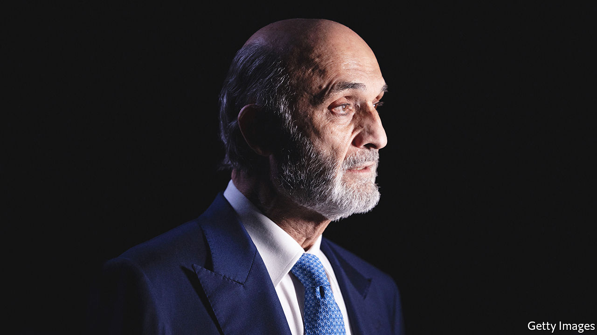

###### Rooting for change in Beirut

# Lebanon’s shock election result shows deep anger at the elite 

##### A hung parliament will need to tackle a profound crisis in a polarised country 

 

> May 19th 2022 

There was something for everyone in the outcome of Lebanon’s general election—except for a clear outcome. The ruling elite lost some symbolic races but kept its grip on power. Voters plumped for candidates who ran on a platform of change. One winning candidate proudly declared that he had no platform at all.

Many Lebanese were unenthusiastic about the ballot on May 15th. Just 41% of voters resident in the country bothered to show up, down six points from 2018 (turnout was higher in the diaspora). It was plagued by irregularities, from polling centres that lacked pens and ballot papers to piles of votes that mysteriously disappeared. Even tallying the results is hard, since some of the candidates who ran as independents in fact have close ties to the country’s long-standing sectarian parties.

Still, two things are clear. First, the alliance led by Hizbullah, the powerful Shia militia-cum-political party, has lost its majority. Second, an unprecedented number of genuine independents did indeed win seats. Both signal the voters’ deep anger directed at the leaders who plunged Lebanon into the worst economic crisis in its history, even including the devastation caused by its civil war from 1975 to 1990. In the short term, however, neither development may mean dramatic change.

Hizbullah won 13 seats, up one from last time, but says its camp in parliament has just 61 seats, four short of a majority. Its main Christian ally, the Free Patriotic Movement (fpm), did poorly compared with last time. The Christian vote instead seems to have tilted toward the Lebanese Forces, led by Samir Geagea, an ex-warlord.

That will please Hizbullah’s critics in Lebanon and the wider Arab world. But its opponents do not have a clear majority either—and even if they did, the “Party of God” will not relinquish its weapons simply because voters ask it to. Some treated the poll as a referendum on Hizbullah, yet the hung parliament it produced can do little to rein in a group that assassinates critics and outguns the official army.

Others saw a chance to throw out the whole ruling class. They had much to be angry about. The Lebanese pound, once reliably pegged to the dollar, is all but worthless. gdp has dropped by 58% since 2019. A third of the labour force is jobless. 

But the electoral law was rigged in favour of incumbent parties and the opposition was divided. Before the vote many activists said they would count four or five extra opposition seats won as a victory. They did far better. True independents won a dozen seats, 10% of the total. That is something to cheer, even if much of parliament is still held by warlords and thieves.

Their most pressing issue is Lebanon’s economic collapse. Tens of thousands of people have left, from entrepreneurs decamping for Dubai to the poor boarding rickety boats for Cyprus. Those who remain are barely surviving. Parliament must agree on a deal with the imf, clean up insolvent banks and restructure public debt estimated at 360% of gdp.

The old guard caused the crisis. They looted billions from the treasury and have dubious ties to banks that took part in a disastrous state-run Ponzi scheme. The newcomers, meanwhile, were vague about their views. Among the opposition blocs, a centre-left party that fielded dozens of candidates had the closest thing to a coherent economic platform. It lost every race.

Even without a hung parliament, it usually takes months to form a government. Lawmakers must also select a new head of state to replace Michel Aoun, the outgoing president and founder of the fpm, whose term ends in October. That may add to the delay. Changing a corrupt, clubby system is not the work of one election. It takes years, if not decades. Lebanon, alas, does not have that much time. ■

