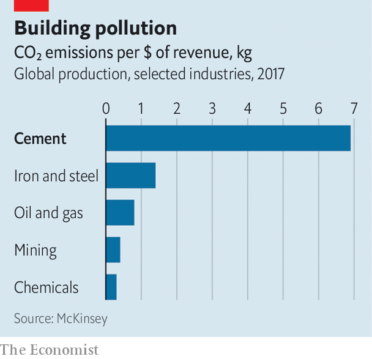
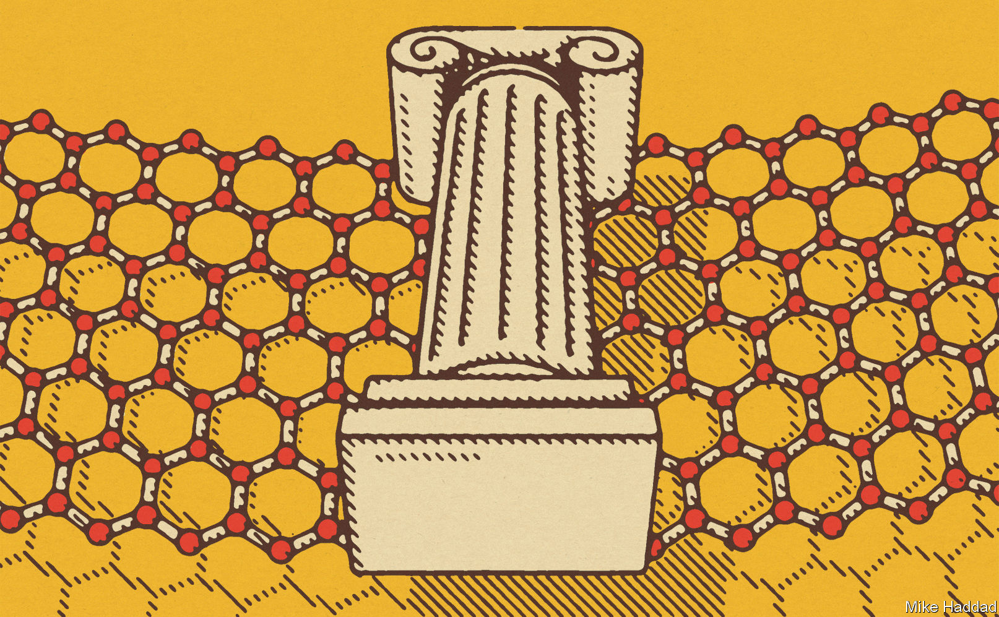

###### Carbon nanomaterials

# The wonder material graphene may have found its killer app 

##### It will help decarbonise industry, produce greener concrete and make hydrogen 

 

> May 18th 2022 

Close to where the college rowing teams of Britain’s second-oldest university practise their strokes along the River Cam, a grey shipping container sits outside a business unit waiting to be dispatched to Abu Dhabi. Inside is a piece of equipment devised by a firm called Levidian Nanosystems. In a deal announced on May 16th with Zero Carbon Ventures, a firm in the United Arab Emirates, Levidian will ship 500 more such units to the region over the next five years. They will take methane emitted from landfill or being flared off at oil-production sites, and turn it into cleaner-burning hydrogen, along with a pile of fluffy black powder called graphene. 

Graphene, which consists of monolayers of carbon atoms bonded in a repeating hexagonal pattern, is the thinnest known material. It was isolated in 2004 at the University of Manchester by Andre Geim and Konstantin Novoselov, who went on to win a Nobel prize for their discovery. 

At the time, amid much hype, graphene was said to offer astonishing possibilities. It certainly has many interesting properties. For a start, it is 200 times stronger than steel. Yet it is extremely lightweight and flexible. It is also an excellent conductor of heat and electricity, and exhibits interesting light-absorbing abilities. Researchers are still finding ways to tune it to obtain other features. Recently, for example, it has been shown that by arranging several sheets of graphene at particular angles, a superconducting version of the material (that is, one which lets electricity pass without resistance) can be created.

Putting carbon to work

Yet despite this promise, apart from a few niche uses in electronics, water filtration and some specialist sports equipment, graphene remains largely unemployed. Certainly, no killer application of the sort predicted when the stuff was discovered has emerged. But that could be about to change. Concrete is as far from superconductivity on the technological sexiness spectrum as it is possible to get. Yet it is an important material and of great concern to those attempting to slow down global warming, because the process of making it inevitably releases carbon dioxide. And graphene may hold the key to reducing that contribution considerably.

 


Concrete is made by mixing sand, gravel, water and cement. And cement is made by roasting limestone, a rock composed of calcium carbonate, to drive off carbon dioxide and leave behind calcium oxide. The 5bn tonnes of cement produced each year thus account for some 8% of the world’s anthropogenic CO, and generate abnormally high emissions per dollar of revenue earned compared even with other polluting industries (see chart). Yet if less than 0.1% by weight of graphene is added to the mixture, concrete ends up 30% stronger. And stronger concrete means less of it is needed, with a consequent reduction in CO. 

That does, indeed, sound like a killer app. There is, though, some way to go. As with most new materials it can take years for commercial production to scale up to the point of mass-market adoption. Petroleum-based carbon-fibre composites were invented in the 1950s, but it took more than 30 years before they began to be used in significant quantities in aircraft and cars. Graphene is now moving in that direction. According to estimates by idTechEx, a firm of analysts based in Cambridge, the world’s annual production capacity of the material was less than 3,000 tonnes in the first quarter of 2019. By the first quarter of this year, that figure had more than quadrupled, to 12,700 tonnes. 

Novel production methods, such as Levidian Nanosystems’ and others being developed around the world, are assisting this growth. Besides methane, graphene is being made from an increasing range of materials, including waste and discarded mixed plastics, which otherwise might end up in landfill. This avoids “exfoliating” mined graphite, which at present is the dominant manufacturing process. 

Graphite, the common form of crystalline carbon (the rarer one being diamond) is, in essence, a lot of layers of graphene piled on top of one another. Indeed, to make their discovery, Dr Geim and Dr Novoselov simply used sticky tape to peel individual layers away from a graphite block. As that is a bit too tedious for industrial use, various chemical and mechanical methods have been developed to speed things up. 

Two of the world’s biggest suppliers, for example, use proprietary water-based processes to do the exfoliation. NanoXplore, in Montreal, Canada, recently upped its capacity to 4,000 tonnes a year, and Sixth Element Materials Technology, a firm based in Changzhou, China, plans to expand its 1,000-tonne annual capacity. 

Out of the mine

The various grades of graphene produced by exfoliation are not necessarily green, though. Graphite is not a renewable resource and it has to be mined, which can be environmentally damaging. As an alternative some producers obtain their feedstock elsewhere. This can be as organic compounds in gaseous form, such as methane, or as liquids like ethanol, an alcohol that can be made from plant matter. These are used in chemical vapour deposition (cvd), a long established industrial process. cvd relies on a chemical reaction, sometimes in combination with heat and a catalyst, to deposit carbon atoms turned into a vapour onto a substrate, such as copper or nickel. The substrate can then be removed, if desired, and the graphene recovered. 

Levidian Nanosystems employs yet another approach, which it calls loop. This process uses microwaves to turn methane (a molecule composed of a carbon atom and four hydrogens) into a plasma by stripping electrons from its molecules. This causes the chemical bonds holding the molecule together to break, thus creating hydrogen (which is extracted from the top of the reaction chamber) and high-quality graphene (which collects at the bottom). The process does not rely on any catalysts.

The idea is that loop can be used to strip carbon from methane gas flows, such as those found in various industrial processes, water-treatment plants and biogas reactors, as well as oil wells and landfill sites. That gets rid of methane, a potent pollutant, without generating CO—which would be an inevitable outcome if the methane were, instead, burned. The hydrogen that is made can then be burned as fuel without producing any greenhouse gases and the graphene sold for other applications, such as an additive to toughen anti-corrosion paint—in exactly the same way that the grey paint used to protect Levidian’s shipping container from the elements has been treated.

Although Levidian began as a graphene producer, it now sees its role as providing a decarbonisation service. The loop system is being tested by Britain’s National Grid, which is responsible for the distribution of the country’s gas and electricity, to boost the amount of hydrogen in the gas supply. The main ingredient of natural gas is methane, and decarbonising it in this way can produce up to a 40% reduction in CO emissions when the gas is subsequently burnt, according to John Hartley, Levidian’s boss. As for the graphene, National Grid plans to use that to reinforce its pipelines so that they can carry more hydrogen. 

 


Depending on the source of the methane, Levidian claims the loop process has both a lower cost and a lower environmental impact than other means of making hydrogen—in particular, steam reformation, which generates a lot of CO. In fact, at current market prices, the sale of the graphene produced means the hydrogen comes free. In time, the company hopes the loop process can be scaled up to become a big producer of the gas. 

James Tour and his colleagues at Rice University in Houston, Texas, have cast their net even wider in the search for alternative feedstocks to make graphene. So far, they have successfully tried coal, petroleum coke (a by-product of oil-refining), discarded food, old tyres and mixed-plastic waste. 

To carry out the conversion, Dr Tour uses a method called the “flash” process that his team have developed. This employs a specially designed reaction chamber in which a carbon-containing material is sandwiched between a pair of electrodes. High-energy pulses of electricity are then used to create a rapid rise in temperature to 2,700°C. In only a second or so, this results in a sudden flash of light (hence the name) caused by the release of energy as molecules in the material disintegrate.

Any substances that are not carbon are vaporised into a gas, which can be collected, cleaned and used in other processes. What remains is a form of graphene called turbostratic. This consists of a number of layers misaligned with one another. That misalignment, however, is a useful feature because it allows the layers to be more easily separated when the stuff is mixed into other materials. With graphene, the fewer the layers the more powerful are the benefits bestowed.

Fixing concrete cracks

One mixture in which Dr Tour is particularly interested in is concrete, some 30bn tonnes of which are poured every year. The addition of a small amount of graphene to concrete provides an anchor for the cement in it to grab onto, resulting in a more powerful interaction as the concrete cures. This means not only that less concrete is needed to achieve the same level of strength, but also that structures made of it are likely to last longer. Graphene-enhancement would also protect rebar, the steel rods used to reinforce concrete, from moisture. If water creeps into tiny cracks in concrete it can cause rebar to rust and expand, which results in concrete crumbling and sometimes in buildings collapsing.

In certain cases, indeed, the use of rebar in construction might be avoided altogether, saving costs and the emissions involved in producing the steel from which it is made. Last year, a team from the University of Manchester, working with Nationwide Engineering, a British construction company, used graphene to enhance the concrete floor of a new gymnasium in Amesbury, in southern England, avoiding the need for rebar. This reduced the amount of material that would otherwise be required by nearly a third, resulting in a similar saving in CO emissions. 

Another hazard to concrete is chlorine, which is found in seawater and is particularly corrosive. Sixth Element says it has found the addition of just 0.005% of graphene to marine cement enhances its resistance to chlorine by 40%.

It might even be possible to build without concrete by adding graphene to composite materials made from wood and polymers. This would be particularly green if the graphene involved were produced from waste or recycled materials, including graphene itself. Dr Tour has already successfully flashed composites made with graphene in order to recover the material so that it can be used again. The use of stronger, lighter composites that are easily recyclable might tempt many manufacturers to move away from energy-intensive materials such as steel and aluminium. Ford, for one, has started using graphene to enhance the durability and reduce the weight of some of the composites used in its cars. 

A complicating factor is that not all graphene is technically graphene. Most commercial graphene has more than one layer of atoms. Generally, anything under ten layers is accepted as graphene by most in the industry, although some products have more than that. Graphene also varies in form, from films to powders, to nanoplatelets, to graphene oxides and more. On top of that there are different quality levels, particularly as some of the carbon structures of which it is made contain defects. This does not necessarily mean that high quality, so-called “few layer”, graphene is the most useful. All types have some value, hence pricing is dependent on the application the material is used for. This huge variation in what is labelled graphene results in prices ranging from tens of dollars a kilogram to more than $1,000. 

“We aim to be at the lower end of that spectrum,” says Jon Van Leeuwen, chief executive of Universal Matter, a Canadian company based in Burlington, Ontario, which has licensed the flash process from Rice University. It is building a demonstration plant, which by early next year should be making a tonne of flash graphene a day. 

Greening cement is seen as the biggest market. “We all know it works in cement and concrete,” says Mr Van Leeuwen. “But to go big you need a certain cost point that has been unachievable until now.” Other potential markets include adding small amounts of graphene to the bitumen used to make asphalt roads. This would greatly prolong their life, preventing creeping and rutting in hot weather and cracking during cold spells, which leads to potholes. Graphene can also increase the abrasion-resistance of car tyres, making them last longer.

No pixie dust

But using graphene is not as simple as “sprinkling a bit of magic pixie dust into your end product,” cautions Adrian Potts, chief executive of Applied Graphene Materials, a British company based in Redcar. The firm makes its own graphene from ethanol using a cvd process, and also buys in the material. Its particular expertise is in what is called “dispersion” technologies, which means putting few-layer graphene into a range of different substances so that it is easier to mix into products. 

On its own, graphene has a tendency to restack itself into graphite, which can diminish its usefulness. The idea, says Dr Potts, is to make “graphene stay as graphene” when it is mixed into things such as anticorrosion treatments, composites and even the car wax used to polish and protect vehicle bodywork. 

There remain, however, some concerns about the health implications of the growing use of engineered nanomaterials such as graphene. Researchers are trying to get a better understanding of how they might enter the body and what the effects of their doing so might be. Hence, adds Dr Potts, it is going to be important for the industry as it scales up for ways to be found that not only allow graphene to be used in bulk applications, but also to be used safely.

Not everyone is convinced graphene is on the cusp of great success as an environmental fix. Richard Collins, the North American research director of idTechEx, follows the business closely. He agrees that graphene could become an enabling technology for certain decarbonisation processes. “But the feedstock and processes currently used by the main players makes calling it a green material a stretch.” 

Some of the new production methods, such as the flash process, could change that, especially if they can use waste materials such as discarded food as a feedstock, says Dr Collins. But he cautions that these methods are at an early stage and have yet to prove themselves at scale.

Nevertheless, there is, he adds, precedent to be found with graphene’s older and less glamorous siblings, carbon nanotubes. These are essentially rolled up sheets of graphene and can also be made with cvd. Carbon nanotubes have been in development for a decade or so longer than graphene, with annual production hovering around a few thousand tonnes. But demand is starting to soar, and may reach more than 70,000 tonnes by 2032. The reason? Carbon nanotubes have found their killer app: making cathodes for the lithium-ion batteries used by electric cars (evs). With battery gigafactories springing up all over the world, this has become a booming business. 

Researchers are looking at ways of using graphene itself to enhance the performance of batteries. Graphite is already widely used in battery-making. Graphene could allow ev batteries to be lighter, longer-lasting and faster-charging. If any of that pays off, graphene will have found itself another important market.

The big bet

Green concrete, though, remains the big bet for graphene—not least because the volumes of material involved are so huge. However, it faces competition in that field. Other ways to reduce concrete emissions are being explored. One promising method is to inject captured COinto concrete at the point when the water and cement are being mixed in. This not only locks the gas up as calcium carbonate, but also makes the concrete stronger. Even so, there is nothing to stop anyone adding a bit of graphene as well, if the price is right. 

Many of the other potential uses of graphene besides concrete and batteries could also turn into big markets. Simply making things last longer with anti-corrosion coatings and producing sturdier composite structures would be good for the environment, not least because they will need less maintenance and will not need replacing so often. And when, eventually, these things do reach the ends of their lives, if the graphene can be recovered and used again it would be a welcome boost to building a circular economy. Nothing is certain with new technologies, but the wonder material’s time just might be coming. ■


