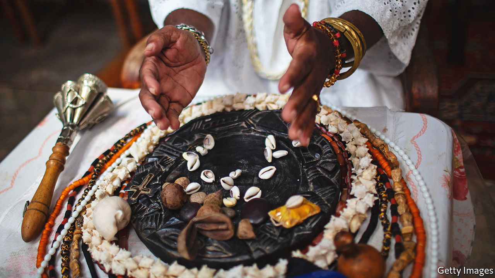

###### Seer shells

# In Brazil, if you need answers, see a cowrie-shell thrower 

##### A mystical Afro-Brazilian tradition thrives in a changing country 

 

> May 19th 2022 

Mãe carmem has long been in conversation with the , Afro-Brazilian deities who embody the forces of nature. They dance easily into her thoughts and her dreams. But communing on behalf of others takes work. In a room on the outskirts of Salvador, on Brazil’s north-eastern coast, she takes out 16 cowrie shells—shaped like coffee beans, cream-coloured, with a seam of serrated teeth. She shakes them, murmuring incantations in Yoruba, a west African language, then rattles them onto the board. , the god of rainbows, rattles rain upon the roof in unison.

Brazilians who want answers often turn to , the throwing of shells. Adverts for shell-based prophecy plaster lampposts; shell-shaking soothsayers set up stalls in malls. Adepts are pressed for predictions ahead of elections or football games—and consulted in private by participants. The 256 ways that the 16 shells can fall, each either open or closed, are read to diagnose and solve any problem.

Some Brazilians lampoon the practice. In February , Brazil’s biggest broadcaster, was fined for airing a comedy sketch about “Cãodomblé”, a shell-reading golden retriever.  is a play on , or dog, and Candomblé, the biggest Afro-Brazilian religion. That hints at the racially tinged distaste for such traditions among some Brazilians, which persists even though 56% claim African descent. In 2021 91% of religious hate crimes reported in Rio de Janeiro were against adherents of Afro-Brazilian religions, who comprise just 2% of the state’s population.

Brazil’s first shell-throwers arrived among the 5m slaves who survived the horror of being shipped across the Atlantic from west Africa. The practice continued, mixed with Catholicism, among communities of freed Yoruba. Despite centuries of repression, it still dictates the rhythm of life within the  or temples of Candomblé. No big decision is taken without first consulting the shells.

But shell-reading has become “detached from religion”, says Augusto Waga, a divination scholar at the Federal University of Rio de Janeiro. Baba King, an Ifá priest who runs a temple in São Paulo, reckons 70% of the 40,000 clients he has seen over the years did not share his faith. 

The pandemic has made shell-reading more secular, and digital. As society shut down, the internet offered virtual divination stalls that could compete with the temple. On one website, a fortune teller who specialises in difficult love affairs offers , and other readings, for 100 ($20) a pop. (Her most solicited service is “rival’s removal”.) For Mãe Carmem, such upstarts insult her training. You can’t train to be a doctor for three days and then dish out advice on the internet, she says. 

But that does not mean tradition trumps opportunity. On New Year’s Eve, a busy time for fortune-tellers, videos of Mãe Carmem’s readings appear on YouTube. She takes live radio call-ins. The human connection with the  endures. The mediums by which their answers are revealed change with the times. ■

