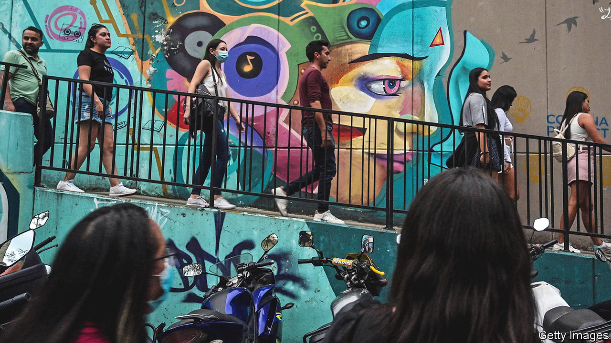
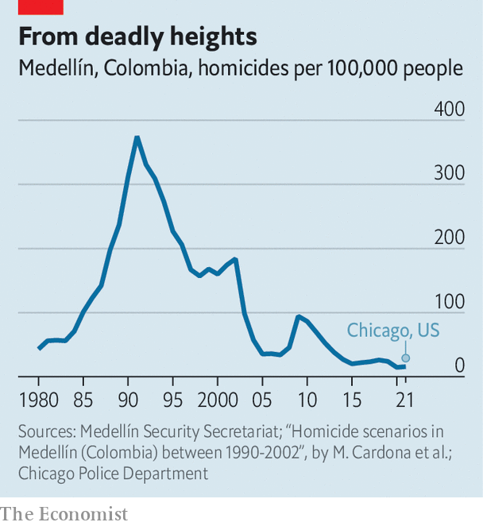
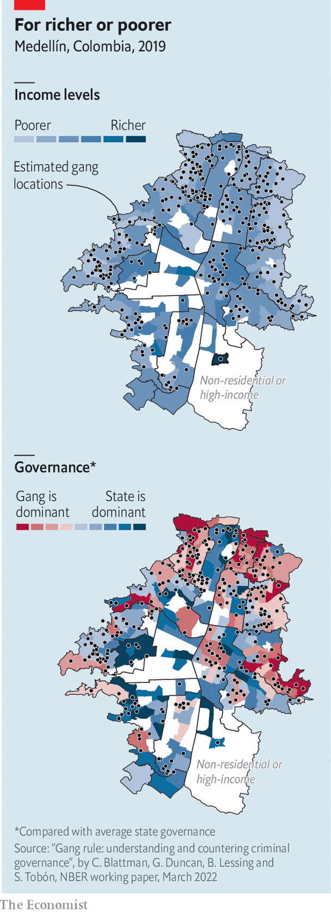

###### From Escobar to cable cars

# Medellín is an example of what Colombia could be 

##### Its former mayors make up half the field in the country’s presidential election 

 

> May 19th 2022 

Alicia rivas has lived in Comuna 13, a slum in Medellín, for most of her 84 years. It used to be the most violent city on the planet. “We would hide under the bed when the guerrillas shot at each other, because sometimes a bullet would come into your house and kill you,” she says. That’s how her grandson died. Today Medellín, Colombia’s second city, is safer than Chicago (see chart). Ms Rivas counts noisy tourists among her more serious problems. Thousands traipse in to gawk at graffiti and ride the outdoor escalators that climb hundreds of metres up the  hills. 

Two men who served as mayors during that transformation, Sergio Fajardo and Federico Gutiérrez, are among the leading candidates to be Colombia’s next president. A coalition of right-wing parties chose Mr Gutiérrez, commonly known as Fico, in primary season in March. The centrists chose Mr Fajardo. (The frontrunner and main left-wing candidate is Gustavo Petro, a former guerrilla and ex-mayor of Bogotá, the capital, who would be the country’s first leftist president if elected, although polls have been tightening.) Colombians would do well to understand the legacies of Mr Gutiérrez and Mr Fajardo before casting their vote. 

 


Medellín’s fortunes waxed as those of Colombia’s drug cartels waned. In 1991, when a notorious kingpin, Pablo Escobar, in effect ran the city, there were 7,000 murders in a single year. Colombia was a global homicide hotspot. Escobar was killed in 1993; subsequent feuds among paramilitary groups had fizzled out by the early 2000s. Medellín flourished. The proportion of people who are extremely poor, defined as earning too little to buy enough food, fell by half between 2008 and 2016. The city expanded public transport, connecting Colombia’s only metro system (Bogotá has just started building its own) to a network of cable cars and escalators, and so linking slums on the city’s hilly fringes with its posher centre. 

The seeds of Mr Fajardo’s political life were sown in Medellín in the 1990s. César Gaviria, Colombia’s president at the time, appointed a council of advisers to stem violence in the city. That council’s leader, Maria Emma Mejía, gathered businessfolk, academics and charity workers to discuss the problem. Those discussions fed into the creation of an organisation called (Citizen Engagement). Mr Fajardo, a mathematician, became one of its leaders and won a mayoral election in 2003 by a landslide, running as an independent against the established parties that had long governed the city. 

 


Mr Fajardo and his successors ushered in a battery of new policies. They gave the  control over 5% of the municipality’s budget. Investment in primary schools, libraries and health centres boomed. Six cable-car lines opened between 2004 and 2021. Five years after the inauguration of the first, incomes in the newly connected Comuna 1, the poorest slum in Medellín, had grown by 56%. Juliana, who lives there and works in the city centre as a maid, says her commute was cut from three hours to 40 minutes. “We led a revolution in Medellín,” says Mr Fajardo. “We changed the city’s history.”

But Mr Fajardo’s presidential campaign has been lacklustre. His brand of wonkish centrism lacks appeal in an increasingly polarised country. His coalition has been squabbling, and in 2021 Mr Fajardo was indicted for embezzlement, though a court dismissed the charges in January.

It is Mr Gutiérrez, who was elected as Medellín’s mayor in 2015, who is hot on Mr Petro’s heels in the presidential race. His rise has been swift. Before the primaries his name was hardly known outside Medellín. Since then the share of people who say they will vote for him has tripled, to around a quarter. He is a more skillful glad-hander than Mr Fajardo, seeking and receiving the backing of all of Colombia’s established parties (there are no big outfits on the left). He has cut into Mr Fajardo’s base by choosing a moderate as his running-mate. Some 42% of people in Medellín say they will vote for Mr Gutiérrez. Thirteen percent plump for Mr Petro, while just 3% like Mr Fajardo. 

Mr Gutiérrez was the first mayor of Medellín in 12 years to be elected without the backing of . His four-year term was defined by promises to be tough on crime: less civic engagement, more cracking heads. He trumpets the fact that city police arrested 166 gang bosses during his term. He had Escobar’s mansion blown up in front of an audience that included the president, with backing music provided by a symphony orchestra. 

These stunts played well on social media, but Medellín’s murder rate crept up as gang members fought over the power vacuum left by their jailed leaders. Worse for tough-on-crime Fico, his first security minister was jailed after being accused of having connections with the , a criminal organisation that started life collecting debts for Escobar. 

Mr Gutiérrez’s other focus as mayor was helping business. By 2020 the city was home to 43 businesses for every 1,000 inhabitants, up by 20% from 2016. He cultivated an everyman persona, going by his nickname and posting videos of police chases online. His presidential campaign is much the same. His slogan is “” (I identify with Fico). 

Medellín’s former mayors have not been solely responsible for its success. Money has helped, too. Much of that has come from the municipal utility, Empresas Públicas de Medellín, which sells electricity, gas, water, sewerage and telecommunications services not just to Medellín but also across Colombia and Latin America. It funnels about a third of its profits to the municipality. Those profits have grown as it has expanded to become Colombia’s fifth largest company. In 2020 it generated $371m for the city, more than a quarter of the municipal budget of $1.4bn. 

The city’s status as an emblem of good governance, so useful to Mr Gutiérrez and Mr Fajardo, has lately taken some hits. Daniel Quintero, who became mayor in 2020, was suspended from office by the , the national disciplinary office for civil servants and government officials, on May 10th, accused of meddling in the presidential campaign on Mr Petro’s behalf. Some consider the suspension itself to be meddling. A growing proportion of the tourists thronging the city are there to buy sex, not ride escalators and ogle graffiti, according to Daniel Duque, a city councillor. Drug use in public parks has become increasingly conspicuous. The proportion of people in the city who are poor has remained stubbornly high for years, hovering around a quarter. 

Small local gangs known as  still control large areas in and around the city. “If you have a problem here you go to a , not the police,” says Juliana, the maid from Comuna 1. Research published by the National Bureau of Economic Research last year showed that Juliana’s view is shared by most of Medellín’s poorer residents, who have more faith in the to respond rapidly to their problems than they do in the police or the mayor’s office. As well as city taxes, many locals pay a  (vaccine) to the  “for security”, says Juliana. When a truce among the  broke down in 2009 it led to a spike in homicides. They have since patched up their differences, but that could change.

The election is on May 29th. If no one wins more than 50% of the vote, there will be a run-off between the top two candidates in June. If those are Mr Petro and Mr Gutiérrez, the result could be close. Mr Fajardo has the stronger claim to have made Medellín what it is. But it is Mr Gutiérrez who has the best chance against Mr Petro. Mr Fajardo’s competent wonkery was enough to win power in Medellín. Winning over the rest of the country seems to require a little more pizazz. ■

