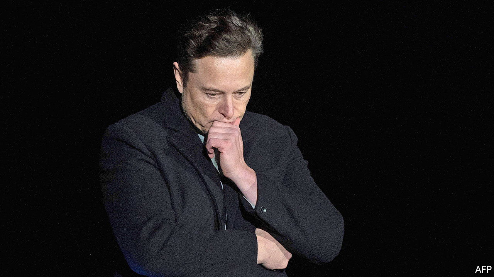
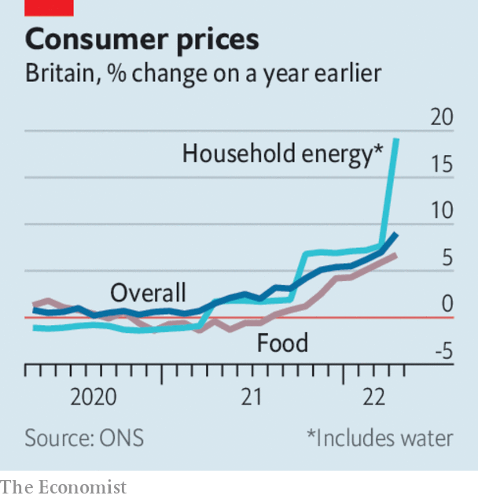

###### The world this week

# Business 

#####  

 

> May 19th 2022 

 insisted that it would enforce the buy-out deal it struck with , for $44bn, after Mr Musk said he was putting the offer on hold. Mr Musk wants the company to provide evidence that spam and fake accounts make up less than 5% of all its users, as claimed by Twitter. Mr Musk thinks the figure is 20%. Investors wonder what he is up to. Mr Musk may be trying to get a lower price for the deal, or be seeking to walk away and pay a $1bn break-up fee. 

Investors took fright when a batch of company earnings revealed that higher costs and  were hurting their business.  share price slumped by 25% after the retailer issued a profit warning.  said that higher food prices were also eating into its profits. Its share price swooned. The s&amp;p 500 plunged by 4%, its biggest one-day loss since mid-2020. The nasdaq composite fell by 4.7%, as tech giants such as Amazon and Apple shed more than 5% of their value. 

António Guterres, the un secretary-general, warned of a coming global  caused by the war in Ukraine that would particularly affect developing countries. He called for Ukraine’s grain supplies to be released from its ports, and for Russian food and fertiliser exports to be allowed to resume trading on world markets. 

Global  surged after India, the world’s second-biggest producer, decided to halt exports of the grain as it tackles soaring domestic food prices. Similar price increases have destabilised neighbouring Sri Lanka. Wheat supplies were already tight following Russia’s invasion of Ukraine.

Higher commodity prices were one reason why  shrank by 0.2% in the first three months of the year over the previous quarter. The country’s import costs have risen as the yen has fallen to a 20-year low. 

 


Britain’s annual rate of  leapt to 9% in April, the highest level in four decades. Britain now has the worst rate of inflation in the g7. Andrew Bailey, the governor of the Bank of England, said there was not much he could do about it, singling out “apocalyptic” rises in food prices as an external cause, although energy costs account for much of Britain’s inflation. His calls for restraint on pay increases, which firms usually pass on to consumers, have not gone down well with cash-strapped workers. 

The end of McDemocracy

 decided to pull out of Russia for good, two months after closing its outlets there at the start of Russia’s war on Ukraine. “The Golden Arches will shine no more in Russia,” lamented the chief executive. 

A judge in California struck down the state’s requirement for  on the boards of companies that are based there. The judge, a woman, found that academic studies on the benefits of having more women on boards were inconclusive, and that the state had failed to show how the law improved opportunities for females. But although the law has been overturned, many firms are increasing their share of female directors under pressure from investors. 

Shareholders at   voted by a wide margin against the bank’s pay packages for senior management, including for Jamie Dimon, the chief executive. It was the first time it had lost a “say on pay” vote since its introduction in 2009; investors are not happy with the underperforming share price. The vote is non-binding, but Mr Dimon said he “appreciates the feedback”.

 announced a settlement with American authorities over fraud at one of its subsidiaries, which resulted in institutional investors losing billions of dollars. The German financial-services company is paying $850m in penalties to the authorities, and $5bn in compensation to the investors.

The stockmarket debut of , a state-run business and household name in India, was a disappointment, as the share price sank by almost 8% on the first day of trading. The government sold off 3.5% of lic in what was India’s biggest-ever ipo, raising $2.7bn.

, Asia’s richest man, made his biggest acquisition to date when his conglomerate agreed to buy the Indian assets controlled by Holcim, a cement producer, for $10.5bn. 

Cash in hand

Mastercard launched a  programme in which customers will need to give only a “quick smile” into a camera or “wave of your hand” over a scanner to pay for goods. Payment systems based on a person’s biometric data, such as eye pattern or palm print, have stalled amid legal challenges to facial-recognition technology. Mastercard is starting its scheme in São Paulo, and then the Middle East and Asia, regions where privacy concerns are less prevalent. The firm said nothing about whether a scowl from shoppers, as they inspect their rising grocery bills, will suffice in place of a smile. 

