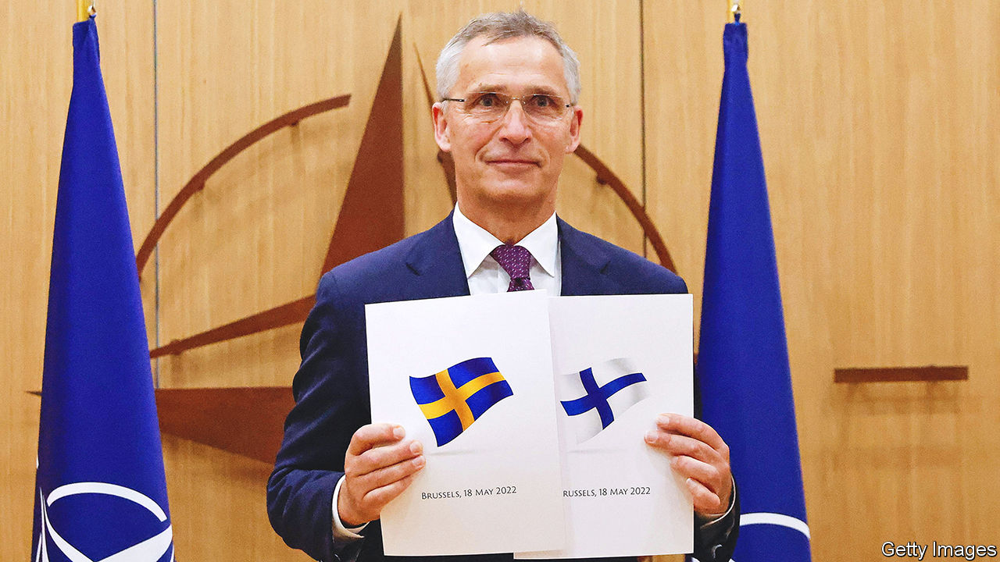
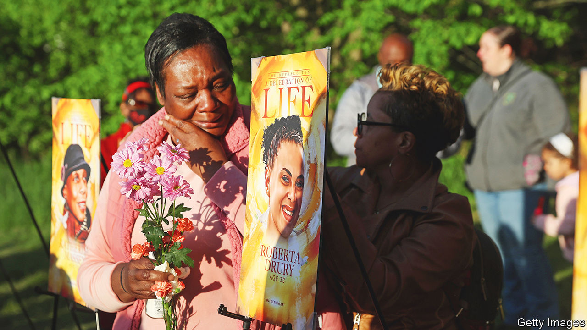

###### The world this week

# Politics 

#####  

 

> May 19th 2022 

 and  both formally submitted their applications to join . The two Nordic countries had stayed outside the alliance since its inception in 1949, for fear of provoking the Kremlin. But since Vladimir Putin invaded Ukraine, Swedes and Finns have decided they would be safer inside than out. Rapid acceptance of the two would-be members is expected, although Turkey is raising objections. nato’s border with Russia will double in length.

Russian forces pulled back from the area around Kharkiv,  second city. It is no longer in range of Russian artillery, having been pounded since the start of the war in February. Elsewhere, the invaders continued to make slow progress. In Mariupol more than 250 fighters, who had been holed up in the Azovstal steel works, surrendered. An unknown number remain, preventing Russia from securing a town it has almost completely destroyed.

Borne to lead

Emmanuel Macron appointed  as prime minister of . Her first task will be to ensure that the president retains his majority in parliamentary elections due next month.

 chancellor, Olaf Scholz, suffered a new blow when his party performed poorly in state elections in , the country’s most populous state. The vote for his Social Democrats was down by four percentage points from the previous election, in what was for decades the party’s stronghold.

 main unionist party, the dup, blocked the formation of a new power-sharing executive in the province, after Sinn Féin, an Irish nationalist party, won the most seats in a recent election. The dup says it wants the British government to scrap or fundamentally change the , a post-Brexit agreement which creates a customs border with the rest of the United Kingdom. Liz Truss, Britain’s foreign secretary, duly announced plans for legislation to do just that.

In  an alliance led by Hizbullah, a Shia political party-cum-militia, lost its majority in parliament at an election, while independent candidates gained ground. A new government could take months to emerge. The old sectarian system is still likely to block wholesale reform.

Ten days after  president, Emmerson Mnangagwa, announced a ban on all bank lending, including overdrafts, the country’s central bank lifted it. The ban had been intended to curb spiralling inflation. The opposition had described it as “absolute madness”.

 junta, which has twice seized power in coups since 2020, said it had foiled an attempted putsch. The military government has also withdrawn Mali from a regional counter-terrorism force, the g5 Sahel, blaming it for failing to make progress against the jihadists who control large parts of the country.

America plans to return about 500 troops to  to fight al-Shabab, a militia affiliated with al-Qaeda. This reverses Donald Trump’s decision to pull all American troops out of the country. Hassan Sheikh Mohamud, who was Somalia’s president from 2012 to 2017, was elected to another term. The election ended a constitutional crisis created by his predecessor, whose term should have ended a year ago.

Ranil Wickremesinghe took over as prime minister of , as the country attempts to navigate an economic and political crisis. In his first speech he warned that shortages would worsen, stocks of petrol were depleted, and that he had no choice but to print money to pay wages. The government is negotiating with the imf for a bail-out.

 reported nearly 2m cases of “fever”. Outsiders assume this means covid-19. As the Omicron variant spreads, at least 56 people have died, officially. No North Koreans have been vaccinated. The country’s isolated socialist dictatorship has so far declined offers of help from democratic South Korea, but is asking China for medical supplies. 

Officials in  cheered residents by laying out a plan to ease covid restrictions by June 1st, after two months of a strict lockdown that has crippled the city’s economy. In many other parts of China, restrictions remain. 

America’s pain

 


Joe Biden visited the site of a mass shooting in , at which ten people, all of them black, were murdered. The 18-year-old white perpetrator had published a 180-page online rant full of racist and anti-Semitic tropes in which he said that he intended to kill as many black people as possible. He then livestreamed the atrocity. Last year police in the suspect’s home town had hauled him in to assess his mental health after he threatened to attack a school. But he was released. 

In southern  a Taiwan-born American citizen was arrested after he shot dead one man and wounded five people at a church frequented by Taiwanese-Americans. Police said the shooter had been ”upset about political tensions involving China and Taiwan”.

 attorney-general, Consuelo Porras, was barred from entering the United States. Antony Blinken, America’s secretary of state, accused Ms Porras of corrupt acts which “undermine democracy in Guatemala”. She denies the allegations. Last year Ms Porras sacked Juan Francisco Sandoval, the head of Guatemala’s anti-corruption unit.

The Biden administration loosened a few of the restrictions imposed on  by Donald Trump’s administration. It is issuing more visas for Cubans under a family-reunification scheme, allowing more flights from America to cities outside Havana and scrapping a limit on remittances. 

The number of people in  officially listed as “disappeared” has risen to 100,000 from 73,000 two years ago. The records go back to 1964. Many are thought to have been murdered by criminal gangs, sometimes with “varying degrees of acquiescence or omission” by officials, as a un report delicately put it.

Greenhouse-gas concentrations, the rise of sea levels, ocean heat and ocean acidification all set new records in 2021, according to the World Meteorological Organisation, a un body. It said that the past seven years have been the warmest on record. A study from Britain’s Met Office reported that “ is driving the heat intensity” of recent weather in north-west India and Pakistan, where temperatures have exceeded 50C (122F) in some spots. 

