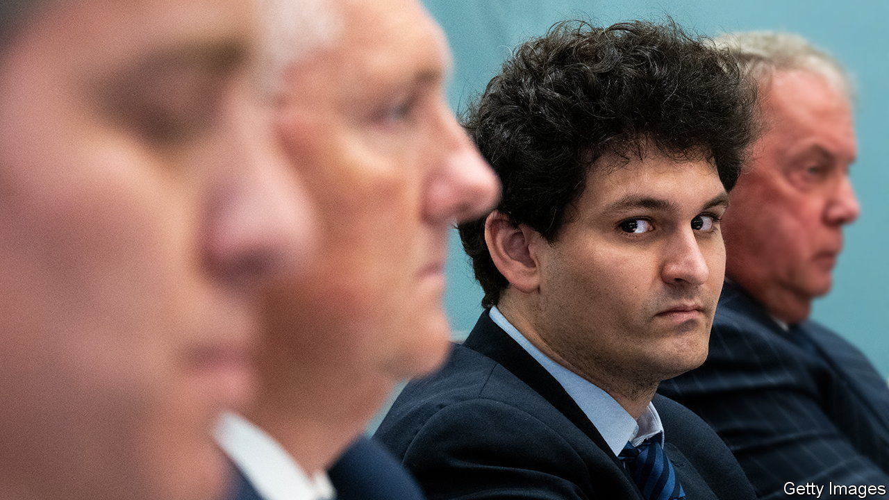
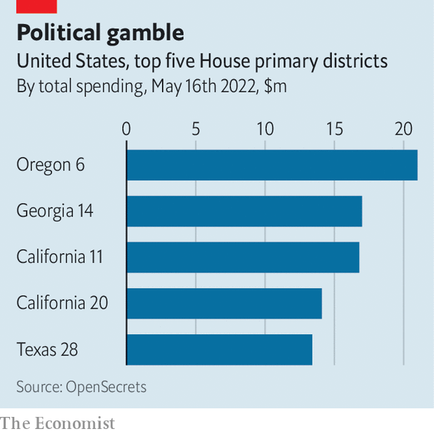

###### Politics and philosophy

# America’s costliest House race and the ideology that made it so 

##### The drive to take “effective altruism” to Washington 

 

> May 19th 2022 

Sam bankman-fried drives a Toyota Corolla and sleeps on a beanbag in a flat he shares with ten roommates. It might come as a surprise that the 30-year-old is a crypto-entrepreneur whose exchange, ftx, was valued at $32bn in January. Recently he has taken an interest in politics. 

On May 17th nine Democrats vied to contest a seat in Oregon’s sixth, a new congressional district born from the 2020 census. And a $10.5m donation from Mr Bankman-Fried to one of them, Carrick Flynn, made it the costliest House primary in this cycle to date. 

Mr Flynn and his backer both live by the principles of “effective altruism”, which urges people to maximise the amount of good they can do. Effective altruists argue that money should be spent where it goes furthest: forgo that donation to the local soup kitchen when the same amount could save hundreds of children in Bangladeshi slums. To Mr Bankman-Fried, adhering to the ideology means earning a lot to give to effective causes—he has pledged to donate 99% of his lifetime earnings. To Mr Flynn, a researcher with no previous political ambitions who became infuriated with Congress’s poor response to covid-19, it means running for office to bolster planning for disasters. 

 


Effective altruists have long heralded the measurable benefits of deworming medication and mosquito nets. Politics, however, is more of a gamble, with hazier payoffs and a lower probability of success. The Centre for Effective Altruism, which champions “empathy with evidence”, has advised the World Bank, the World Health Organisation and the British government. But in Oregon this week Mr Flynn failed to win the Democratic nomination: Congress is not about to experience an injection of altruism. 


