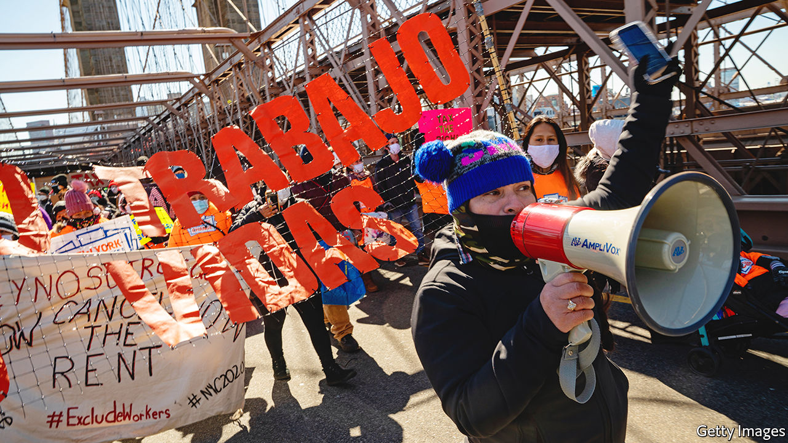

###### Welfare states

# Democratic states are extending welfare benefits to the undocumented 

##### The efforts have attracted only muted controversy in their home states, but they are revolutionary 

 

> May 19th 2022 

One march morning, a raucous parade of protesters passed by ’s offices in midtown Manhattan. Supporters of a policy called the Excluded Workers Fund were showing their discontent, discernible above the din of city traffic, with New York’s governor, Kathy Hochul (whose office is a few blocks away). They also sought attention in other ways, disrupting traffic on the Brooklyn and Manhattan Bridges. Some even marched 150 miles (240km) to the state capital, Albany. 

The Excluded Workers Fund was a state fund set up to pay workers who did not qualify for federal unemployment benefits or stimulus cheques—mainly undocumented immigrants. Established in August 2021, it exhausted the $2.1bn allocated to it in three months, mostly through payments of $15,600 to 130,000 people. The protesters were demanding $3bn more to cover 175,000 workers who also qualified. 

Expansions of benefits to immigrants illegally in America is a relatively recent, bicoastal affair. From May 1st, California has allowed undocumented residents above the age of 50 to receive benefits from Medicaid, the government health-insurance programme for the poor. The state was already covering Medicaid costs for those under 26 out of its own purse. In his most recent budget the governor, Gavin Newsom, proposed covering the final missing group, those between the ages of 26 and 50—in essence offering Medicaid as a right to all Californians, regardless of immigration status. During the covid-19 pandemic, the state gave cheques amounting to $1,700 per person to all. 

Although the campaign to refill the Excluded Workers Fund failed in New York, Ms Hochul has put her state on the path to California-style incremental expansion by signing a budget in April that provides Medicaid for elderly undocumented residents who are over 65. Since 2020, California and Colorado allow undocumented immigrants to claim earned-income tax credits as though they were legal residents.

These moves have attracted muted controversy in their home states. Yet they are revolutionary. The federal government, like most advanced welfare states from Britain to Sweden, generally prohibits benefits from going to those without a legal right to work (and imposes waiting periods for legal migrants). Democrat-run state and local governments have long resisted federal immigration enforcement. These efforts take things to a new level. 

Disaffection with Congress’s inability to pass immigration reform, including a path to citizenship, has led some states, buoyed by recent surpluses, to spend their funds on emulating the federal safety-net for undocumented residents. In December New York City Council even voted to allow 800,000 non-citizens with work permits to vote in the city’s next council and mayoral elections, including about 30,000 “Dreamers”, who migrated illegally to America as children but received permits through an Obama-era programme. Only a few short years ago, such policies might have been dismissed as fever-dreams of the nativist right. 

Activists employ two broad justifications for such moves. One is an accounting argument: that they have positive fiscal multipliers that improve economic output. The maths is debatable, given that states must forgo federal dollars when funding these expansions. As yet, the amounts involved also appear relatively small for rich states: the ongoing annual cost of a full Medicaid expansion to undocumented immigrants in California is estimated to be $2.4bn. A bill under consideration to create California’s version of a permanent excluded workers fund would cost an extra $600m a year. Together, that is just 1.4% of the $213bn in general-fund spending that Mr Newsom has just proposed.

The more compelling justification is moral. Advocates emphasise that undocumented immigrants make up a disproportionate share of essential workers, and that two-thirds have lived in America for more than a decade. “I think as New Yorkers, we need to do everything we can to create parity for our communities, no matter their status,” says Jessica González-Rojas, a Democratic member of the state Assembly from Queens, New York. “They pay into the system…so they’re quite deserving of this.”

The trajectory remains towards expansion of benefits. In Albany, Ms González-Rojas has been agitating for legislation that would qualify undocumented New Yorkers for government-sponsored health insurance for the poor, the elderly and those of working age. This year, much of that agenda has stalled “largely because of the potential political ramifications in our election year” and “the relentless attacks by Republicans on how we’re spending our tax money”. She calls the exclusion this year of undocumented children from a programme to expand child-care subsidies “just cruel”. 

Asked whether or not she worries that the state’s generosity may function as a magnet for more undocumented immigrants, Ms González-Rojas is unperturbed: “I welcome undocumented communities. I know they fuel our economy, they make our neighbourhoods richer and more vibrant and are people I love. It wouldn’t bother me to have folks come here because it’s an exciting place to be, and as long as the services are provided, I think we’ll have a very vibrant economy.”

Within the Democratic caucus, disagreement is hard to discern. Most home-grown criticism comes from Republicans who are in the minority. “In a state like New York—or any state—we cannot confer citizenship. That is exclusively the role of the federal government. But we can confer de facto citizenship when you provide unemployment benefits, you provide identification, drivers’ licences, you provide access to free or state-funded health care and education,” says Rob Ortt, the Republican leader of the New York Senate, who argues that the issue may help his party electorally in more conservative parts of the state. “A lot of New Yorkers are going: ‘OK, well what about me? I’m not on drugs; I haven’t broken the law; I’m not here illegally. All I try to do is pay my exorbitant taxes.’”

Blue for benefits, red for rage

These state experiments face practical problems. Once built up, government programmes are not easily dismantled. In recessions, the pledged obligations to non-citizens may seem harder to justify to voters. And although a poll in 2021 found that a majority of Californians supported health-care expansions for the undocumented, a majority of Americans do not. The programmes may become a potent attack line in a Republican Party which has previously done well by criticising progressives for wishing to abolish the federal immigration-enforcement agency. New York City’s voting proposal has attracted criticism in Republican primaries as far afield as Georgia, fuelling right-wing ire.

The more serious problems are elsewhere, though. Democratic and Republican America are fast splintering. That is true on matters of abortion, electoral legitimacy and immigration. In Republican-dominated Texas the governor, Greg Abbott, is fantasising that a conservative Supreme Court will overturn the precedent of , meaning that his state would no longer have to pay the public-education costs of undocumented children. He is also gathering unlawful migrants arrested on the state’s southern border and sending them by the busload to Washington, as a sign of defiance to President Joe Biden. These divergent immigration regimes are emerging because the illegal-immigration question has so little chance of being resolved federally. The authority of the federal government to set the country’s immigration policy is dwindling as a result. 

States are supposed to function as laboratories of democracy. Today they commonly act as laboratories of disunity. ■


