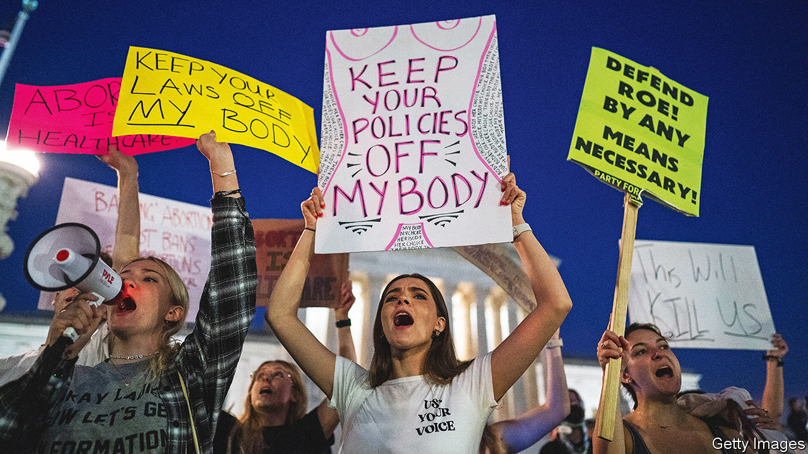

###### Abortion and the left

# Democrats are overreaching in their defence of abortion rights 

##### They could blow a chance to enthuse mid-term voters 

 

> May 15th 2022 

Are democrats blowing the chance that the  of  has given them? The revelation this month that the Supreme Court has voted, at least provisionally, to strike down the ruling that in 1973 declared abortion a constitutional right has provided the party with a rare opportunity to energise voters ahead of mid-term elections in November. Most Americans do not want  to go.

Yet in vowing to protect abortion rights, Democrats have at times gone further than may be politically wise. On May 11th the Senate voted against the Democrats’ Women’s Health Protection Act (whpa), which would  across the country. Holding the vote was largely symbolic: the bill stood no chance. Still, two rare pro-choice Republican senators, Susan Collins of Maine and Lisa Murkowski of Alaska, and a Democrat, Joe Manchin of West Virginia, voted against it, saying it went further than .

Though the bill broadly echoes Supreme Court rulings, protecting abortion on demand until a fetus is viable (at around 23 weeks) and allowing exceptions on health grounds later, it would ban states from enacting abortion regulations that  permits. Ms Collins said she also disliked the bill because it did not allow Catholic hospitals to refuse to perform abortions. Erin O’Brien, a political scientist at the University of Massachusetts, Boston, reckons it would be “smart” for congressional Democrats to now back the more limited abortion-rights bill drawn up by Senators Collins and Murkowski.

Several Republicans have incorrectly described the whpa as having “no limits” on abortion. Yet that fairly characterises the situation in at least four states (Colorado, New Jersey, Oregon, Vermont) and Washington, dc, that have passed laws protecting the right to abortion throughout pregnancy, according to the Guttmacher Institute, a pro-choice think-tank. Such laws are designed to make it easier for women from states that would ban abortion—and those that have already sharply curtailed access—to obtain it elsewhere. 

Those laws stand in sharp contrast to the rest of the rich world. Many European countries have a limit on abortion on demand of 12 or 14 weeks; only two (Britain and the Netherlands) allow it until 24 weeks. Hence  itself is comparatively liberal: of 59 countries that allow abortion on demand, America is one of only seven that allow it after 20 weeks of pregnancy.

Polling suggests that such liberal abortion laws are out of step with public opinion in America. A recent -YouGov poll found that only a quarter of all Americans believe abortion should “always be legal” with “no restrictions”. Gallup polls have repeatedly found that most Americans say abortion on demand should be available in the first trimester (the first 12 weeks) but not thereafter.

How might all this affect Democrats’ prospects at the polls? Their failure to push a more moderate line on abortion could harm them, for two reasons.

Extreme reaction

First, it gives Republicans an opportunity to cast Democrats as the extremists. “It’s all, you know, abortion up to the point of birth,” said John Thune, a Republican senator from South Dakota, after the vote on the whpa, echoing what has become the Republicans’ main talking point on abortion. 

It would be hard to make such claims if Democrats had not dropped the “safe, legal and rare” language adopted by Bill Clinton during his presidential campaign in 1992 (and echoed by Hillary Clinton in 2008). Joe Biden, a practising Catholic, has avoided speaking about abortion much—or even using the word in public, according to a website, didbidensayabortionyet.org, that is tracking this—with the result that more extreme voices in his party have dominated the debate on the controversial issue.

This leads to the second problem: voters tuning out. Since Donald Trump swore in 2016 that he would appoint conservative justices to overturn , the clash of extremes in America’s abortion war has intensified. This is most evident in the rash of cruel and extreme abortion laws introduced in conservative states. In Missouri, lawmakers want to prevent women travelling out of the state to have an abortion. In Louisiana, some lawmakers tried (and failed) to classify abortion as homicide so that prosecutors could bring criminal cases against women.

Yet on the left, campaigns like #ShoutYourAbortion, which encourages women to recount their experiences (“Having an abortion made me happy in a totally unqualified way,” its co-founder has said), seem unlikely to fire up the many Americans of both parties who think of abortion as sometimes necessary but hardly desirable. Protests outside the homes of Supreme Court justices have elicited criticism from pro-choice as well as pro-life Americans, in part because such action could be counter-productive.

In the longer run, it is progressive states’ relaxed abortion laws that may be most damaging to the left. Though abortions in the second and third trimesters are rare, and even in states where they are permitted some doctors set their own gestational limits, they give anti-abortion activists an easy target. Kyleen Wright, the president of Texans for Life, says that if  is overturned groups like hers will “work to shore up constitutional protections in pro-life states, as the abortion advocates have done in the most pro-abortion states”. But they will also home in on pro-abortion states, she says. “Late abortions are abhorrent to voters pretty much across the political spectrum, so that would resonate even in states that protect abortion.” ■

