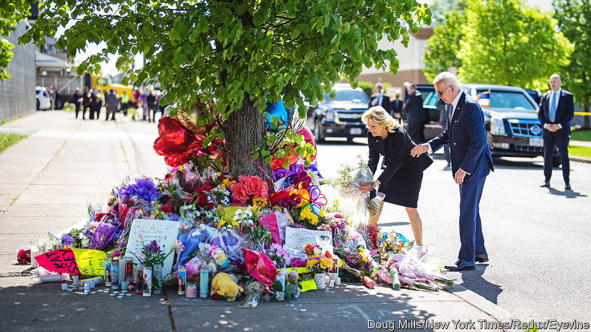
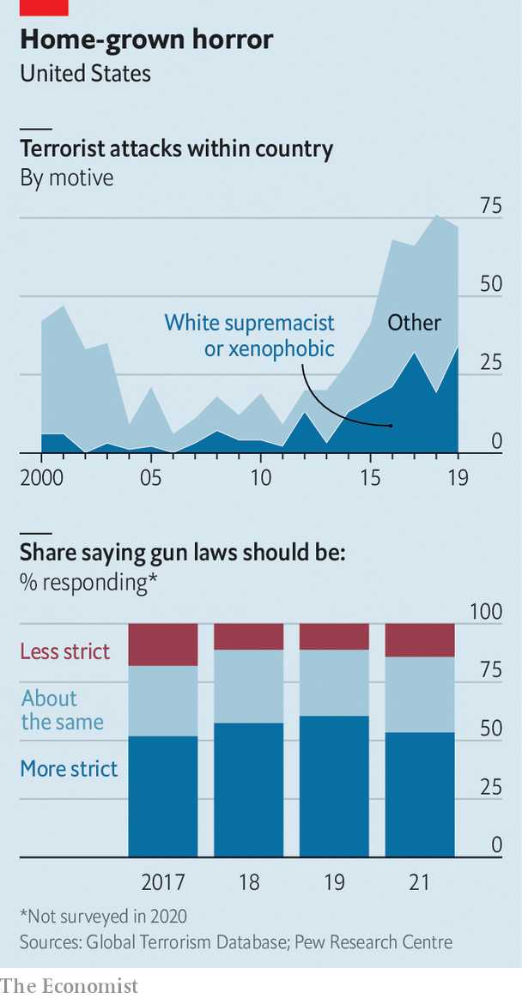

###### Buffalo shooting

# Online radicalisation led a white supremacist to target African-Americans 

##### A conspiracy theory that was once on the fringe leads to another mass shooting 

 

> May 19th 2022 

“He was a really great guy,” says Dayna Overton-Burns, of her friend Aaron Salter, who was shot dead at Tops, the supermarket on Jefferson Avenue in Buffalo where he worked as a security guard. “You can talk with him about anything,” she recounted tearfully. Mr Salter, a retired policeman, tried to stop Payton Gendron, the 18-year-old gunman. But Salter’s gun was useless against the assailant’s bulletproof vest. Mr Gendron, who live-streamed the horror on Twitch, a gaming site, killed ten people and injured three more. Eleven of his victims were African-American. All “because of the colour of our skin”, says Ms Overton-Burns.

From a 180-page manifesto that the white shooter allegedly wrote, and hundreds of messages he apparently posted online, it is clear he targeted the supermarket because it was in a mainly African-American neighbourhood in New York state’s second-biggest city. He planned the assault for months, driving the 200 miles (320km) from his small town near New York’s border with Pennsylvania, on reconnaissance. He mapped out the shop’s aisles. And his manifesto outlined his motives, based on a belief in a sinister plot known as the Great Replacement theory. 

This conspiracy theory, which has deep roots, asserts that there is a plan to bring non-white people to Western countries to replace whites. The “invaders” would eventually lead to the extinction of the white race. Some extremists, like one who killed 11 people at a Pittsburgh synagogue in 2018, think Jews are behind it all. The previous year white supremacists chanted “Jews will not replace us” in Charlottesville, Virginia, as they protested against the removal of a confederate statue. Such rhetoric was once confined to the fringe, but some of its themes have been echoed by media personalities and politicians.

A  investigation showed that in more than 400 episodes of his Fox News show, Tucker Carlson alluded to the theory when he said that Democrats and elites want to use immigration to force demographic change. During a visit to Buffalo on May 17th to comfort victims’ families, President Joe Biden called white supremacy a “poison” which had been “allowed to fester and grow right in front of our eyes”.

 


White-supremacist terrorist attacks have risen alarmingly in America (see top chart). In 2019, half of all attacks were orchestrated by supremacists, up from 14% in 2000. New atrocities create fears of copycat killings. The Buffalo gunman hoped he would be emulated. 

Mr Gendron wrote in his manifesto that he became radicalised browsing 4chan, a far-right message board. Ideas travel far and fast online. Erin Miller of the University of Maryland’s Global Terrorism Database, which tracks attacks, thinks this “creates an incentive to take action…when you’re feeling insignificant”. Dylann Roof, a teenager who killed nine church congregants in South Carolina in 2015, also radicalised himself online. In Buffalo Mr Gendron copied the methods of Brenton Tarrant, who killed 51 people at mosques in Christchurch, New Zealand, in 2019. Mr Tarrant, too, wrote a manifesto (Mr Gendron lifted whole passages) and live-streamed his attack. On May 18th, Letitia James, New York’s attorney-general, said she would investigate the social platforms used by Mr Gendron.

Hours after Mr Biden spoke, a few people yelled at police for not killing Mr Gendron when they had the chance. Others are frustrated that no red flags were put on his record last year, after he threatened to carry out a school shooting. Instead, he was able to buy a weapon easily in New York, which has stricter gun laws than Pennsylvania, where he also bought some of his arsenal. Few expect a tightening. According to Pew Research Centre polling, barely half of Americans even want stricter laws (see bottom chart). 

There is anger in Buffalo, but mostly there is sorrow and fear. At a vigil outside the supermarket on May 17th, prayers and hugs were in abundance. People also queued for donations of food, baby formula and nappies—with Tops closed, the low-income neighbourhood is without its only supermarket. Isaiah Goldsmith, a college student who grew up nearby, says Tops was a place where the neighbourhood’s elderly, including his grandmother, would socialise. Jefferson Avenue is one of the main commercial arteries for Buffalo’s African-Americans. In a way, said one local, “Tops is Jefferson’s heart.” ■


