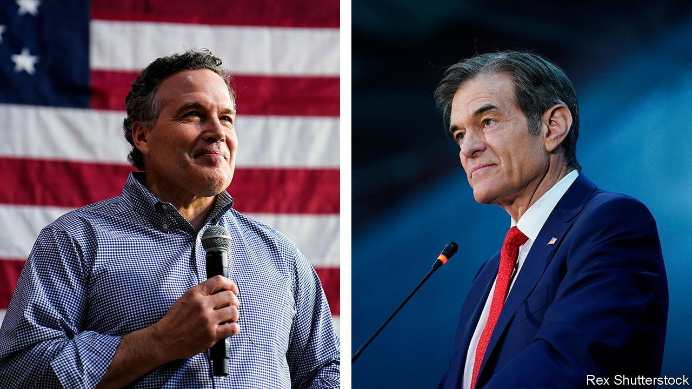

###### Keystone-cop politics

# Republicans divide and Democrats unite in the Pennsylvania primaries 

##### The Republican party may be fumbling a key step in its path to a Senate majority 

 

> May 18th 2022 

Like a doctor at the bedside, a politician must try to soothe voters’ worries. At an event on the eve of the Republican Senate primary election in Pennsylvania, Mehmet Oz, a celebrity television doctor, took voters’ blood pressure. They told him about their concerns, from inflation to schools, and their fondness for Donald Trump. But as they filed out, many still seemed sceptical. Dr Oz had won the former president’s endorsement, but not the love of his fans. 

By May 18th, the day after the election, Dr Oz appeared to have edged ahead of David McCormick. But with a margin of less than 0.5 percentage points separating the two, the race will probably head to a recount that must be completed by June 7th.

The saga will weigh on Republicans, who cannot afford to lose the state come November. With an incumbent Republican senator retiring, Pennsylvania is one of Democrats’ few chances to flip a seat and retain their thin majority in the upper chamber. But in chasing votes and Mr Trump’s coveted endorsement, Dr Oz and Mr McCormick, a former hedge-fund executive, adopted nearly identical messages and spent much of the campaign attacking one another in television ads. 

They had a scare from the insurgent campaign of Kathy Barnette, a charismatic African-American far-right commentator. She rocketed into contention on the back of her strenuous opposition to abortion and background as the child of rape. Mr Trump appeared alarmed to find his preferred candidate outflanked, and labelled Ms Barnette unelectable. “He’s not Jesus, he can be wrong,” said Ms Barnette, referring to Mr Trump, while tarring her opponents as part of the “woke right”. In the end, after being vastly outspent, she came third with a quarter of the vote. 

Republicans faced more discomfort in the governor’s contest. The comfortable victor, a state senator, Doug Mastriano, is also among the more extreme flavours of Republican. He joined the rally (as did Ms Barnette) to overturn the election of President Joe Biden at America’s Capitol on January 6th 2021. He has vowed to appoint a like-minded Pennsylvania secretary of state to administer elections—one who may resist certifying a future Democratic presidential victory there. 

The Republican candidates now face two formidable Democratic opponents. The state’s no-nonsense attorney-general, Josh Shapiro, won the uncontested nomination for governor. The Democrats’ Senate nominee, John Fetterman, the hulking, goateed state lieutenant-governor, won by a landslide. Mr Fetterman spent the campaign disavowing his lefty reputation and would appear well-positioned closer to the centre. But he suffered a stroke five days before the primary, requiring surgery and raising questions about his fitness for the rough and tumble of a campaign.

If Democrats have managed to unite behind credible candidates, Republicans are increasingly panicked that they may squander two prime chances in Pennsylvania. Even Mr Trump appears  that continues to pay him homage. He endorsed Mr Mastriano with just four days to go before the primary, when he was already well ahead in the polls. If Dr Oz prevails, Mr Trump will no doubt claim further vindication, however shaky. Nearly every Republican candidate mimicked the former president’s positions and rhetoric. But the experience suggests that, though the party has been recast in Mr Trump’s image, taming the voters is more elusive. ■

