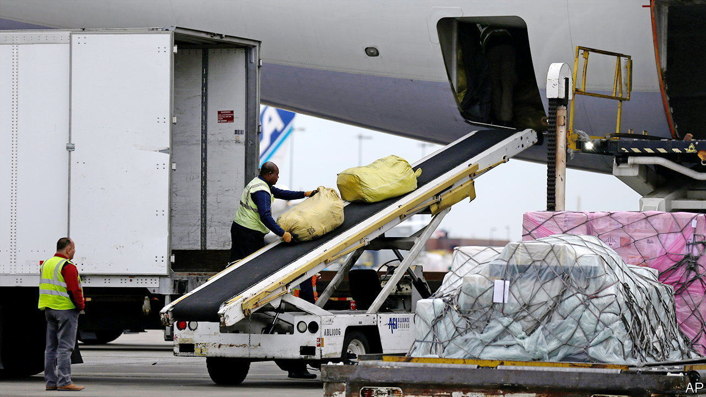

###### O’Hareport

# Supply-chain woes are forcing more of America’s trade onto planes 

##### Chicago’s jumbo airport is now America’s leading port 

 

> May 19th 2022 

For passengers arriving at the rather faded terminals at Chicago O’Hare, it may not feel like it. But as of last year they are landing at America’s most important port, measured by value of trade. In the north-eastern corner of the airport, a stately if ageing Korean Boeing 747 lands and within ten minutes moves into position outside a giant warehouse. On board, bound in plastic and cord, are 115 tonnes of cargo—mostly consumer electronics, but also pharmaceuticals, food and more. In an hour it will be unloaded, and will soon be on trucks heading around the country. If the cargo is worth the average of cargo processed at O’Hare, that one flight will have brought $14m of imports into America.

Chicago is built on its transport links. Before European settlers arrived, it was the site of a portage between the Mississippi river and Lake Michigan, over which people carried trade goods between boats by hand. Later, in the mid-19th century, came the Illinois and Michigan Canal, and then the railways, linking the fast-growing farmlands of the Midwest to the industrial cities of the east coast, and turning Chicago into the “hog butcher for the world”. Today its airport is doing the lifting work of the City of Broad Shoulders. And it shows how the pandemic, and its supply-chain stresses, are changing American trade.

In 2021, reckons usTradenumbers.com, a website, goods worth roughly $305bn passed through O’Hare, about 6.6% of American trade. It is far from being the port that receives most goods by volume (that is Los Angeles) or even the busiest airport (Anchorage’s moves more goods). But the 2.5m tonnes moved through Chicago is made up of far pricier stuff. 

Though they are designed in California and assembled in China, it is Chicago where almost all Apple’s products arrive in America. So, too, do aeroplane engines manufactured by Rolls-Royce in Britain, car parts made in Japan and sensitive medicines synthesised in India. Products from midwestern factories, such as two enormous hotel-kitchen ovens destined for Singapore, are loaded up for the journey out (flying things out to Asia costs a tenth of what bringing things in does).

The pandemic has boosted the airport’s freight business. Before covid-19, people said that “bellies [of passenger jets] are taking over the world, we don’t need freighters”, notes Shawn McWhorter, the boss in America of Nippon Cargo Airlines, a Japanese firm. For Chicago, where most flights are domestic, that was not so positive. But when people stopped flying because of the pandemic, the cargo holds of passenger planes were no longer available. Instead, more freight has been flown into specialised cargo terminals, like the one in Chicago. Since 2019 the amount moved through O’Hare has increased by 47% in value, and almost as much in volume.

Now, passenger flights are returning, but not everywhere. Transatlantic travel is back almost to pre-pandemic levels, but far more imports are flown in from Asia, where covid restrictions are still in force, so specialist cargo flights are still needed. 

Other factors too are fuelling demand, says Neel Jones Shah, a vice-president at Flexport, a freight-forwarding firm which operates a warehouse at O’Hare. Not only are Americans buying more physical stuff than ever, but also congestion at American seaports means that items that would previously have been shipped by sea are being flown instead. Even simple car parts are now being flown in to take to factories in Michigan. McDonald’s French fries made from Idaho potatoes are being flown the other way. (Mr McWhorter recently shipped four full charter planes of them.)

Can the boom continue? It has been fantastic for air freighters: rates had trebled by the start of the year, says Mr Jones Shah. Profits at big firms, such as Germany’s Lufthansa Cargo, have soared, even as the airline industry in general struggles. Orders for new cargo jets are flooding into Airbus and Boeing. But costs are also going up. The price of fuel has soared. Ground staff are in short supply. Some firms have not realised they need to raise pay, and are flailing. “You cannot run a labour-intensive operation with 50% staff turnover,” says Mr Jones Shah.

To beat the crunch, a lot of money is now being invested in technology to try to increase efficiency. Flexport’s warehouse has clever scanners that use artificial intelligence to try to spot automatically crates that have been loaded onto the wrong lorries. The firm also tries to use its data to offer clients more efficient ways to move their stuff around, balancing air and sea freight. In the short run, though, higher costs mean higher prices for consumers. That risks bringing the boom to an abrupt end—an O’Hare raising prospect. ■


