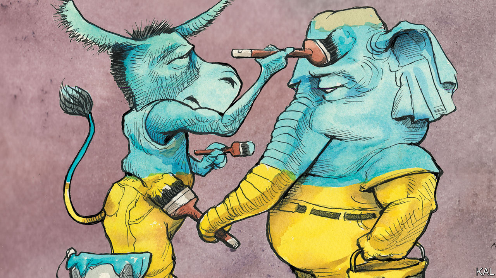

###### Lexington

# The quiet Ukraine consensus 

##### Congress has maintained bipartisan agreement on the war by not talking about it much 

 

> May 19th 2022 

“Virtually the whole world is against us,” Mikhail Khodaryonok, a defence expert, told Russian state television this week. And what is more, he noted, even America’s political parties are together on this: “The lend-lease programme is about to start functioning and the resistance of a single senator will be overcome quite quickly.”

He was exaggerating slightly. Hours later, 11 of the 50 Republican senators voted to block a $40bn package of military and other aid for Ukraine. Yet with all other senators in favour, the bill was expected to breeze through the Senate shortly after this column is published. Not many policies receive such bipartisan backing these days—especially ones as significant as this. Added to the roughly $4bn of arms that Joe Biden’s administration has already shipped to Ukraine from American arsenals, the new bill represents a staggering haul. It is more, in just three months, than America sent to Iraq or Afghanistan in any given year. A senior Pentagon official describes it, probably accurately, as the fastest supply of military support in history.

This reflects material change in America’s risk calibration. Administration officials who used to speak warily of Vladimir Putin’s threat to use nuclear weapons now almost shrug it off. Russia, they note, has not overreacted to nato’s support for the Ukrainians, even as that has increased in heft as well as volume. In March the administration prevaricated over, then ruled against providing Polish mig-29 fighter jets; it has since delivered so many spare mig parts to help patch up Ukraine’s existing planes that it comes to the same thing. As the war has moved from its hit-and-run phase outside Kyiv to trench warfare and artillery duels in the east, meanwhile, the scale of other American-supplied kit has increased hugely.

According to a fact-sheet released by the Pentagon, America has provided 90 howitzer artillery pieces, 72 vehicles to tow them, 16 helicopters and 200 armoured personnel carriers. The Ukrainians are also asking for multiple-launch rocket systems and anti-ship missiles. John Barrasso, a Republican member of the Senate Foreign Relations Committee, predicts that they will get them. “We’ve given them every weapons system they’ve asked for so far,” he said, after returning from a visit to Kyiv last weekend alongside Mitch McConnell, the Republican Senate leader. So long as nato troops are not on the battlefield, it seems almost anything goes.

Considering how momentous it is, the issue is politically low-key. Mr Biden, a relatively inconspicuous president on any issue, has made only a couple of Ukraine-related speeches. The latest arms package looked set to clear Congress with remarkably little debate given its size, most of it occasioned by Rand Paul, the isolationist senator Mr Khodaryonok alluded to. Donald Trump, a lightning-rod for Russia-related controversy, has for the most part sounded ambivalent on the war. It has received scant attention in early campaigning for the mid-terms.

That is less paradoxical than it might seem. The dismal political reality is that any prominent issue is liable to get polarised and stuck. The fact that Mr Biden and his counterparts on Capitol Hill have not been more outspoken on Ukraine represents in part a tacit consensus to prevent that happening.

Such dealmaking is not uncommon. Over the past decade Congress has passed a number of hugely important bills with bipartisan majorities in part by not really talking about them. The list includes a $305bn infrastructure splurge under Barack Obama, a $35bn clean-tech investment under Mr Trump and this year a long overdue overhaul of the postal service’s finances. Simon Bazelon and Matthew Yglesias, both writers on politics, term this phenomenon “the Secret Congress”. And it is good to know that Washington, dc, is a bit less dysfunctional than it often seems. But, when applied to a foreign policy as important and delicate as this one, such elite discretion also looks risky.

Voters deserve more of a public debate on Ukraine than they are getting, not least on the crucial question of where America’s military support is heading. If the war turns into a stalemate, should there be limits to America’s aid? Or would the administration escalate further?

As a matter of good democratic practice, presidents also deserve more reward for good policy than Mr Biden has had. His administration has won global acclaim and, in private, even grudging praise from some Republicans for its handling of the crisis. Mr Biden’s advantages over Mr Trump have never been more obvious. Yet he remains very nearly as unpopular as Mr Trump was. 

Worse, the lack of serious debate leaves space for the unserious to fill—and Republican isolationists have ambitions in that regard. Back in March, only three House Republicans opposed Congress’s first response to the Russian invasion, a simple declaration of support for Ukraine. But over the course of 15 subsequent Ukraine-related bills, the number of Republican holdouts has steadily increased. Over a quarter of House Republicans opposed the $40bn aid package. That encouraged Mr Trump to mischaracterise the bipartisan bill as a case of “Democrats…sending another $40bn to Ukraine [while] America’s parents are struggling to even feed their children.”

Dare you to say it, Mitch

Mr McConnell suggested his visit to Volodymyr Zelensky was intended to head off the antis in his party: “What I assured him, as this is an all-Republican delegation, is that support for Ukraine and this war against the Russians is bipartisan.” To ensure it remains so, he should put more of his political capital where his mouth is. He should undertake that all future delegations will be bipartisan. And given that Mr McConnell appears to agree with everything Mr Biden has said and done on Ukraine, he should enthusiastically say so. That would be quite something. ■


