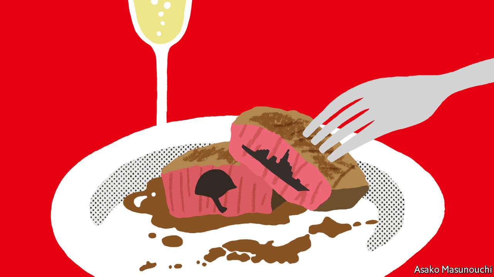

###### Banyan

# Abe Shinzo still looms large over Japan 

##### The hawkish former prime minister is pushing for a more muscular security policy 

 

> May 26th 2022 

The menus during President Joe Biden’s visit to Tokyo this week reflected the tastes of Japan’s prime minister, Kishida Fumio, whose family is from Hiroshima. There were Hiroshima beef fillets, Hiroshima vegetables and Hiroshima lemon sodas. The agenda, however, owed more to Abe Shinzo, a former prime minister who led the country from 2012 to 2020. 

Japan promised to spend much more on defence and urged America to rejoin an Asian trade pact the bigger country had ditched. Both are longtime causes of Mr Abe’s. Mr Kishida chatted with Mr Biden about the “Free and Open Indo-Pacific”, a concept Mr Abe codified. The two leaders met their Australian and Indian counterparts as part of the Quad, a grouping Mr Abe championed. 

Though Mr Kishida leads the ruling Liberal Democratic Party (ldp), and thus Japan itself, the party remains under the sway of Mr Abe, especially when it comes to foreign and security policy. “Kishida is not the agenda-setter for Japan—Abe is,” says Tobias Harris, the author of a biography of the former prime minister. 

Mr Abe’s basic strategy remains the default for Japan: doubling down on the alliance with America while beefing up its own defences and strengthening partnerships with third countries to counter China’s rise. Even the opposition has struggled to articulate an alternative course. As Michael Green, an American academic and former government official, argues in a new book, “Line of Advantage”, the trajectory set under Mr Abe looks likely to endure for a generation: “What is now in place is a grand strategy for the era of Abe Shinzo—not just the tenure of Abe Shinzo.”

Yet while the direction has been set, the country has yet to arrive where Mr Abe would like: a Japan less shackled to its post-war past and more autonomous in its security. “Japan likes to speak about an ideal world,” Mr Abe tells . “But we must change our attitude of leaving all military matters to America. Japan must take responsibility for peace and stability, and...work together with America to achieve it.” 

That unfinished business may be one reason why he has eschewed a quiet retirement. His mentor, Koizumi Junichiro, a former prime minister, retired from politics soon after leaving office and lent his voice to the superhero character Ultraman King in “Mega Monster Battle Ultra Galaxy: The Movie”. After stepping down as prime minister because of a chronic illness in 2020, Mr Abe immediately returned to the Diet, where he now leads the ldp’s largest faction. He has used his voice to continue calling for a more assertive security policy, a cause that has taken on a new urgency after Vladimir Putin’s invasion of Ukraine. 

The Japanese people have had to “face the reality” that invasions are possible in the modern era, Mr Abe says. Since leaving office, he has talked more openly about the defence of Taiwan. Recently, he has urged Japan to discuss hosting American nukes, as some nato members do. As for the time and political capital he spent on his 27 meetings with Mr Putin, he does not regret it “at all”; he backs Mr Kishida’s tougher approach to Russia in the wake of the invasion.

He seems determined to use his bully pulpit—and his big voting bloc in parliament—to pragmatically advance his goals, rather than picking ideological fights. His talk of hosting American nukes is intended to end the “taboo” around discussing nuclear deterrence, not to make the idea an immediate reality, Mr Abe insists. Instead of making a renewed case for revising Japan’s post-war constitution, he touts the “epoch-making” nature of the more limited legal changes he managed to pass, which allow the Japanese Self-Defence Forces to operate in a wider range of situations.

Yet in Japan, Mr Abe remains a polarising figure. To some observers, his recent outspokenness points to the re-emergence of Abe the ideologue, freed from the responsibility of higher office to push the nationalist causes with which he has long been identified. Mr Kishida, a more vanilla figure, may in fact be better placed to move the ldp’s security agenda forward. Since fewer people, especially liberals, have “an allergic reaction” to Mr Kishida, he may find it easier to get Japan to “swallow bitter medicine”, says Akita Hiroyuki, a commentator for , a Japanese daily. Mr Abe’s plans for beefier Japanese security, in short, may go down better with a slab of Hiroshima beef. 


Read a  of ’s interview with Mr Abe

