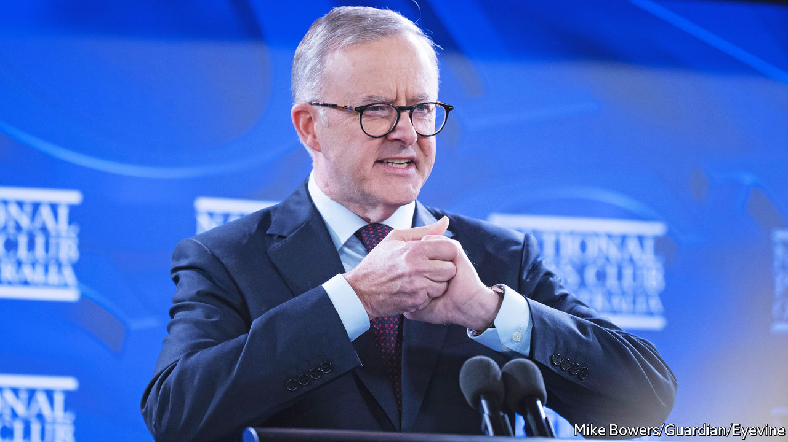

###### Political weather

# Australian voters have had enough of climate inaction 

##### The country’s election hinged on promises to reduce emissions 

 

> May 26th 2022 

First came fires, which incinerated an area larger than Britain and swallowed cities in a suffocating haze. Then came floods, which inundated towns in Queensland and New South Wales. Climate change has become harder to ignore since Australians last voted in a federal election in 2019. When they returned to the polls on May 21st, enough of them cast their ballots with the climate in mind to oust a conservative coalition government that had been in office for nine years. “Together we can end the climate wars,” declared the new prime minister, Anthony Albanese (pictured), after his Labor Party won.

These wars have crippled Australian politics this century: three of the country’s prime ministers have lost their jobs since 2010 for trying to cut emissions. Conservative politicians have stoked fear about doing so on the basis that it would dent the jobs and wealth generated by Australia’s vast coal and gas industries. Yet they are increasingly out of touch with the public. Some 60% of Australians cite climate change as a “serious and pressing problem” which needs tackling even if “significant costs” are involved, according to the Lowy Institute, a think-tank in Sydney. Mr Albanese, or “Albo”, as he is known, promises to do more about it.

His Labor government will set a goal to cut emissions by 43% by 2030, compared with 2005 levels—up from the coalition’s 26-28%. It will focus on cleaning up electricity generation, the biggest source of Australia’s carbon emissions. Most of the country’s power comes from coal; in 2020 less than a quarter came from renewables. Mr Albanese wants to raise that to 82% over the next eight years, helped by a modernisation of the transmission network. 

Still, his plans fall short of what scientists say Australia should be doing. They were “deliberately not very ambitious, to prevent attacks from the coalition”, says Frank Jotzo, a climate economist. The results of the election suggest that many Australians would like Mr Albanese to have a tougher climate policy. Less than a third of them voted for Labor, making it the least popular government in Australia’s history. Mr Albanese prevailed partly because his opponent, Scott Morrison, fared so poorly. Voters in cities and rich suburbs abandoned Mr Morrison’s Liberals, the larger party in the conservative coalition, for new independent and Green candidates demanding stronger climate action. Second votes, under a preferential voting system, helped push Labor to power.

Together, those new mps represent a third force in Australia’s parliament. Six “teals”, independents named after the colour of their branding, won metropolitan seats held by the Liberals for generations. They called for cuts to emissions of at least 50% by 2030. The Greens, meanwhile, made gains in Australia’s coal heartland, Queensland, snatching at least two constituencies in Brisbane. Overall, the number of independent and minor-party mps in the House of Representatives has more than doubled. About a third of Australians voted for them—up from a quarter in 2019. 

Mr Albanese will not need their support if he can eke out a majority in the lower house, which seemed likely as  went to press. (Postal votes were still arriving.) The prime minister insists he will not change his emissions targets. Yet “he cannot ignore the pretty overwhelming vote to deal with this issue”, says Frank Bongiorno of the Australian National University in Canberra, the capital. And Labor will not control the Senate. The Greens made gains there too, and will hold its balance of power. They will push for a ban on new coal and gas projects.

This is not the first time a government promising action on climate has been elected. In 2007 Australians voted in a new Labor prime minister, Kevin Rudd, who pledged to do more. His plans for an emissions-trading scheme were scuppered by the Senate, partly because Greens voted against them (the scheme was weak, they argued). Both left-leaning parties have “learnt from their mistakes to be more collaborative”, says Mr Bongiorno. Australians know a move away from coal is coming. Conservative politicians may keep waging climate wars—but fewer citizens are enlisting. ■

