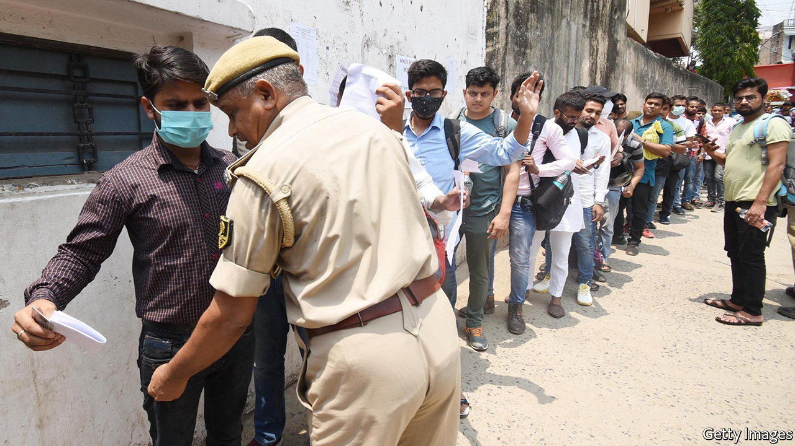

###### Testing situation

# India’s exams are plagued by cheating 

##### It is a symptom of a poor education system 

 

> May 26th 2022 

As india’s exam season kicked off earlier this year Facebook groups dedicated to helping with preparations were inundated with offers of guaranteed academic success. “Get leaked questions and answers before your upcoming exam, 100% guaranteed and secured,” read one. “Get certificate without sitting exams 100% legal,” promised another. 

India’s education system is brutal. The bar for entry to university is extraordinarily high. There is a near-unlimited pool of applicants for the top institutions. Until it changed its policies this year, Delhi University, among the best, required prospective students to have scored at least 99% in their school-leaving exams. Stratospheric parental expectations only add to the pressure. Getting into university is not the end of it, either. High marks are necessary there, too, so that graduates can go on to foreign universities or find jobs at home. Plenty of canny (if dubious) entrepreneurs are only too happy to offer shortcuts to success—for a hefty price. 

Cheating is thus widespread. It is also organised and elaborate. In a survey in 2021 by Learning Spiral, a big provider of online-exam software, 73% of university students admitted to cheating in online tests. Neha, who teaches at an engineering college in Maharashtra, a western state, reckons that 90% of her students cheat in some form. 

At its simplest, cheating involves smuggling notes into the exam hall or buying stolen test papers. Students are routinely frisked as they enter the hall. Question papers are often kept under lock and key in police stations or government buildings. They are nonetheless commonly leaked on social media. Sarita Sinha, a former schoolteacher who now runs a prep centre, says she does not find this surprising. “Even if you lock it in police stations, you think the policemen do not have children?” she says. Yet it works both ways. Once a paper is out online, it quickly goes viral. This means everyone—including the authorities—discovers the leak and questions can be changed.

Officials are turning to ever more sophisticated and stringent measures. This year, the state of West Bengal installed internet jammers near schools in many districts. It also put cctv cameras in exam halls and insisted students trade in their face masks for fresh ones provided by the school. More basic methods are also used: in 2019, a school in Karnataka, in the south, forced students to wear cardboard boxes over their heads—cut open on one side—to foil cheating.

Yet even as officials come up with novel ideas, so do the cheats. In February, a medical student at Mahatma Gandhi Memorial College in Indore, a small city, was caught with a skin-coloured Bluetooth device surgically implanted in his ear. A phone linked to the device was sewn into a secret trouser pocket. Last year, ten students taking a trainee-teacher exam were arrested for attempting to use Bluetooth gadgets concealed in the soles of their flip-flops. At least 25 students had bought such footwear from a gang for 600,000 rupees ($7,700) a pair. It is often mandatory for students to remove shoes and socks before exams.

Parents, too, sometimes help with the cheating. In 2015 dozens of them scaled the outside of a five-storey building to pass answers to their schoolchildren taking crucial year-end exams inside. Hundreds, including parents, were arrested and at least 750 students expelled. 

The problem may be with the education system itself, rather than any innate dishonesty among students. Teachers receive low salaries and can be bribed to help or turn a blind eye. Schools care about pass rates. Learning revolves around memorisation rather than understanding or reasoning. Outcomes are poor. Exams requiring thought rather than regurgitation would be harder to memorise, says Ms Sinha. The quality of education would improve, too. The Indian government is mulling changes to the way it assesses students at higher levels. Until then, the cat-and-mouse game between students and invigilators is doomed to continue. ■

