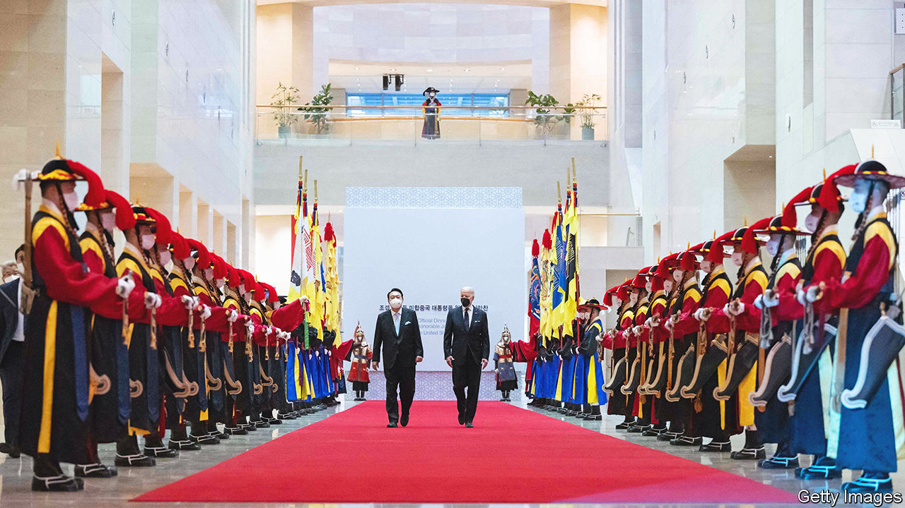

###### Quiet comfort

# Joe Biden vows to deepen America’s ties with South Korea 

##### That works better when no mention is made of China 

 

> May 26th 2022 

When president joe biden paid a visit to South Korea on May 20th, the first stop on a five-day tour of East Asia, he brought a special present for his South Korean counterpart. Yoon Suk-yeol, who took over as South Korea’s president on May 10th, now owns a replica of the sign that adorned the desk of Harry Truman, the president who sent American soldiers to fight in the Korean war in 1950. It reads, “The buck stops here.”

Beyond the congratulatory gesture, the gift alluded to America’s responsibilities as South Korea’s oldest ally and defender against the nuclear-armed dictatorship to the north. It set the tone for Mr Biden’s visit, during which he and Mr Yoon vowed to expand their countries’ military co-operation, strengthen deterrence against North Korea and work together on a host of other issues from supply-chain resilience to space exploration.

The commitment to more deterrence was put to the test soon after Mr Biden left Japan, the second stop on his trip. On May 25th North Korea launched three missiles off its east coast. South Korea’s armed forces said one of them was likely to have been an intercontinental ballistic missile, which America regards as particularly provocative. Such weapons may be capable of hitting its own shores. On the same day the South Korean intelligence service said it had evidence that the North had been trying a nuclear detonator over the past few weeks, probably in preparation for a nuclear test. America and South Korea responded by affirming the commitment Messrs Yoon and Biden had made just days before, conducting their first publicly declared joint missile launch in five years. 

The show of strength echoed the general tone of Mr Biden’s visit. Earlier in the week the president had made headlines with an offhand remark, quickly walked back, about how America might get involved militarily should  be invaded. Big items on the agenda aimed to assure allies of America’s commitment to countering China’s increasing heft in the region. These included a meeting with leaders from the Quad, a loose grouping of America, Australia, India and Japan, and the launch of the Indo-Pacific Economic Framework, a plan to strengthen America’s economic presence in Asia. In a joint statement with Kishida Fumio, Japan’s prime minister, in Tokyo on May 23rd Mr Biden admonished China for its failure to condemn Russia’s invasion of Ukraine and for its coercive actions in the South China Sea.

Yet when it came to South Korea’s relationship with China, Mr Biden trod more carefully. The joint statement he and Mr Yoon issued at the end of his visit ran to nearly 3,000 words but did not mention China. That reflects South Korea’s wariness of antagonising its largest trading partner. Memories are still fresh of China’s economic boycott of South Korea following the deployment of an American missile-defence system there in 2017. 

For South Korea, diversifying supply chains by building trade links with other Asian countries might reduce China’s ability to hold it to ransom. So might an American commitment to step in with economic assistance should a situation like that in 2017 repeat itself. Mr Biden is right that the best way to counter China is to reassure allies in the region of America’s reliability. But in certain places, if not others, such assurances may be best uttered quietly. ■


