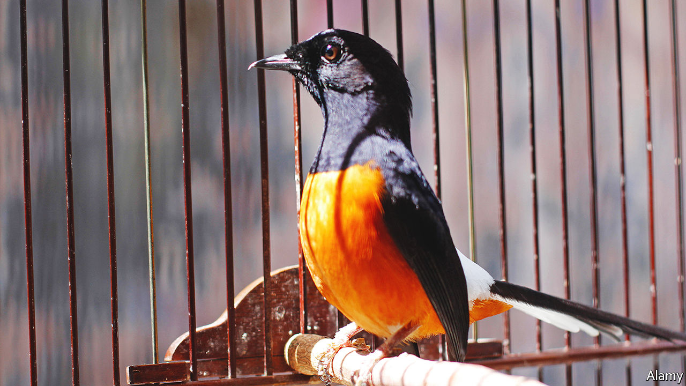

###### Avian idol

# Songbird competitions are a popular pastime in Indonesia 

##### Owners win prizes and socialise, but their hobby is endangering the birds 

 

> May 26th 2022 

Some men spend their weekends watching football. Imam Safi’i and his mates spend theirs watching songbirds warble. Hundreds of songbird contests take place across Indonesia every year. On most weekends Mr Imam and his friends attend duels in Jakarta, the capital, rooting for their pet crooners. The birds are assessed by referees who grade the complexity and range of their melodies, as well as their stamina and posture as they flit around their cages. 

Owning a champion bird is not just a matter of pride. Winners receive televisions, motorcycles, cars and cash prizes of hundreds or thousands of dollars. Over the past four year Ethes, Mr Imam’s stone magpie, has racked up scores of trophies and enriched his owner by some 15m rupiah ($1,000)—half the average annual wage. Mr Imam attributes his bird’s success to love, care and good nutrition. Looking after songbirds, he says, is like looking after children.

Indonesians have come to regard songbirds as a “social and financial asset”, writes Paul Jepson of the University of Oxford, and competitions as an opportunity to network. They also provide an excuse to hang out with buddies. Tournaments are “boisterous” and a “great time”, says Mr Imam, especially when Ethes is not competing. Watching songbirds challenge each other in a kind of Avian Idol “relieves our stress over the weekend”. Men from all walks of life participate—even Joko Widodo, Indonesia’s president, once entered his white-rumped shama in a competition. 

The people of Java, Indonesia’s most populous island, have kept songbirds, a symbol of Javanese knighthood, for centuries. But contests started to become common in the 1980s and 1990s, when enthusiasts began replacing imported zebra doves, whose vocalisations are fixed, with native passerines, which could be trained. This opened up the tournaments to anyone with the time and patience to coach their pets.

Ownership of songbirds in Java has doubled over the past decade. There are between 66m and 84m birds in captivity on the island. Nearly a third of households keep them, according to a survey conducted in 2018. Breeders cannot keep up with demand, and in any case it is wild birds that are prized for their supposedly superior vocal cords. So many birds have been whisked from the forests of Indonesia that more than a dozen species are in danger of extinction. 

Traders are now ransacking Malaysia and Thailand, too. The Indonesian government is aware of the problem and forbids trade in protected species. In 2018 hundreds of birds, including songbirds, were added to that list. Yet traders exploit legal loopholes and patchy enforcement. As many as 1m birds were smuggled out of the forests of Sumatra, a big Indonesian island, in 2019, according to one estimate. Indonesia’s love of birdsong threatens the songbirds themselves. 

