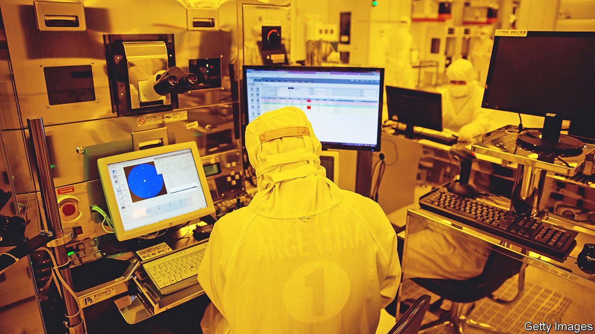
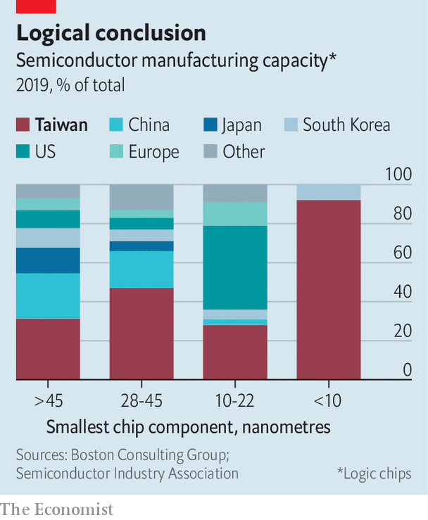

###### Semiconductors and strategy

# Taiwan is worried about the security of its chip industry 

##### New laws are meant to prevent espionage and leaking 

 

> May 26th 2022 

For a brief moment on May 23rd, it seemed as if American policy towards Taiwan had undergone a sudden and dramatic change. Asked if America would “get involved militarily” to defend Taiwan in case of an invasion, President Joe Biden replied that it would. “That’s the commitment we made,” he said. It was the third time he had made a similar statement—and the third time it was quickly dialled back by his aides. 

Good thing then that Taiwan has , or the “magic mountain that protects the nation”. The mountain is not a sophisticated defensive fortification, nor a treaty with a big power. It is instead what Taiwanese call their $147bn semiconductor industry, equivalent to 15% of gdp. It accounts for nearly 40% of its exports and is a pillar of the island’s economy. It is also a guarantor of its security. Taiwanese companies make the world’s most advanced chips, which in turn make the island an indispensable part of the global supply chain for crucial industries such as consumer technology, cars and aviation. America’s firms (and its armed forces) depend on Taiwan’s semiconductors, and so do China’s businesses and military hardware. 

 


For the mountain to retain its magic, the industry must retain its technological edge. Taiwan Semiconductor Manufacturing Company (tsmc), the world’s largest contract chipmaker, controls 90% of the market for the most advanced kind of chips—those with components smaller than ten nanometres (see chart), or about 10,000 times thinner than a sheet of paper. Such chips sit at the heart of the most powerful computing devices, from iPhones to supercomputers. Only two other companies, Intel and Samsung, can make semiconductors approaching this level of sophistication, but their technology is not as good as tsmc’s, nor are they innovating as fast.

tsmc rose to dominance by focusing on making chips rather than designing them. Specialisation allowed the company to become the best at a complex manufacturing process that involves manipulating subatomic particles to create a super-precise form of ultraviolet etching light. How that process works involves many levels of trade secrets that rivals are desperate to acquire. Headhunters prowl Hsinchu Science Park, where most of Taiwan’s chip companies are based, seeking potential recruits who could bring valuable know-how to South Korea or America—or China.

Semiconductors pose a big and growing problem for China. The government has set a target of producing 70% of its own chips by 2025. It set up a 139bn yuan ($23bn) National Semiconductor Fund in 2014, which it topped up with another $30bn in 2019. Local governments have poured at least $25bn more into their own such funds. In 2020, by when China produced 16% of the chips it used, it announced ten years of corporate-tax exemption for the most advanced chip manufacturers. That year, America restricted exports of chip-making equipment to China’s leading manufacturer of semiconductors. 

Such incentives have prompted a big expansion of chip-making in China and attracted many engineers and executives from Taiwan. Between 2014 and 2019, more than 3,000 semiconductor workers—7% of Taiwan’s chip workforce—moved to China, according to Taiwan’s government. 

The exodus has alarmed Taiwanese officials. On May 20th the legislature passed amendments to its national-security laws and those that govern relations with China. The changes criminalise economic espionage and require government permission for employees of companies that work on “national core technology” and receive some form of government support to go to China. The amendments threaten up to 12 years of prison for anyone giving “national core technology trade secrets” to a foreign power, but do not define what constitutes core technology or trade secrets. 

Chip-industry types are unenthusiastic about the rules. “The government thinks it’s trying to do something, but they don’t know how business works,” says Nicholas Chen, an intellectual-property lawyer in Taipei. Though Chinese companies have been poaching Taiwanese executives and engineers, the most advanced Chinese chipmakers remain years behind Taiwan’s best. tsmc has maintained its lead by tightening internal trade-secret protection, not by erecting barriers to China, which is one of its biggest markets. 

It is also not clear how big a problem the brain drain really is. Taiwanese managers have realised that they get dumped by Chinese companies after an average of five years, when all their know-how has been extracted. Then they cannot find jobs back in Taiwan, where they are seen as “traitors”, says Lucy Chen of Isaiah Research, which studies the industry. Chinese attitudes have changed, too. Taiwanese used to be looked up to as managers and experts, but now they feel more like “mercenaries” or “just one of the workers”, says a Taiwanese-American executive who worked in China for many years. Moreover, China’s covid-19 lockdowns and pressure from American and Taiwanese governments are persuading many to go home.

If Taiwan wants to keep its edge, says Mr Chen, the government should not rely on vague laws. Instead, it should help other semiconductor companies improve their own policies to protect trade secrets, which can be costly to implement. That is a view echoed by Richard Thurston, tsmc’s former general counsel. He says it would allow Taiwanese firms to keep growing while protecting them from rivals—not just Chinese firms but other foreign and domestic ones, too. tsmc’s main competitor is not a Chinese company, but Samsung, which is South Korean. In 2015 tsmc won a legal battle against Liang Meng-song, an executive who moved to South Korea and leaked trade secrets there. ■

