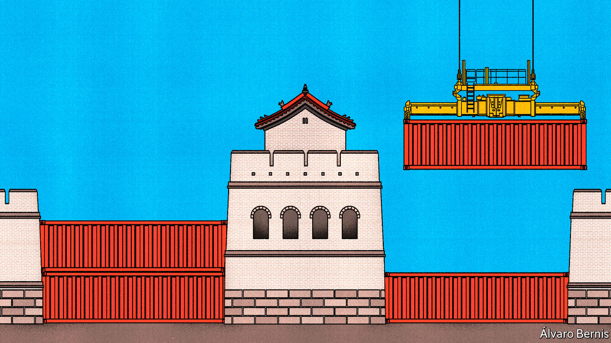
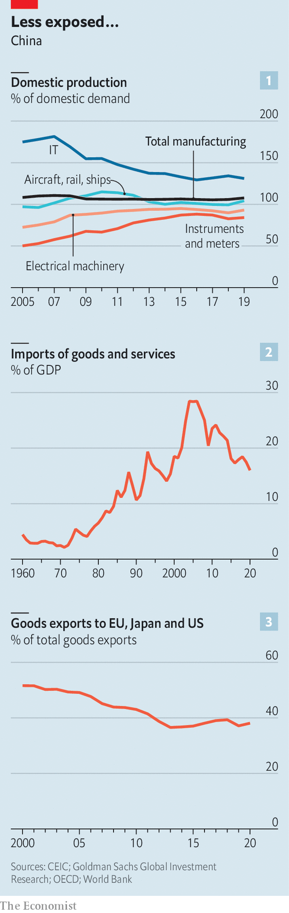
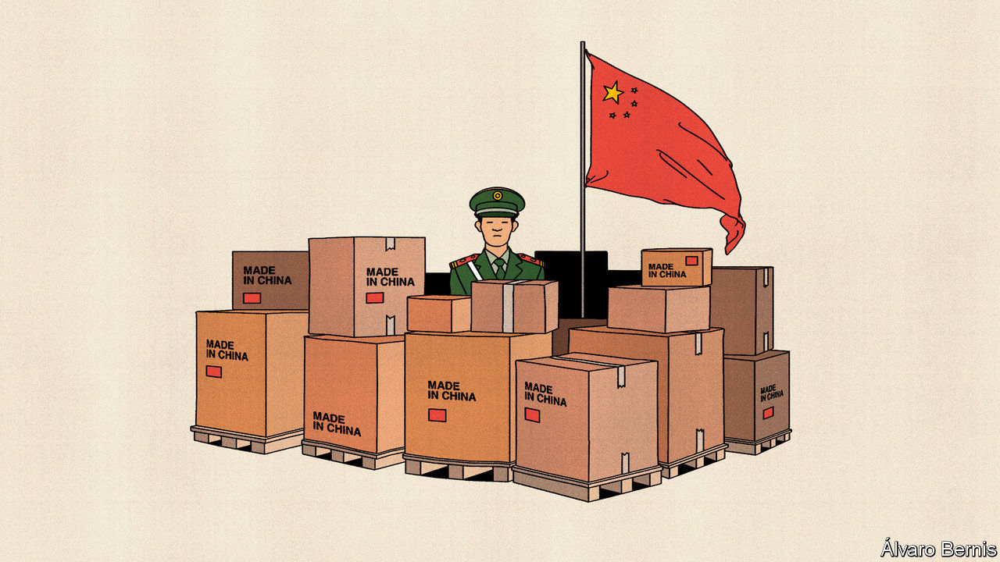
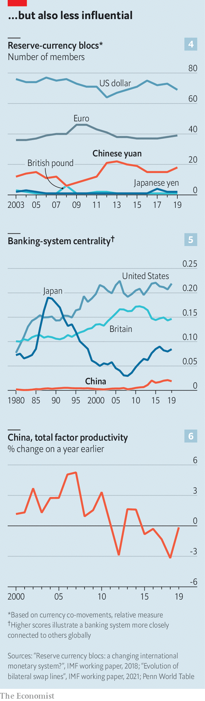

###### Fortified but not enriched

# China is trying to protect its economy from Western pressure 

##### The results are mixed 

 

> May 26th 2022 

In a message to Chinese aerospace engineers and researchers for “Youth Day” earlier this month, President Xi Jinping shared his ambitions for the industry. Young workers should advance the cause of Chinese self-reliance, he said, following in the footsteps of their predecessors who developed a home-grown nuclear weapon, missile and satellite, with little help from outsiders, in a campaign in the era of Mao Zedong called “Two bombs, one satellite”.

On the face of things, this is an odd message to trumpet in the country that has benefited more than any other from the most recent wave of globalisation. In 2000 China was the biggest merchandise trading partner of only a tiny number of countries. Now it is the biggest partner of more than 60. Between 1985 and 2015 Chinese exports of goods to America rose by a factor of 125. Partly as a result of the associated manufacturing boom, growth in China’s gdp per person averaged more than 8% a year from 2001 to 2020.

But the Chinese government has never been completely comfortable with globalisation, whatever the benefits. The process of “reform and opening up” started by Deng Xiaoping in the 1970s, under which China liberalised production and trade, has always been piecemeal and partial. The Communist Party does not intend to relinquish a commanding role in the economy. It worries about the infiltration of Western ideas. Foreign capital and expertise have therefore been courted and rewarded, but also circumscribed and often resented.

Mr Xi’s calls for self-reliance reflect his view that the balance of globalisation’s risks and rewards has changed. He believes that China has become too dependent on liberal democracies, including Europe and Japan but especially America. One risk is that the West might experience another economic slowdown similar to the financial crisis of 2007-09, sapping demand for Chinese goods and services. Another, made much more vivid by the sanctions imposed on Russia after its invasion of Ukraine, is that Western countries might use their economic power to weaken China.

To ward off such perils, Mr Xi wants to change China’s place in the world economy. To oversimplify a little, there are two interrelated elements to what Mr Xi terms ”becoming strong”. The first is to build a commanding position in industries the government considers strategic—tech and energy, for the most part—so that no one can thwart China’s economic rise. China knows that its crucial role in global supply chains helps keep its autocratic system safe from foreign attacks. The second objective is for China to rely less on potentially hostile Western partners for trade and finance, and to develop new and better ones closer to home. The Belt and Road Initiative, a huge global infrastructure development strategy, is just one method by which China hopes to find new economic friends.

Make, don’t buy

China has had some success with the strategic industries. Research published by Goldman Sachs in 2020 found that China’s self-sufficiency in high-tech products was broadly improving (see chart 1). In many industries domestic production has caught up with domestic demand, meaning that China needs fewer products from abroad. Indeed, after hitting an all-time high in 2004-06, China’s imports of goods and services have fallen sharply relative to its gdp (see chart 2). 

 


In few industries has the push for self-sufficiency borne more fruit than in solar energy. China accounts for over 70% of the production of the raw materials used to manufacture solar cells, but also the cells themselves, and the modules into which they are assembled. Dan Wang, an analyst at Gavekal Dragonomics, a research firm, suggests that China’s lead in solar technology is likely to be irreversible. The same is true of batteries for the booming electric-vehicle industry. Wind energy is going gangbusters too. China added more offshore-wind capacity in 2021 alone than the rest of the world managed in the prior five years put together. 

In fact, China has come to dominate many businesses in this way. looked at export data for 120-odd global manufacturing industries. We estimate that in 2005 China was ascendant (defined as a share of global exports of more than a quarter) in 42% of them. In 2019 that hit 67%, a record. The share of export markets that China dominated—which we define as a market share of more than half—tripled over the same period, to a third. 

Yet in many important respects China’s drive for self-reliance has disappointed. Even as Mr Xi has reduced China’s overall import bill, relative to gdp, he has struggled to reduce its dependence on foreign components used to make high-tech goods. China spent 2.7% of gdp on imported components for electronics when he came to power in 2012, and 2.6% in 2020. Its overall bill for imports requiring large amounts of research and development has dropped only slightly.

What is more, China relies heavily on geopolitical rivals for supplies of such goods, including  and Western democracies. In aviation and spacecraft—the object of Mr Xi’s calls for self-reliance earlier this month—the democratic world still supplies 98% of China’s imported components.

China is also increasingly dependent on foreign expertise. The vast majority of Chinese patent filings are home-grown, but the share involving foreigners has risen from 4.8% to 5.9% since 2012. Scientists based in the eu, Japan and America are increasingly common partners with Chinese inventors, even as Western companies and universities talk of disengaging from China to try to stop industrial espionage. In 2020 China was responsible for 8.4% of total global cross-border payments for the use of intellectual property, an all-time high.

Mr Xi’s second big objective—finding better trading and investment partners—is another mixed bag. Take trade. China has eagerly befriended Russia, which has been shunned by the West. It has also embraced the Regional Comprehensive Economic Partnership, a fairly shallow but broad trade deal involving 15 Asian countries that account for almost a third of global gdp. It has applied to join the rump of the Trans-Pacific Partnership, an ambitious trade pact conceived by America but then abandoned by it.

In a survey of policymakers, business leaders and other grandees from South-East Asia published earlier this year, 77% of respondents named China as the most influential economic power in the region. “I see East and South-East Asia increasingly being pulled within the sphere of the gravitational force of the Chinese economy. That is inevitable,” says Henry Gao of Singapore Management University. 

Overlapping spheres

Yet big Western economies continue to exert a pull on China. gathered data on stocks of foreign direct investment (fdi—takeovers of companies and the construction of factories), portfolio investment (purchases of stocks, bonds and the like) and international trade for nearly 120 countries. For each indicator we ranked every country based on the strength of its bilateral relationship with China, then combined the rankings. 

The countries with which China has the closest economic relationships are all still Western or Western-leaning: America, South Korea, Singapore, Germany and Japan. And during Mr Xi’s rule most Western economies have become more intertwined with China’s. The stock of German fdi in China has more than doubled, for instance. Chinese long-term investors have doubled their gross exposure to Australia, even as politicians in both countries hurled invective at each other. Meanwhile China’s ties with countries that might be expected to fall within its sphere of influence, such as Indonesia and Russia, have weakened. 

China’s export industries also remain highly dependent on Western demand for their wares. In the decade before Mr Xi came to power the share of Chinese goods exports that were destined for the eu, Japan and America had fallen from 50% to 39% (see chart 3). But since then no further progress has been made. Countries with which China would like to develop closer trading relationships are simply too small to replace the huge markets of America, Europe and Japan. It is difficult simultaneously to produce more high-tech goods and services and to expect the share of them sold to poorer countries rather than rich ones to increase. Despite all the warm handshakes Mr Xi shares with Vladimir Putin, Russia’s president, Russia buys just 2% of China’s exports.

In recent years China has been trying to develop closer financial ties with countries it believes to be sympathetic to its objectives. This includes an attempt to promote the use of its currency internationally. The idea is to reduce China’s dependence on the dollar, and thus to become less vulnerable to American financial sanctions. To this end China has slowly opened its bond market to foreign investors. In the early 2010s the central bank began signing agreements on yuan-denominated swaps (ie, emergency lines of credit) with other central banks. It has also been working hard to develop a digital yuan, which is intended to make trade using the currency faster and easier to monitor. Chinese firms have been paying for imports of Russian commodities in yuan this year, which helps Russia by diminishing the impact of Western sanctions while also raising the yuan’s international profile.

 


But China’s financial links with its near abroad remain weak. Take its bond market. A new paper by four economists, Christopher Clayton, Amanda Dos Santos, Matteo Maggiori and Jesse Schreger, examines private investors’ holdings of yuan-denominated bonds. In recent years the vast majority of inflows into these assets have come from America, the euro zone and Japan. A paper published in 2018 by Camilo Tovar and Tania Mohd-Nor of the imf examined the importance of the yuan to other currencies (ie, how much one influences the other). The researchers find “no evidence to suggest that the [yuan] is the dominant currency in Asia, by influencing exchange rates in the region or through Asian supply chains”. 

China’s push for a more self-sufficient economy, in short, has not been entirely successful in its own terms. What is more, the attempt to create one has thrown up a series of contradictions. The desire to promote the use of the yuan abroad, for example, clashes with efforts to insulate China from global financial swings. The resulting muddle has left China neither much of a force in global finance nor protected from movements in markets beyond its control. The Chinese currency’s share in cross-border payments recorded by swift, a financial-messaging network, is around 2% most months, as it has been for most of the past five years. Even that overstates the currency’s reach, since most transactions involving the yuan outside of mainland China take place in Hong Kong, which is part of China but uses a different currency.

 


On a global scale the yuan is an “anchor” for few other currencies (see chart 4). The number of new yuan-denominated swaps agreed by the central bank has slowed sharply. Research published last year by Michael Perks, Yudong Rao, Jongsoon Shin and Kiichi Tokuoka, all of the imf, found that the Chinese banking system still plays a tiny role in global finance compared with America’s (see chart 5). A new paper by Yi Fang of the Central University of Finance and Economics, in China, and colleagues, finds that Chinese markets “are more influenced by the financial markets in the g7 economies than the other way around”. When America sneezes the rest of the world catches a cold. When China sneezes, most countries brush it off. 

Another tension in China’s push for self-reliance concerns productivity. Total factor productivity (ie, the amount of output per unit of labour and capital) has barely grown under Mr Xi, a marked deceleration from before the financial crisis (see chart 6). The government believes that aiming for self-sufficiency in high-tech industries will encourage innovation and so boost productivity. In fact, the opposite is more likely. In its efforts to boost domestic champions and spur trade with friendly countries, the government will probably end up conferring advantages on firms that are not the most efficient or capable suppliers of a given product, thereby denting productivity. Because lifting productivity is the only lasting way to raise living standards, that is a worrying prospect.

Taken alone, either of Mr Xi’s ambitions—whether fortifying China against economic and technological vulnerabilities or finding a more reliable set of partners for trade and investment—would be a massive undertaking. Taken together, they are already generating contradictions, and more are likely to emerge. Trade and investment create mutual benefit and therefore mutual vulnerability by their very nature. China’s leaders are right that dependence on Western technology, markets and financial plumbing leaves them exposed, but wrong if they imagine they can escape this predicament. The only alternative to interdependence is immiseration, whatever Mr Xi tells China’s rocket scientists. ■

