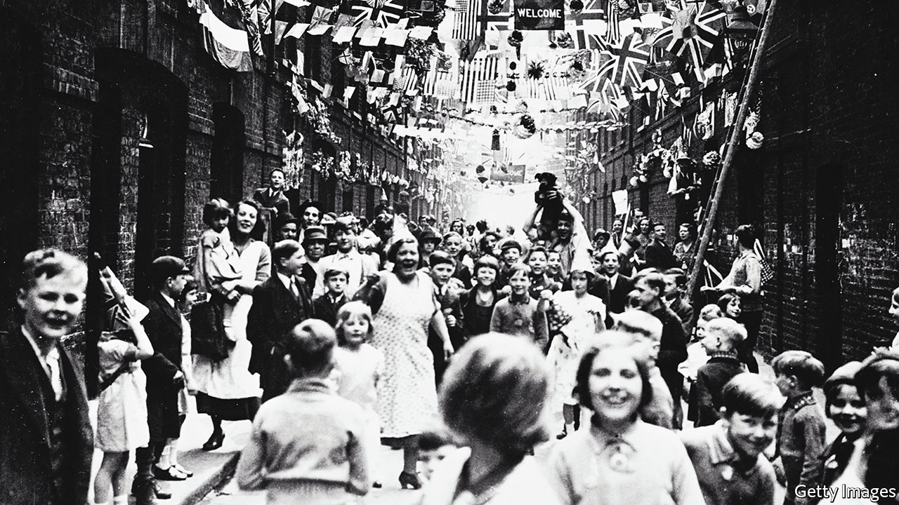

###### Land of hops and glory

# Britain celebrates a jubilee, again 

##### Britain is celebrating jubilees more often, but less confidently 

 

> May 26th 2022 

In ramsbottom there was roistering, beer and “rustic sports”. In Bletchington people enjoyed roast beef and “as much ale as they could drink”. In Llanrothal there were “copious libations of cider”. Sunday School children in Spilsby were given “a plum-cake and a glass of wine each, to drink his Majesty’s health”. Britain’s first jubilee, held in 1809 for George III, was celebrated with abundant quantities of beer and an even more abundant supply of Georgian euphemisms for “everyone got extremely drunk”. There are numerous “loyal toasts”, plenty of “patriotic toasts”, a lot of “patriotic songs” and an almost unseemly amount of “regaling”. You can all but smell the ale on their breath. 

Royal jubilees are odd sorts of celebrations. Unlike most royal events—such as weddings, coronations or funerals, all of which mark change of some kind—a jubilee is a marker of mere stasis. It celebrates the fact that the current monarch has stayed alive for a prolonged period of time. This might sound underwhelming but it is a feat that most English monarchs have failed to achieve. Of 50-odd English kings and queens, only six have lived long enough to qualify for a golden jubilee to mark a reign lasting 50 years; only two have lived long enough for a diamond one, marking 60 years on the throne; and only Queen Elizabeth II has achieved a 70-year platinum jubilee. Although she actually reached that milestone in February, it will be publicly celebrated in early June. 

Until relatively recently the monarchs of this sceptred isle specialised in untimely and often unseemly deaths, with one allegedly stabbed on the toilet and another through the eye; a third was dispatched by an (again allegedly) importunate poker. Not kicking the bucket was enough of a feat that English monarchs used to hold annual festivals to commemorate their accession. That practice only stopped, says Tracy Borman, a royal historian, when monarchs started to live so long that people “got a bit bored”. Hence the switch to jubilees. 

Look through the reports of past jubilees and it becomes clear that each has its own flavour. Whereas the jubilee of George III involved getting heroically drunk, in the era of Victoria the mood became notably more Victorian. In 1887 this paper reflected on the celebrations for that queen’s Golden Jubilee and was well satisfied by what it saw. The English, the author observed, had hitherto been a “rough, turbulent and brutal” lot but they had improved. Manners had softened; brutishness was in abeyance; and a suggestion “to run fountains with beer” had been greeted with “the utmost indignation”. Good works marked the 1935 Silver Jubilee of George V: Welsh coal-mine owners gave their workers a pension fund, and Indian tribesmen forswore cattle-rustling “in token of their esteem”. 

These earlier jubilees seem like confident affairs. The Georgians might have been off their faces but they seem comfortable in their own skins. This newspaper’s account of Victoria’s Golden Jubilee appears shortly after an admiring special report on imperial expansion. 

At the queen’s Silver Jubilee in 1977, to celebrate her 25th year on the throne, the prevailing mood was more curmudgeonly. The Mass Observation Project (an eccentric but benign project in which volunteers record everyday life in Britain) set out to take the temperature of the nation—and found it chilly. “People are not in the mood,” said one woman, bluntly. In Scotland, Mass Observation reported, there was “total apathy”. In Bath one local observed that “The Royal Family leave me cold. I couldn’t care less either way.” 

The impending Platinum Jubilee is also less dazzled by the present, more nostalgic for the past. The government’s plans for it promise pageants and bandstands; they refer to village halls and “pomp and circumstance”; they speak, in short, of a Britain that hasn’t existed for 50 years or more, if it ever did. 

Even the entertainment has an air of nostalgia. Instead of new acts, 150 “national treasures” will participate in the jubilee celebrations. Once Britain had only a handful of national treasures, figures such as Sir David Attenborough and Dame Helen Mirren; to suddenly produce 150 is an act of cultural quantitative easing that speaks of a certain institutional insecurity. Everywhere there will be bunting and street parties, “jubilee trifles” and cucumber sandwiches, and the taste of a country that is, ever so slightly, playing a part. 

Look closely, however, and you can see signs that there does remain, after all, a strain of authentic Britishness. The government plans also include the information that “to mark Her Majesty the Queen’s Platinum Jubilee”, Parliament has “passed an order to extend licensing hours in pubs, clubs and bars…to 1am”. There will, once again, be regaling. ■

