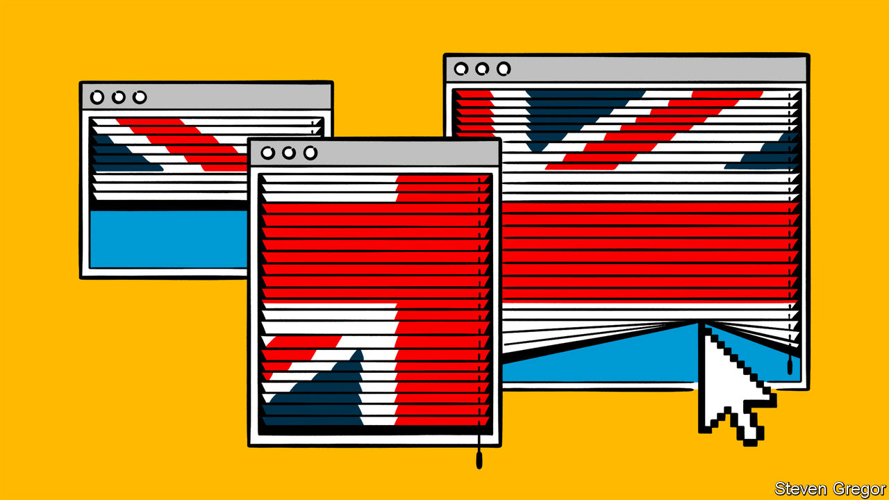
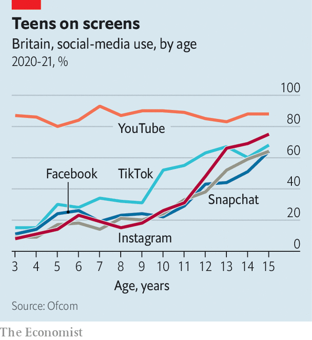

###### Internet regulation

# Britain’s Online Safety Bill could change the face of the internet 

##### Tech firms will be incentivised to censor their users en masse 

 

> May 25th 2022 

Britain’s government likes to trumpet the benefits of free speech. Announcing a bill designed to prevent stroppy students “no-platforming” speakers at universities, Boris Johnson told his millions of Twitter followers last year: “Freedom of speech is at the very core of our democracy.” The Higher Education (Freedom of Speech) Bill was included in the Queen’s Speech, which sets out the government’s legislative agenda, earlier this month.

Outside the lecture hall, though, Mr Johnson’s government is accused of censorship in its own right. Also in the Queen’s Speech was the Online Safety Bill (osb), a bumper piece of legislation that will impose sweeping new obligations on search engines, social-media sites, forums, video sites and the like. Ministers say it is “world-leading”. At 225 pages, with 194 separate clauses, and with up to 25,000 firms potentially affected, everyone agrees it is ambitious. The arguments are about its consequences.

To its defenders, the bill—whose origins date back to Theresa May’s time as prime minister—is designed to make Britain “the safest place in the world in which to use the internet”. The osb will impose a “duty of care” on tech firms, a concept that began in health-and-safety legislation for the workplace. Tech firms will be required by law to protect their British users from racism, death threats, sexual exploitation, dodgy adverts and much, much more. 

 


Any site likely to be accessed by children—which, in practice, means most of them—could demand identification to ensure visitors are over 18. The biggest sites will be required to scour everything their users upload for potential illegality—and perhaps also for things that, despite being legal, are deemed “harmful” in Whitehall. Penalties run to 10% of a firm’s worldwide revenues, or even an outright ban. 

Civil libertarians are not happy. A legal opinion commissioned by Index on Censorship, a charity, said the bill was likely to fall foul of the free-speech provisions of the European Convention on Human Rights (to which Britain remains a signatory). David Davis, a Conservative mp, has described it as a “censor’s charter” that would “strangle free speech online”. 

The bill establishes several tiers of nastiness. The worst tier is reserved for things that are against existing laws, such as assisting suicide, making threats to kill or assisting illegal immigration. The biggest firms (the definition of “big” remains unclear) will have to proactively purge such things from their sites. The sheer size of big platforms (500 hours of video are uploaded to YouTube every minute) means that it is not feasible for humans to check every post. Firms will have to rely on automated enforcement.

But algorithms are blunt tools, says Mark Johnson of Big Brother Watch, which campaigns on civil liberties. They often struggle with nuance and context. “Is an algorithm going to be able to reliably tell the difference between someone encouraging suicide and someone with postnatal depression posting about feeling suicidal on Mumsnet [a big web forum]?” With billions of dollars potentially at stake, he says, the risk is that firms will err heavily on the side of caution, leading to overzealous blocking of innocuous posts. 

A second tier of content concerns posts that are not in themselves illegal, but which are deemed to be “harmful”. Exactly what belongs in that category is unclear (it is left for ministers to decide later). But the government has talked about everything from vaccine scepticism and bullying to glorifying anorexia and hurling racist insults at England’s football team. Sites will be required by law to minimise the chance that children see such posts. For everyone else, they will have to make an active decision about whether to block or downplay such content, or to carry on promoting and recommending it as they would anything else on their products. 

Campaigners argue that these “legal but harmful” provisions amount to censorship by the back door, and create an entirely new category of speech in law. Ruth Smeeth, a former mp and the boss of Index on Censorship, calls them a “clusterfuck”. The government has tried to reassure doubters by pointing out that tech firms will be free to leave such posts up if they so choose. Ms Smeeth is dismissive: “Can you imagine the political pressure on any platform that says publicly they’re ok with this stuff?” Those that decide to suppress it will again depend on idiot-savant algorithms. 

There are other doubts. A string of new communications offences rely on subjective definitions of psychological harm. Jonathan Hall, the government’s independent reviewer of terrorism legislation, is unhappy with similar vagueness around definitions of terrorism. Some police officers worry that firms could destroy digital evidence of crime by deleting posts. But support in Parliament remains strong. Last year Sir Keir Starmer, the Labour leader, castigated the government for not moving more quickly. The bill looks likely to make it onto the statute books. 

Online, off limits

That could have international repercussions. Tech firms may choose to try to apply the new laws in Britain only. If they decide that it is too difficult to create a new set of rules for a subset of their users, one option is to apply at least some of the osb’s provisions to their services anywhere. There is precedent: last year Britain brought in the Age Appropriate Design Code, which prescribes stricter privacy for children online. Google, TikTok and others made worldwide changes as a result. Another possibility is that some foreign firms, particularly smaller ones, may stop serving Britain entirely. In various ways, the price of safety may be silence. ■

